# Git学习笔记

学习git之前，我们需要先明白一个概念**版本控制！**

## 什么是版本控制

版本控制（Revision control）是一种在开发的过程中用于管理我们对文件、目录或工程等内容的修改历史，方便查看更改历史记录，备份以便恢复以前的版本的软件工程技术。

- 实现跨区域多人协同开发
- 追踪和记载一个或者多个文件的历史记录
- 组织和保护你的源代码和文档
- 统计工作量
- 并行开发、提高开发效率
- 跟踪记录整个软件的开发过程
- 减轻开发人员的负担，节省时间，同时降低人为错误

简单说就是用于管理多人协同开发项目的技术。


> 常见的版本控制工具

我们学习的东西，一定是当下最流行的！

主流的版本控制器有如下这些：

- **Git**
- **SVN**（Subversion）
- **CVS**（Concurrent Versions System）
- **VSS**（Micorosoft Visual SourceSafe）
- **TFS**（Team Foundation Server）
- Visual Studio Online

版本控制产品非常的多（Perforce、Rational ClearCase、RCS（GNU Revision Control System）、Serena Dimention、SVK、BitKeeper、Monotone、Bazaar、Mercurial、SourceGear Vault），现在影响力最大且使用最广泛的是Git与SVN


> 版本控制分类

**1、本地版本控制**

记录文件每次的更新，可以对每个版本做一个快照，或是记录补丁文件，适合个人用，如RCS。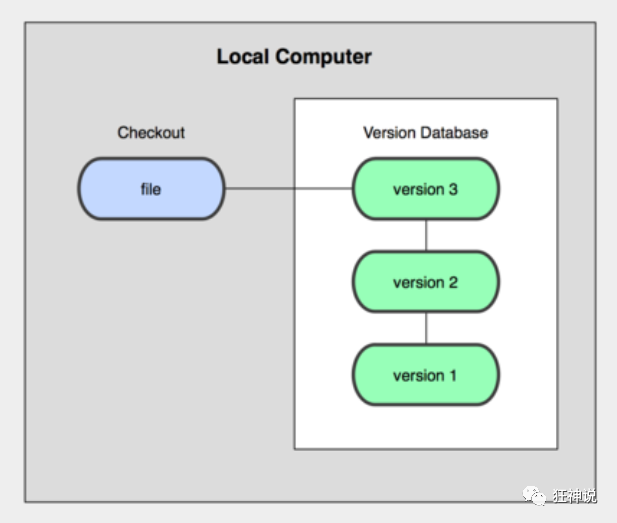


**2、集中版本控制  SVN**

所有的版本数据都保存在服务器上，协同开发者从服务器上同步更新或上传自己的修改

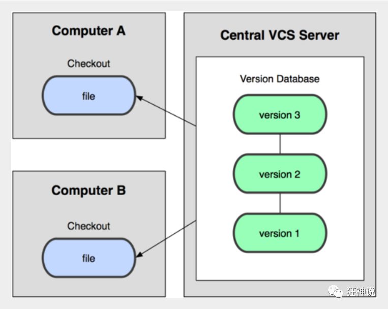


**所有的版本数据都存在服务器上**，用户的本地只有自己以前所同步的版本，如果不连网的话，用户就看不到历史版本，也无法切换版本验证问题，或在不同分支工作。而且，所有数据都保存在单一的服务器上，有很大的风险这个服务器会损坏，这样就会丢失所有的数据，当然可以定期备份。代表产品：SVN、CVS、VSS

**3、分布式版本控制 	Git**

每个人都拥有全部的代码！安全隐患！

**所有版本信息仓库全部同步到本地的每个用户**，这样就可以在本地查看所有版本历史，可以离线在本地提交，只需在连网时push到相应的服务器或其他用户那里。由于每个用户那里保存的都是所有的版本数据，只要有一个用户的设备没有问题就可以恢复所有的数据，但这增加了本地存储空间的占用。

不会因为服务器损坏或者网络问题，造成不能工作的情况！

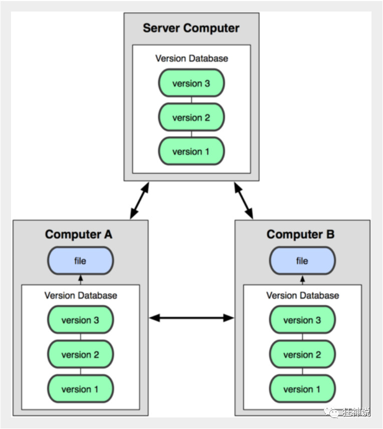


> Git与SVN的主要区别

SVN是集中式版本控制系统，版本库是集中放在中央服务器的，而工作的时候，用的都是自己的电脑，所以首先要从中央服务器得到最新的版本，然后工作，完成工作后，需要把自己做完的活推送到中央服务器。集中式版本控制系统是必须联网才能工作，对网络带宽要求较高。

Git是分布式版本控制系统，没有中央服务器，每个人的电脑就是一个完整的版本库，工作的时候不需要联网了，因为版本都在自己电脑上。协同的方法是这样的：比如说自己在电脑上改了文件A，其他人也在电脑上改了文件A，这时，你们两之间只需把各自的修改推送给对方，就可以互相看到对方的修改了。Git可以直接看到更新了哪些代码和文件！

**<font color=red >Git是目前世界上最先进的分布式版本控制系统。</font>**


## 聊聊Git的历史

同生活中的许多伟大事物一样，Git 诞生于一个极富纷争大举创新的年代。

Linux 内核开源项目有着为数众广的参与者。绝大多数的 Linux 内核维护工作都花在了提交补丁和保存归档的繁琐事务上(1991－2002年间)。到 2002 年，整个项目组开始启用一个专有的分布式版本控制系 BitKeeper  来管理和维护代码。

Linux社区中存在很多的大佬！破解研究 BitKeeper ！

到了 2005 年，开发 BitKeeper 的商业公司同 Linux 内核开源社区的合作关系结束，他们收回了 Linux 内核社区免费使用 BitKeeper 的权力。这就迫使 Linux 开源社区(特别是 Linux 的缔造者 Linus Torvalds)基于使用 BitKeeper 时的经验教训，开发出自己的版本系统。（2周左右！） 也就是后来的 Git！

**<font color=red>Git是目前世界上最先进的分布式版本控制系统。</font>**

Git是免费、开源的，最初Git是为辅助 Linux 内核开发的，来替代 BitKeeper！

Linux和Git之父李纳斯·托沃兹（Linus Benedic Torvalds）1969、芬兰


## Git环境配置

> 下载

打开 [git官网] https://git-scm.com/，下载git对应操作系统的版本。

所有东西下载慢的话就可以去找镜像！

官网下载太慢，我们可以使用淘宝镜像下载：http://npm.taobao.org/mirrors/git-for-windows/

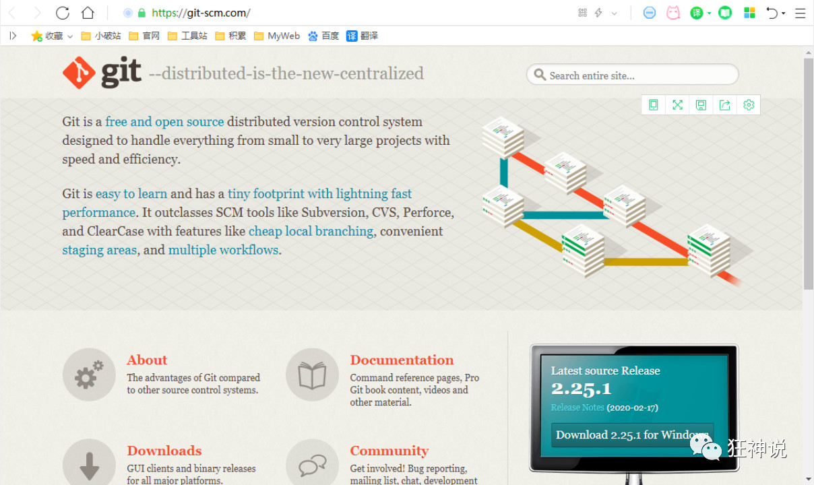

下载对应的版本即可安装！

安装：无脑下一步即可！安装完毕就可以使用了！

> 卸载

直接反安装（uninstall）即可，然后清除环境变量！

环境变量只是为了全局使用而已！

>  启动Git

安装成功后在开始菜单中会有Git项，菜单下有3个程序：任意文件夹下右键也可以看到对应的程序！

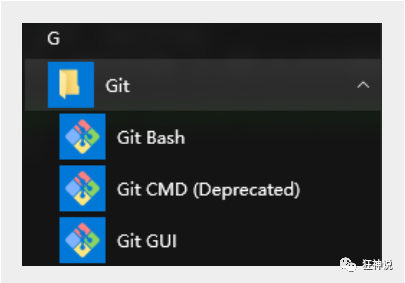

**Git Bash：**Unix与Linux风格的命令行，使用最多，推荐最多

**Git CMD：**Windows风格的命令行

**Git GUI**：图形界面的Git，不建议初学者使用，尽量先熟悉常用命令


> 常用的Linux命令

平时一定要多使用这些基础的命令！

1）	cd : 		   改变目录。

2）	cd . .  :	  回退到上一个目录，直接cd进入默认目录

3）	pwd : 	  显示当前所在的目录路径。

4）	ls(ll):  	  都是列出当前目录中的所有文件，只不过ll(两个ll)列出的内容更为详细。

5）	touch :	新建一个文件 如 touch index.js 就会在当前目录下新建一个index.js文件。

6）	rm:  		 删除一个文件, rm index.js 就会把index.js文件删除。

7）	mkdir:    新建一个目录,就是新建一个文件夹。

8）	rm -r :     删除一个文件夹, rm -r src 删除src目录

```
rm -rf / 切勿在Linux中尝试！删除电脑中全部文件！
```

9）	mv 移动文件, mv  [descFile]   [src]  是我们要移动的文件, src 是目标文件夹,当然, 这样写,必须保证文件和目标文件夹在同一目录下。

10）	reset 	重新初始化终端/清屏。

11）	clear 	清屏。

12）	history 	查看命令历史。

13）	help 	帮助。

14）	exit 	退出 bash。

15）	# 表示注释


> Git配置

所有的配置文件，其实都保存在本地！

查看配置  **<font color=red>git config -l</font>**

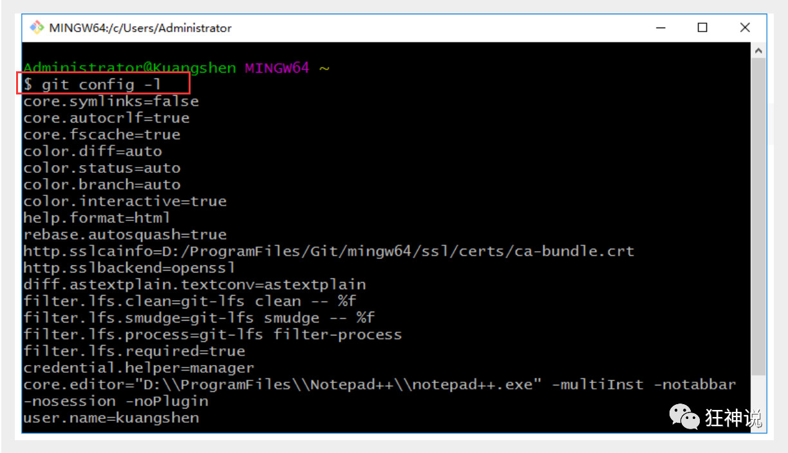

查看不同级别的配置文件：

```bash
#查看系统config
git config --system --list

#查看当前用户（global）配置
git config --global  --list
```


**Git相关的配置文件：**

1）etc/gitconfig: 系统范围内的配置文件，适用于系统所有的用户。 	`git	config	--system`

2）${HOME}/.gitconfig: 用户级的配置文件，只适用于当前用户。			`git	config	--global`

3）.git/config: Git项目级的配置文件，位于当前Git工作目录下，只适用于当前Git项目。	`git  config`

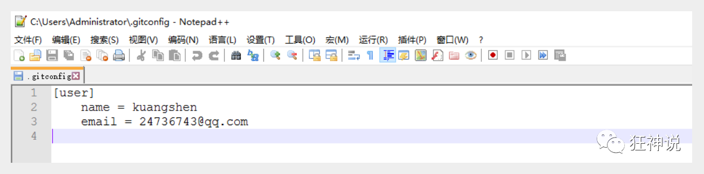

这里可以直接编辑配置文件，通过命令设置后会响应到这里。


> <font color=red>设置用户名与邮箱（用户标识，必要）</font>

当你安装Git后首先要做的事情是设置你的用户名称和e-mail地址。这是非常重要的，因为每次Git提交都会使用该信息。它被永远的嵌入到了你的提交中：

```bash
# git  config  --global 为当前用户配置	
$  git config --global user.name   "kuangshen"  #名称
$  git config --global user.email   24736743@qq.com   #邮箱
```

只需要做一次这个设置，如果你传递了--global 选项，因为Git将总是会使用该信息来处理你在系统中所做的一切操作。如果你希望在一个特定的项目中使用不同的名称或e-mail地址，你可以在该项目中运行该命令而不要--global选项。总之--global为全局配置，不加为某个项目的特定配置。

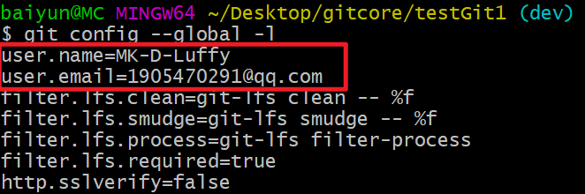


 ## Git基本理论（核心）

> 三个区域

Git本地有三个工作区域：工作目录（Working Directory）、暂存区(Stage/Index)、资源库(Repository或Git Directory)。

如果在加上远程的git仓库(Remote Directory)就可以分为四个工作区域。文件在这四个区域之间的转换关系如下：

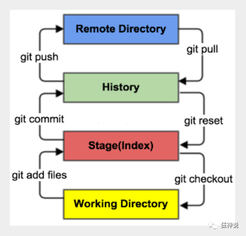

- Workspace：工作区，就是你平时存放项目代码的地方
- Index / Stage：暂存区，用于临时存放你的改动，事实上它只是一个文件，保存即将提交到文件列表信息
- Repository：仓库区（或本地仓库），就是安全存放数据的位置，这里面有你提交到所有版本的数据。其中HEAD指向最新放入仓库的版本
- Remote：远程仓库，托管代码的服务器，可以简单的认为是你项目组中的一台电脑用于远程数据交换

本地的三个区域确切的说应该是git仓库中HEAD指向的版本：

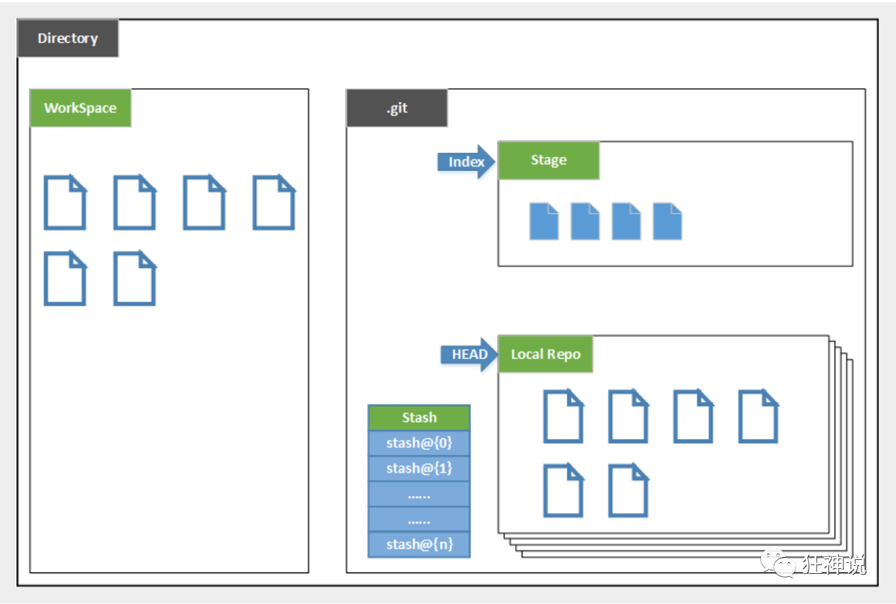

- Directory：使用Git管理的一个目录，也就是一个仓库，包含我们的工作空间和Git的管理空间。

- WorkSpace：需要通过Git进行版本控制的目录和文件，这些目录和文件组成了工作空间。

- .git：存放Git管理信息的目录，初始化仓库的时候自动创建。

- Index/Stage：暂存区，或者叫待提交更新区，在提交进入repo之前，我们可以把所有的更新放在暂存区。

- Local Repo：本地仓库，一个存放在本地的版本库；HEAD会只是当前的开发分支（branch）。

- Stash：隐藏，是一个工作状态保存栈，用于保存/恢复WorkSpace中的临时状态。

	

> 工作流程

git的工作流程一般是这样的：

１、在工作目录中添加、修改文件；

２、将需要进行版本管理的文件放入暂存区域；

３、将暂存区域的文件提交到git仓库。

因此，git管理的文件有三种状态：已修改（modified）,已暂存（staged）,已提交(committed)

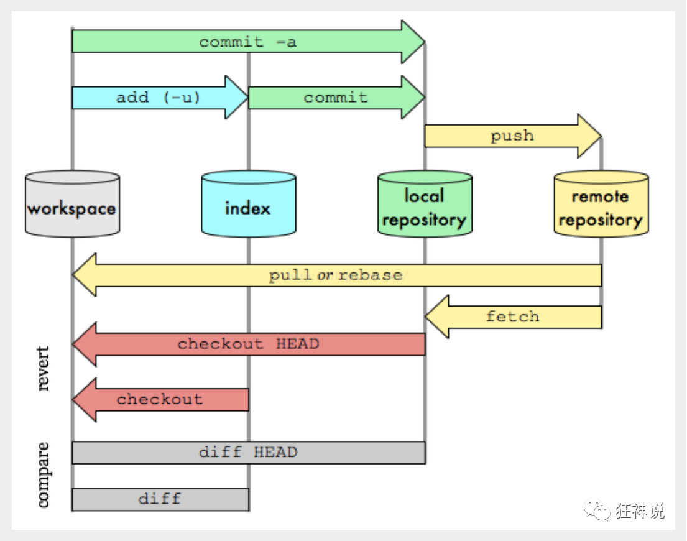


## 在本地搭建Git项目

> 创建工作目录与常用指令

工作目录（WorkSpace)一般就是你希望Git帮助你管理的文件夹，可以是你项目的目录，也可以是一个空目录，建议不要有中文。

日常使用只要记住下图6个命令：

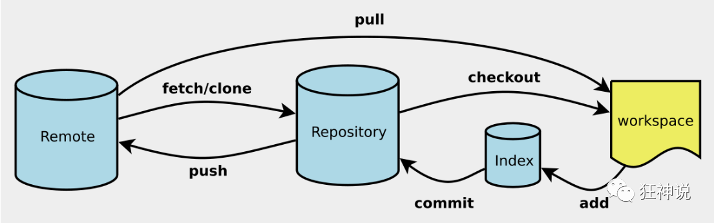


**创建本地仓库的方法有两种：一种是创建全新的仓库，另一种是克隆远程仓库。**

> 本地仓库搭建

1、创建全新的仓库，需要用GIT管理的项目的根目录执行：

```bash
# 在当前目录新建一个Git代码库
$ git init
```

2、执行后可以看到，仅仅在项目目录多出了一个.git目录，关于版本等的所有信息都在这个目录里面。

> 克隆远程仓库

1、另一种方式是克隆远程目录，由于是将远程服务器上的仓库完全镜像一份至本地！

```bash
# 克隆一个项目和它的整个代码历史(版本信息)
$ git clone [url]  # https://gitee.com/kuangstudy/openclass.git
```

2、去 gitee 或者 github 上克隆一个测试！

> 拓展：.git 文件夹介绍

**.git文件夹**是生成本地仓库后在当前目录生成的一个**管理当前git仓库的文件夹**，这里包含所有git操作所需要的东西和关于版本等的所有信息都在这个目录里面。

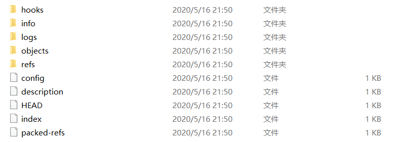

**hooks**(钩)：存放一些shell脚本

**Info**：**exclude**：存放仓库的一些信息

**logs**：保存所有更新的引用记录(**日志**)

**objects**：存放所有的**git**对象

**refs：heads**：保存当前最新的一次提交的哈希值

**config**：git 仓库的配置文件

**description**：仓库的描述信息，主要给gitweb等git托管系统使用

**HEAD**：映射到**ref**引用，能够找到下一次**commit**的前一次哈希值（看上面**logs**的图）

**index**：暂存区（**stage**），一个二进制文件


## Git文件操作

> 文件的四种状态

版本控制就是对文件的版本控制，要对文件进行修改、提交等操作，首先要知道文件当前在什么状态，不然可能会提交了现在还不想提交的文件，或者要提交的文件没提交上。

- Untracked: 未跟踪, 此文件在文件夹中, 但并没有加入到git库, 不参与版本控制. 通过`git add `状态变为`Staged`.
- Unmodify: 文件已经入库, 未修改, 即版本库中的文件快照内容与文件夹中完全一致. 这种类型的文件有两种去处, 如果它被修改, 而变为`Modified`. 如果使用`git rm`移出版本库, 则成为`Untracked`文件
- Modified: 文件已修改, 仅仅是修改, 并没有进行其他的操作. 这个文件也有两个去处, 通过git add可进入暂存staged状态, 使用`git checkout`则丢弃修改过, 返回到`unmodify`状态, 这个`git checkout`即从库中取出文件, 覆盖当前修改 !
- Staged: 暂存状态. 执行`git commit`则将修改同步到库中, 这时库中的文件和本地文件又变为一致, 文件为`Unmodify`状态. 执行`git reset HEAD filename`取消暂存, 文件状态为`Modified`


> 查看文件状态

上面说文件有4种状态，通过如下命令可以查看到文件的状态：

```bash
#查看指定文件状态
git status [filename]

#查看所有文件状态
git status

# git add .                  添加所有文件到暂存区
# git commit -m "消息内容"    提交暂存区中的内容到本地仓库 -m 提交信息
```


> 忽略文件

有些时候我们不想把某些文件纳入版本控制中，比如数据库文件，临时文件，设计文件等

在主目录下建立".gitignore"文件，此文件有如下规则：

1. 忽略文件中的空行或以井号（#）开始的行将会被忽略。
2. 可以使用Linux通配符。例如：星号（*）代表任意多个字符，问号（？）代表一个字符，方括号（[abc]）代表可选字符范围，大括号（{string1,string2,...}）代表可选的字符串等。
3. 如果名称的最前面有一个感叹号（!），表示例外规则，将不被忽略。
4. 如果名称的最前面是一个路径分隔符（/），表示要忽略的文件在此目录下，而子目录中的文件不忽略。
5. 如果名称的最后面是一个路径分隔符（/），表示要忽略的是此目录下该名称的子目录，而非文件（默认文件或目录都忽略）。

```bash
#为注释
*.txt			#忽略所有 .txt结尾的文件,这样的话上传就不会被选中！
!lib.txt     	#但lib.txt除外
/temp        	#仅忽略项目根目录下的TODO文件,不包括其它目录temp
build/       	#忽略build/目录下的所有文件
doc/*.txt    	#会忽略 doc/notes.txt 但不包括 doc/server/arch.txt
```


> <font color=red>一个常规的gitingore文件的配置</font>

```gitingore
# Created by .ignore support plugin (hsz.mobi)

*.gitignore

*.class
*.log
*.yarn.lock

# Package Files #
*.jar
*.war
*.ear
target/

### Intellij IDEA ###
.idea/
*.iml
*.ipr
*.iws
*.classpath
*.project
*.settings/
bin/

tmp/
```


## Git版本控制

- `HEAD`指向的版本就是当前版本，因此，Git允许我们在版本的历史之间穿梭，使用命令

	`git reset --hard [commit_id]`	或

	`git reset --hard HEAD...`

	

	首先，Git必须知道当前版本是哪个版本，在Git的版本回退速度非常快，

	因为Git在内部有个指向当前版本的`HEAD`指针，

	在Git中，用`HEAD`表示当前版本，也就是最新提交的版本

	上一个版本就是`HEAD^`，上上一个版本就是`HEAD^^`，当然往上100个版本写100个`^`比较容易数不过

	来，所以写成`HEAD~100`。

	

	所以当你在回退版本的时候，Git仅仅是把`HEAD`从指向`append GPL`：

	```ascii
	┌────┐
	│HEAD│
	└────┘
	   │
	   └──> ○ append GPL
	        │
	        ○ add distributed
	        │
	        ○ wrote a readme file
	```

	改为指向`add distributed`：

	```ascii
	┌────┐
	│HEAD│
	└────┘
	   │
	   │    ○ append GPL
	   │    │
	   └──> ○ add distributed
	        │
	        ○ wrote a readme file
	```

	然后顺便把工作区的文件更新了。所以你让`HEAD`指向哪个版本号，你就把当前版本定位在哪。

	例如：

	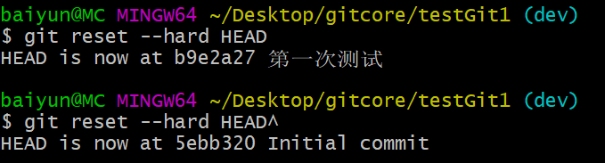

	

- 穿梭前，用`git log`可以查看提交历史，以便确定`commit_id`要回退到哪个版本。

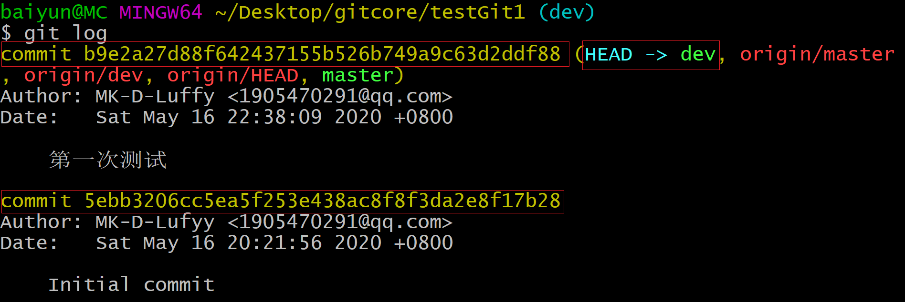

- 要重返未来，用`git reflog`查看命令历史，以便确定要回到未来的哪个版本。(图为简短的commit_id)

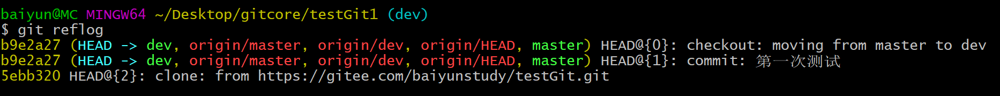


## 使用码云配置远程仓库

> Github是有墙的，比较慢，在国内的话，我们一般使用Gitee ，公司中有时候会搭建自己的Gitlab服务器

这个其实可以作为大家未来找工作的一个重要信息！

1、注册登录码云，完善个人信息

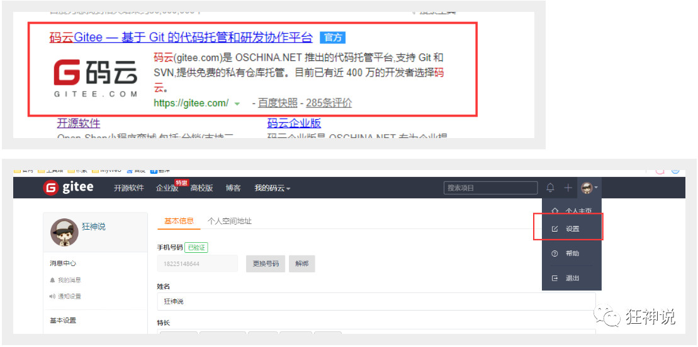

2、设置本机绑定SSH公钥，实现免密码登录！（免密码登录，这一步挺重要的，码云是远程仓库，我们是平时工作在本地仓库！)

```bash
# 进入 C:\Users\Administrator\.ssh 目录# 生成公钥ssh-keygen
# github ssh 配置
$ ssh-keygen -t rsa -C "1905470292@qq.com" -f "github_id_rsa"
# gitee  ssh 配置
$ ssh-keygen -t rsa -C "1905470292@qq.com" -f "gitee_id_rsa"
```

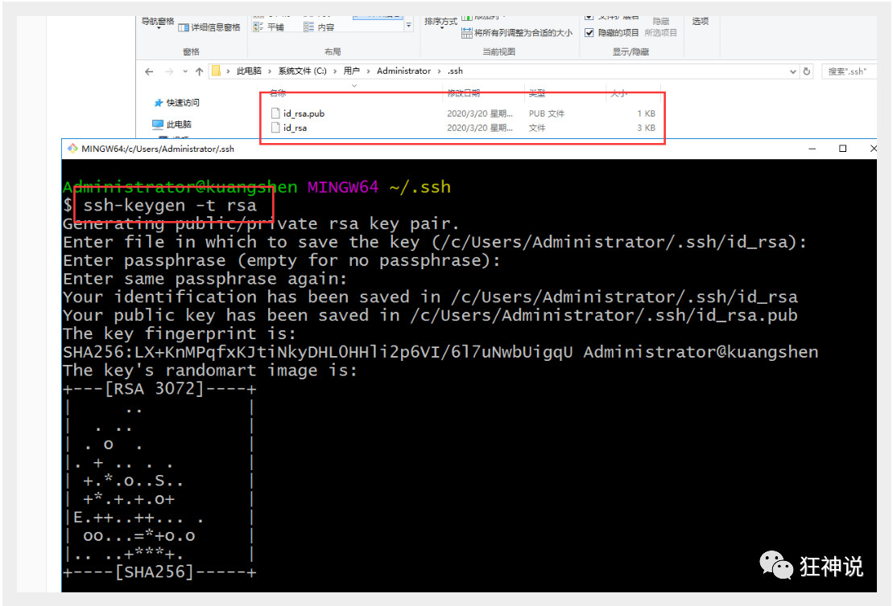

3、将公钥信息public key 添加到码云账户中即可！

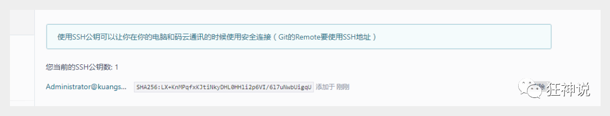

4、使用码云创建一个自己的仓库！

将码云的远程仓库与本地进行绑定！（`通过从远程仓库中获取的 .git文件夹` ）

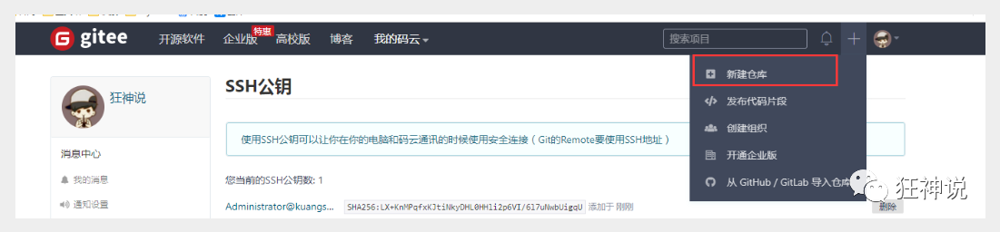

许可证：开源是否可以随意转载，开源但是不能商业使用，不能转载，...  限制！

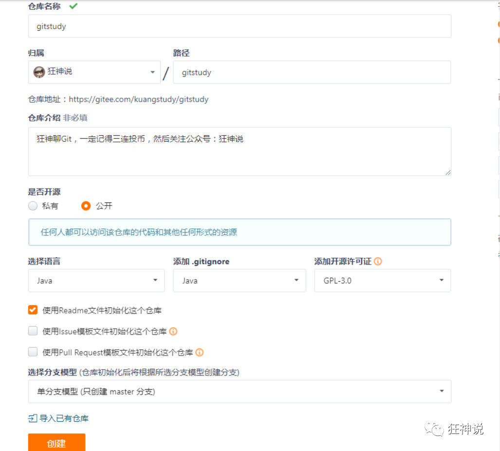

克隆到本地！

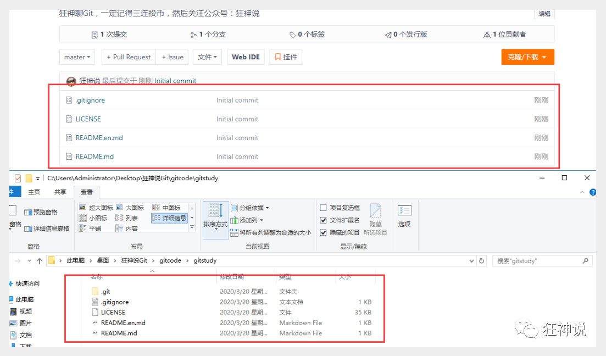


## <font color=red>在IDEA中使用Git</font>

1、新建项目，<font color=red>**通过从远程仓库中克隆的 .git文件夹 绑定到远程仓库。**</font>

因为在本地的 .git文件夹是从远程中克隆的，已经绑定了远程的仓库。


注意观察idea中的变化

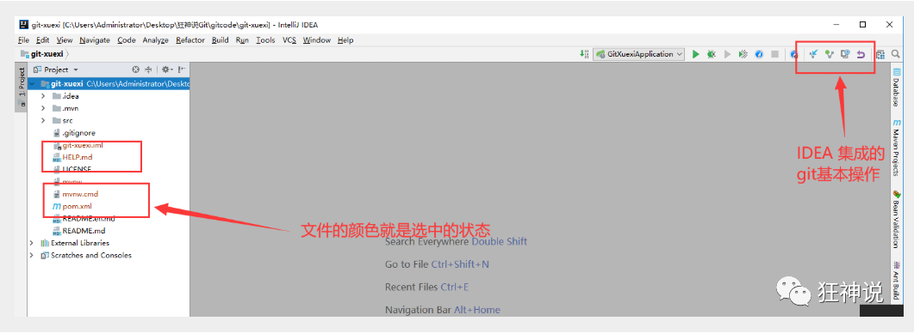

2、修改文件，使用IDEA操作git。

- 添加到暂存区			 `git add .`	
- commit 提交             `git commit	-m	"[commit message]"`
- push到远程仓库       `git push`

3、提交测试

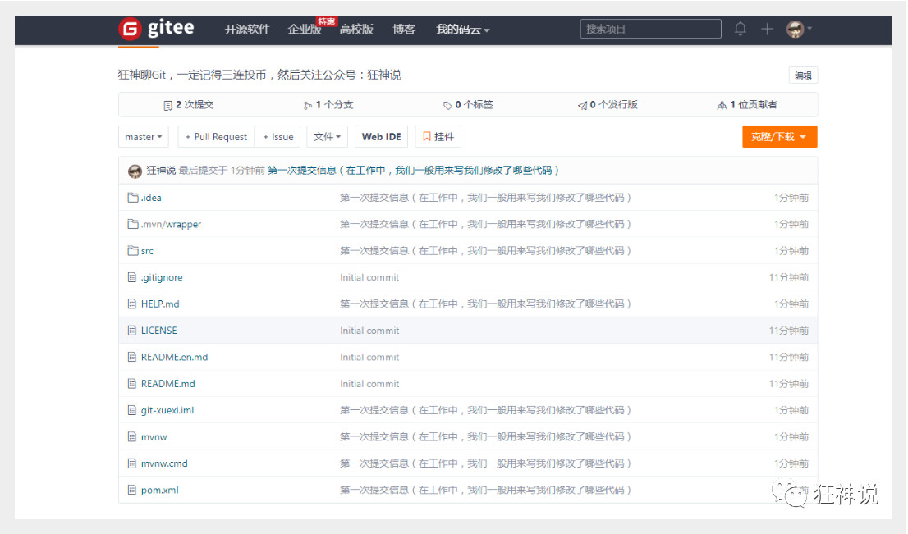

这些都是单个人的操作！


## <font color=red>说明</font>：GIT分支

分支在GIT中相对较难，分支就是科幻电影里面的平行宇宙，如果两个平行宇宙互不干扰，那对现在的你也没啥影响。不过，在某个时间点，两个平行宇宙合并了，我们就需要处理一些问题了！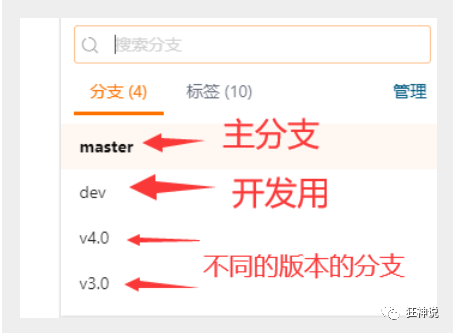

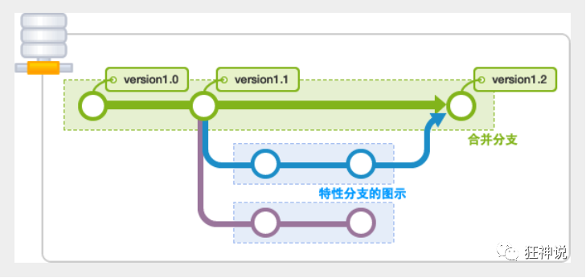

**git分支中常用指令：**

```bash
# 列出【所有本地分支】
$ git branch

# 列出【所有远程分支】
$ git branch -r

# 新建一个分支，但依然停留在当前分支
$ git branch [branch-name]

# 新建一个分支，并切换到该分支
$ git checkout -b [branch-name]
# 切换分支
$ git checkout [branch-name]

# 合并【指定分支】到【当前分支】
$ git merge [branch]

# 删除分支
$ git branch -d [branch-name]

# 删除远程分支
$ git push origin --delete [branch-name]
$ git branch -dr [remote/branch]


# 将dev这个分支提交到远程仓库上面。如果远程仓库没有这个分支，则会新建一个该分支。
# 也可以指定提交到远程仓库的某个分支上。
$ git push origin dev  		  	# 提交【本地分支 dev】及数据到远程仓库
$ git push origin dev:master  	# 将【本地分支 dev】的数据提交到【远程分支 master】上


# 拓展：!
# 如果不是首次提交，需要先执行git pull 合并远程分支的内容再执行git push提交，否则会提交失败：
$ git pull 				# 默认拉取整个远程仓库的内容
$ git pull origin dev 	# 拉取远程仓库的dev分支的内容
$ git fetch 			# 拉取远程仓库所有分支
```

IDEA中操作

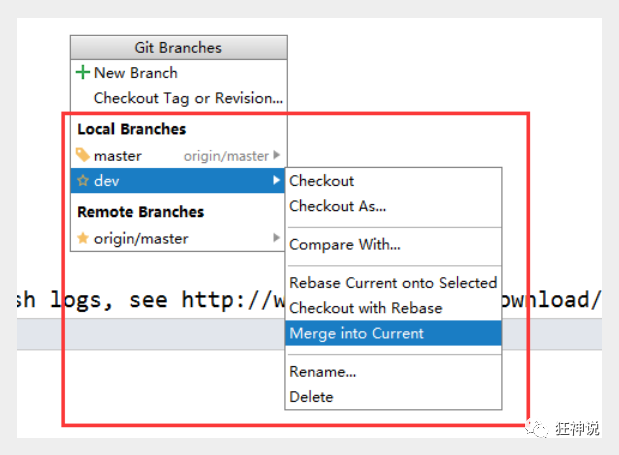

如果同一个文件在合并分支时都被修改了则会引起冲突：解决的办法是可以进行协商，修改冲突文件到达成一致后，重新提交！选择要保留他的代码还是你的代码！

<font color=red>master主分支应该非常稳定，用来发布新版本，一般情况下不允许在上面工作，工作一般情况下在新建的dev分支上工作，工作完后，比如上要发布，或者说dev分支代码稳定后可以合并到主分支master上来。</font>

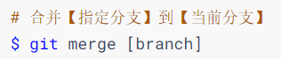


作业练习：找一个小伙伴，一起搭建一个远程仓库，来练习Git！

1、不要把Git想的很难，工作中多练习使用就自然而然的会了！

2、Git的学习也十分多，看完我的Git教程之后，可以多去思考，总结到自己博客！


