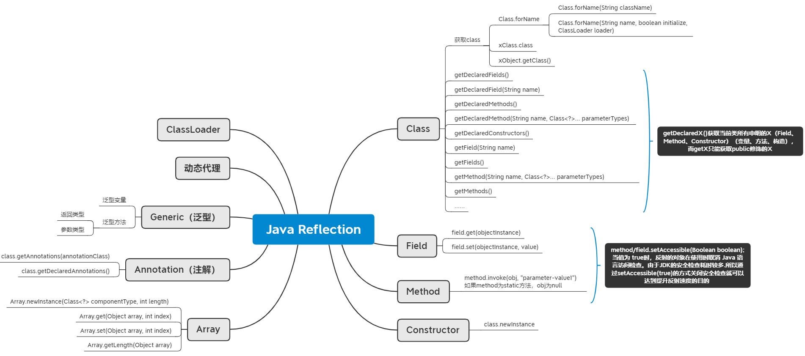

### 一、反射（reflection）

**反射机制**是指在运行状态中，对于任意一个类都能够知道这个类所有的属性和方法；并且对于任意一个对象，都能够调用它的任意一个方法；这种动态获取信息以及动态调用对象方法的功能成为 Java 语言的反射机制。



初始化研究对象，类的内容如下：

```java
// FatherObject
public class FatherObject {
    public void doSomething() {
        System.out.println("做事情......");
    }
}
```

```java
// ChildObject
public class ChildObject extends FatherObject {
    public int age = 22;
    public String name = "DingTao";
    private Integer score = 100;

    public void printName(){
        System.out.println(name);
    }

    public int getAge() {
        return age;
    }

    public void setAge(int age) {
        this.age = age;
    }

    public String getName() {
        return name;
    }

    public void setName(String name) {
        this.name = name;
    }

    public Integer getScore() {
        return score;
    }

    public void setScore(Integer score) {
        this.score = score;
    }

    public ChildObject(){

    }
    
    public ChildObject(String name){

    }
    
    public ChildObject(int age,Integer score){

    }

    @Override
    public void doSomething() {
        super.doSomething();
    }
}
```

```java
//GenericObject

import java.util.List;

public class GenericObject {
    public List<ChildObject> childObjects;

    public List<ChildObject> getChildObjects() {
        return childObjects;
    }

    public void setChildObjects(List<ChildObject> childObjects) {
        this.childObjects = childObjects;
    }

    public GenericObject(List<ChildObject> childObjects) {
        this.childObjects = childObjects;
    }
}

```


#### 1.1 Class对象

1. 如果该对象已经实例化

```java
 Class<? extends ChildObject> clz1 = childObject.getClass();
```

2. 知道Class的名字

```java
Class<ChildObject> clz2 = ChildObject.class;
```

3. 如果在编写代码的时候，不知道类的名字，但是在运行时的时候，可以得到一个类名的字符串，可以用如下的方式获取Class对象：

```java
// Class.forName (String name, boolean initialize, ClassLoader loader)
Class<?> clz3 = Class.forName("com.dingtao.reflection.ChildObject");
// 相当于
Class<?> clz4 = Class.forName("com.dingtao.reflection.ChildObject", true, new ClassLoader() {});
```

注意，此方法需要有2个条件，第一，forName中的字符串必须是全限定名，第二，这个Class类必须在classpath的路径下面，否则该方法会抛出`ClassNotFoundException`的异常。


#### 1.2 类名、包名、父类及实现接口

```java
// 获取全限定名
String className = clz1.getName();
// 获取类名
String simpleName = clz1.getSimpleName();
System.out.println(className); // com.dingtao.reflection.ChildObject
System.out.println(simpleName); // ChildObject
// 获取包
Package packageName = clz1.getPackage();
System.out.println(packageName.getName()); // com.dingtao.reflection
// 获取父类
Class<?> superClass = clz1.getSuperclass();
System.out.println(superClass.getSimpleName()); // FatherObject
int modifiers = superClass.getModifiers();
// 判断是否是abstart类
System.out.println("父类是不是抽象类 " + Modifier.isAbstract(modifiers)); // true
```

getModifiers可以得到类的修饰符，当然，这个getModifiers不仅仅Class对象可以调用，Method对象可以调用。 可以使用java.lang.reflect.Modifier类中的方法来检查修饰符的类型：

```java
Modifier.isAbstract(int modifiers);
Modifier.isFinal(int modifiers);
Modifier.isInterface(int modifiers);
Modifier.isNative(int modifiers);
Modifier.isPrivate(int modifiers);
Modifier.isProtected(int modifiers);
Modifier.isPublic(int modifiers);
Modifier.isStatic(int modifiers);
Modifier.isStrict(int modifiers);
Modifier.isSynchronized(int modifiers);
// 是否未被序列化
Modifier.isTransient(int modifiers);
Modifier.isVolatile(int modifiers);
```

此外，我们还可以得到父类实现的接口

```java
// 获取接口
Class[] classes = superClass.getInterfaces();
System.out.println("父类的接口" + classes[0]); // 父类的接口interface java.lang.Runnable
```

#### 1.3 构造器（Constructor）

利用Java反射可以得到一个类的构造器，并根据构造器，在运行时动态的创建一个对象。首先，Java通过以下方式获取构造器的实例：

```java
 //构造器
Constructor<?>[] constructors = clz1.getConstructors();
for (Constructor constructor:constructors) {
    System.out.println(constructors.toString());
}
```

结果如下：

```
public com.dingtao.reflection.ChildObject(java.lang.String)
public com.dingtao.reflection.ChildObject(int,java.lang.Integer)
public com.dingtao.reflection.ChildObject()
```

如果，事先知道要访问的构造方法的参数类型，可以利用如下方法获取指定的构造方法，例子如下：

```java
// 根据方法的参数获取构造函数
Constructor<? extends ChildObject> constructor = clz1.getConstructor(String.class);
System.out.println(constructor.toString()); 
```

结果显然是:

```
public com.dingtao.reflection.ChildObject(java.lang.String)
```

此外，如果我们不知道构造器的参数，只能得到所有的构造器对象，那么可以用如下方式得到每一个构造器对想的参数：

```java
for (Constructor constructor2 : constructors){
    Class[] parameterTypes = constructor2.getParameterTypes();
    System.out.println("构造器参数如下========================");
    for (Class clz : parameterTypes){
        System.out.println("参数类型 " + clz.toString());
    }
}
```

结果如下：

```
构造器参数如下========================
构造器参数如下========================
参数类型 class java.lang.String
构造器参数如下========================
参数类型 int
参数类型 class java.lang.Integer
```

这里，可以看出无参构造方法，是不打印出结果的。基本类型的Class对象和引用类型的Class对象toString()方法是不一样的。 现在，可以根据构造器的各种信息，动态创建一个对象。

```java
// 获取全部构造器，用数组下标的形式获取相应的构造器。但每次运行时，构造器的顺序都会改变。所以这样操作可能会导致报IllegalArgumentException错误。
Object object = constructors[2].newInstance(1,100);
System.out.println(object.toString());
// 必须采用这样的形式，先通过构造方法相应的参数类型获取构造器，再通过newInstance创建对象。
Constructor<? extends ChildObject> constructor1 = clz1.getConstructor(int.class, Integer.class);
Object object2 = constructor1.newInstance(1,100);
System.out.println(object2.toString());
```

这个创建对象的方式有2个条件，第一是通过有参构造器创建的，第二，构造器对象必须通过传入参数信息的getConstructor得到。 第一个条件，对于无参构造方法就可以创建的对象，不需要得到构造器对象，直接Class对象调用newInstance()方法就直接创建对象。 第二个条件，构造器对象必须通过`clz1.getConstructor(int.class, Integer.class);`这种形式得到。如果通过`getConstructors`得到构造器数组，然后调用指定的构造器对象去创建对象可能会报错。

#### 1.4 变量（Field）

利用Java反射可以在运行时得到一个类的变量信息，并且可以根据上面讲的方式，创建一个对象，设置他的变量值。首先，通过如下方法，得到所有public的变量：

```java
Field[] fields = clz1.getFields();
for (Field field : fields) {
    System.out.println("变量："+field.getName());
}
```

结果如下：

```
变量：public int com.dingtao.reflection.ChildObject.age
变量：public java.lang.String com.dingtao.reflection.ChildObject.name
```

很显然，得到的都是public的变量，上述的private的变量score，并没有得到。 和构造器一样的得到方式一样，我们可以指定一个参数名，然后得到指定的变量：

```
 Field age = clz1.getField("age");
```

反射不仅提供了得到变量的方法，还提供了设置变量值的方式。通过如下方法可以对一个动态生成的类，改变其变量值：

```java
// Object object2 = constructor1.newInstance(1,100);
ChildObject childObject1 = (ChildObject) object2;
System.out.println("修改前："+childObject1.getAge());
age.set(childObject1,10);
System.out.println("修改后："+childObject1.getAge()); // 修改前：22 修改后：10
```

结果如下：

```
修改前：22 
修改后：10
```

根据上面的代码，得到名为age的Field对象，然后调用该对象的set方法，传入一个对象和要更改的值，就可以改变该对象的相应变量的值。注意，此方法不仅仅对成员变量有用，对静态变量也可以。当然，如果是静态变量，传入null，不用传对象，也是可以的。

#### 1.5 方法（Method）

Java反射给我们除了给我们提供类的变量信息之外，当然也给我们提供了方法的信息，反射可以让我们得到方法名，方法的参数，方法的返回类型，以及调用方法等功能。 

1. 获取方法

- class.getMethods()

  ```java
  Method[] methods = clz1.getMethods();
  for (Method method : methods) {
      System.out.print(method.getName() + " ");
  }
  ```

  返回结果：

  ```
  run getName setName getAge printName setAge setScore doSomething getScore wait wait wait equals toString hashCode getClass notify notifyAll getScore
  ```

- class.getMethod(String name, Class\<?>... parameterTypes)

```java
  Method method = clz1.getMethod("getScore");
  System.out.println(method.getName());
  Method method2 = clz1.getMethod("setScore",Integer.class);
  System.out.println(method2.getName());
```

返回结果：

  ```
  getScore
  setScore
  ```

2. 获取方法参数

- method.getParameterTypes

  ```java
  Class<?>[] parameterTypes = method2.getParameterTypes();
  for (Class<?> parameterType : parameterTypes) {
      System.out.println(parameterType.getName());
  }
  ```

  返回结果：

  ```
  java.lang.Integer
  ```

3. 获取方法返回类型

- method.getReturnType()

  ```java
  Class<?> returnType = method2.getReturnType();
  System.out.println(returnType.getName());
  ```

  返回结果：

  ```
  void
  ```

4. 调用方法

- method.invoke(obj, "parameter-value1") 

  invoke第一个参数是该方法所在类的实例化对象，第二个参数是变长数组，传入该方法的参数。如果method为static方法，obj为null。

  ```java
  // 调用childObject1对象的setScore方法，设置score的值为4
  Object invoke = method2.invoke(childObject1, 4);
  System.out.println(childObject1.getScore());
  ```

  返回结果：

  ```
  4
  ```

  

#### 1.6 私有变量与私有方法

上面的方法只能得到public方法和变量，无法得到非public修饰的方法和变量，Java提供了额外的方法来得到非public变量与方法。即通过`getDeclaredFields`与`getDeclaredMethods`方法得到私有的变量与方法，同样也支持用`getDeclaredField（变量名）`与`getDeclaredMethod（方法名)`的形式得到指定的变量名与方法名。但是这样得到的Field对象与Method对象无法直接运用，必须让这些对象调用setAccessible(true),才能正常运用。之后的方式就可上面讲的一样了。

- method/field.setAccessible(Boolean boolean)

  当值为 true时，反射的对象在使用时取消 Java 语言访问检查。由于JDK的安全检查耗时较多.所以通过setAccessible(true)的方式关闭安全检查就可以达到提升反射速度的目的 

#### 1.7 注解

先写一个包含注解的类：

```java
MyAnnotation(name="byhieg",value = "hello world")
public class AnnotationObject {

    @MyAnnotation(name="field",value = "变量")
    public String field;

    @MyAnnotation(name="method",value = "方法")
    public void doSomeThing(){
        System.out.println("做一些事情");
    }

    public void doOtherThing(@MyAnnotation(name="param",value = "参数") String param){

    }
}

@Retention(RetentionPolicy.RUNTIME)
public @interface MyAnnotation {
    public String name();
    public String value();

}
```

Java给我们提供了在运行时获取类的注解信息，可以得到类注解，方法注解，参数注解，变量注解。 与上面获取方式一样，Java提供了2种获取方式，一种是获取全部的注解，返回一个数组，第二种是指定得到指定的注解。 我们以一个类注解为例，讲解以下这两种获取方式。

```java
 Class clz = AnnotationObject.class;
 Annotation[] annotations = clz.getAnnotations();
 Annotation annotation = clz.getAnnotation(AnnotationObject.class);
```

然后，就可以根据得到的注解进行后续的处理，下面是一个处理的例子:

```java
 for (Annotation annotation : annotations){
	if (annotation instanceof MyAnnotation){
		MyAnnotation myAnnotation = (MyAnnotation)annotation;
		System.out.println("name: " + myAnnotation.name());
		System.out.println("value:" + myAnnotation.value());
	}
}
```

上面的类注解使用Class对象调用`getAnnotations`得到的，方法注解和变量注解是一样的，分别用method对象与field对象调用`getDeclaredAnnotations`得到注解，没什么多说的。例子看[反射代码](https://github.com/byhieg/JavaTutorial/tree/master/src/main/java/cn/byhieg/reflectiontutorial) 参数注解是比较麻烦的一项，获取方式比较得到，第一步，先取得method对象，调用`getParameterAnnotations`，但是这个返回值是一个二维数组，因为method对象有很多参数，每个参数有可能有很多注解。例子如下：

```java
Method method1 = clz.getMethod("doOtherThing",String.class);
Annotation[][] annotationInParam = method1.getParameterAnnotations();
Class[] params = method1.getParameterTypes();
int i = 0;
for (Annotation[] annotations: annotationInParam){
	Class para = params[i++];
	for (Annotation annotation : annotations){
		if(annotation instanceof MyAnnotation){
			MyAnnotation myAnnotation = (MyAnnotation) annotation;
			System.out.println("param: " + para.getName());
			System.out.println("name : " + myAnnotation.name());
			System.out.println("value :" + myAnnotation.value());
		}

	}
}
```

#### 1.8 泛型

因为Java泛型是通过擦除来实现的，很难直接得到泛型具体的参数化类型的信息，但是我们可以通过一种间接的形式利用反射得到泛型信息。比如下面这个类：

```java
public class GenericObject {
    public List<String> lists;

    public List<String> getLists() {
        return lists;
    }

    public void setLists(List<String> lists) {
        this.lists = lists;
    }
}
```

如果一个方法返回一个泛型类，我们可以通过method对象去调用`getGenericReturnType`来得到这个泛型类具体的参数化类型是什么。看下面的代码：

```java
Class clz = GenericObject.class;
Method method = clz.getMethod("getLists");
Type genericType = method.getGenericReturnType();
if(genericType instanceof ParameterizedType){
	ParameterizedType parameterizedType = ((ParameterizedType) genericType);
	Type[] types = parameterizedType.getActualTypeArguments();
	for (Type type : types){
		Class actualClz = ((Class) type);
		System.out.println("参数化类型为 ： " + actualClz);
	}
}
```

结果如下：

```
参数化类型为 ： class java.lang.String
```

步骤有点繁琐，下面一步步解释：

1. 反射得到返回类型为泛型类的方法
2. 调用`getGenericReturnType`得到方法返回类型中的参数化类型
3. 判断该type对象能不能向下转型为`ParameterizedType`
4. 转型成功，调用`getActualTypeArguments`得到参数化类型的数组，因为有的泛型类，不只只有一个参数化类型如Map<K，V>
5. 取出数组中的每一个的值，转型为Class对象输出。

看结果确实得到了泛型的具体的信息。 如果没有一个方法返回泛型类型，那么我们也可以通过方法的参数为泛型类，来得到泛型的参数化类型，如上面类中的setLists方法。例子如下：

```java
Method setMethod = clz.getMethod("setLists", List.class);
Type[] genericParameterTypes = setMethod.getGenericParameterTypes();
for (Type genericParameterType: genericParameterTypes){
	System.out.println("GenericParameterTypes为 ： " + genericParameterType.getTypeName());
	if(genericParameterType instanceof ParameterizedType){
		ParameterizedType parameterizedType = ((ParameterizedType) genericParameterType);
		System.out.println("ParameterizedType为 :" + parameterizedType.getTypeName());
		Type types[] = parameterizedType.getActualTypeArguments();
		for (Type type : types){
			System.out.println("参数化类型为 ： " + ((Class) type).getName());
		}
	}

}
```

执行的结果如下：

```
GenericParameterTypes为 ： java.util.List<java.lang.String>
ParameterizedType为 :java.util.List<java.lang.String>
参数化类型为 ： java.lang.String
```

因为方法的参数为泛型类型的可能不止一个，所以通过`getGenericParameterTypes`得到是一个数组，我们需要确定每一个元素，是否是具有参数化类型。后续的步骤与上面类似，就不多说了。 如果连方法参数都不带泛型类，那么只剩下最后一种情况，通过变量类型，即用Field类。例子如下：

```java
Field field = clz.getField("lists");
Type type = field.getGenericType();
if (type instanceof ParameterizedType){
	ParameterizedType parameterizedType = ((ParameterizedType) type);
	Type [] types = parameterizedType.getActualTypeArguments();
	for (Type type1 : types) {
		System.out.println("参数化类型 ： " + ((Class) type1).getTypeName());
	}
}
```

原理和上面的一样，只不过Type对象是通过`field.getGenericType()`，剩下的操作类似就不多说了。 关于通过反射获取泛型的参数化类型的信息的介绍就到此为止。

#### 1.9 数组

Java反射可以对数组进行操作，包括创建一个数组，访问数组中的值，以及得到一个数组的Class对象。 下面，先说简单的，创建数组以及访问数组中的值：在反射中使用Array这个类，是reflect包下面的。

```java
//创建一个int类型的数组，长度为3
int[] intArray = (int[])Array.newInstance(int.class,3);
//通过反射的形式，给数组赋值
for (int i = 0 ;i < intArray.length;i++){
	Array.set(intArray,i,i + 2);
}
//通过反射的形式，得到数组中的值
for (int i = 0 ; i < intArray.length;i++){
	System.out.println(Array.get(intArray,i));
}
```

上述就是创建数组，访问数组中的值利用反射方式。 对于得到一个数组的Class对象，简单的可以用`int[].class`，或者利用Class.forName的形式得到，写法比较奇怪：

```java
 Class clz = Class.forName("[I");
 System.out.println(clz.getTypeName());
```

结果为：

```
int[]
```

这个forName中的字符串，`[`表示是数组，`I`表示是int，float就是`F`，double就是`D`等等，如果要得到一个普通对象的数组，则用下面的形式：

```java
  Class stringClz = Class.forName("[Ljava.lang.String;");
```

`[`表示是数组,`L`的右边是类名，类型的右边是一个`；`； 这种方式获取数组的Class对象实在是太繁琐了。 在得到数组的Class对象之后，就可以调用他的一些独特的方法，比如调用`getComponentType`来得到数组成员的类型信息，如int数组就是成员类型就是int。

```java
System.out.println(clz.getComponentType().getTypeName());
```

结果为`int`

## 参考文献
1. https://github.com/byhieg/JavaTutorial/tree/master/src/main/java/cn/byhieg/reflectiontutorial