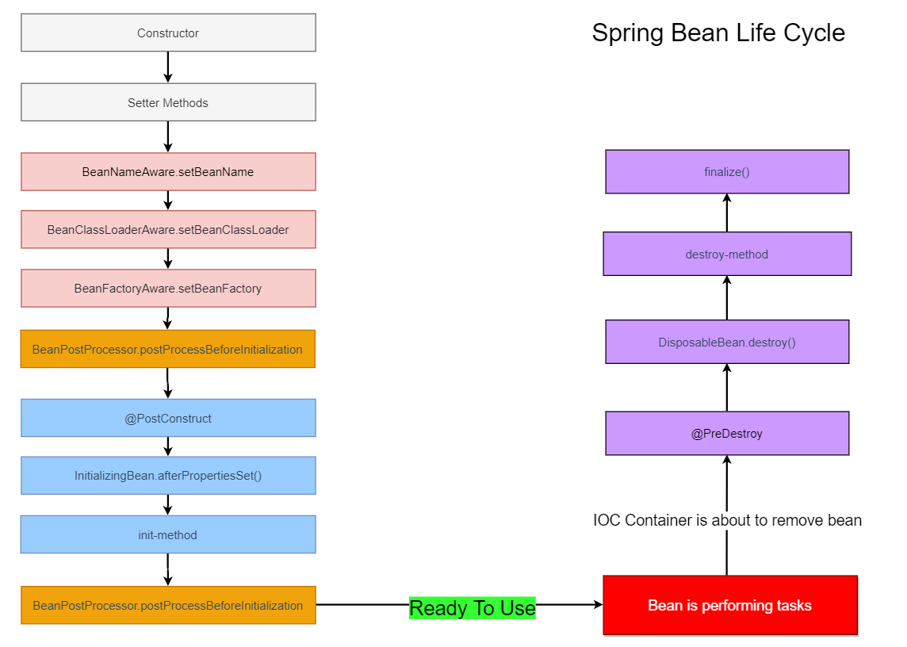

# Spring注解驱动开发

## 组件注册

> @Configuration ==配置类==

@Configuration用于标注配置类，配置类就等同以前的xml配置文件。

> @Bean  ==组件==

@Bean 相当于xml配置文件中的`<bean>`标签，告诉容器注册一个bean。

- @Bean注解的方法名，就是对应注入的`bean的id` 

- @Bean注解的返回值类型，就是对应注入的`bean的class` 

	如果我们不想要方法名来作为bean的id，我们可以在`@Bean`这个注解的value属性来进行指定。

```java
@Bean(value="personAlias")
public Person person() {
    return new Person();
}
```

> @FactoryBean  ==工厂bean==

- 获取工厂bean时，默认获取到的是工厂bean调用getObject创建的对象。

- 如果我们就想要获取这个工厂bean，可以在获取时加上前缀**`&`** 来获取工厂Bean本身。

> @ComponentScan：==自动扫描组件&指定扫描规则==

自动扫描组件：包扫描（`value`）：只要标注了@Controller、@Service、@Repository，@Component。

指定扫描规则：排除和包含指定组件

`excludeFilters = Filter[]`：指定在扫描的时候按照什么规则来排除哪些组件。

`includeFilters = Filter[]`：指定在扫描的时候，只需要包含哪些组件。

```java
@ComponentScan (value = "com.study", excludeFilters = {
        // 按照注解
        @ComponentScan.Filter (type = FilterType.ANNOTATION,classes = {Controller.class, Service.class}),
        // 按照给定的类型
        @ComponentScan.Filter (type = FilterType.ASSIGNABLE_TYPE,classes = BookService.class),
        // 自定义过滤规则
        @ComponentScan.Filter (type = FilterType.CUSTOM,classes = MyTypeFilter.class)
})
```


> @Scope  ==作用域==

`singleton`：单实例：IOC容器启动时会调用方法创建对象放到IOC容器中，

（默认）						以后每次获取都直接从IOC容器中获取。

`prototype`：多实例：IOC容器启动并不会调用方法创建对象放在容器中，

​											 每次获取的时候才会调用方法创建对象。

~~request~~：同一次请求创建一个实例    			 直接将实例放在请求域中即可。

~~session~~：同一个session创建的一个实例		直接将实例放在会话域中即可。

>@Lazy  懒加载

懒加载：是专门针对于`单实例的bean`的，单实例的bean默认是在容器启动的时候创建对象；

懒加载：容器启动的时候，不会创建对象，而是在第一次使用（获取）Bean的时候来创建对象，并进行初始化。


> @Conditional  ==条件判断注册==

`@Conditional作用`：按照一定的条件来进行判断，满足条件才交给容器注册。（SpringBoot底层源码中大量使用）

@Conditional的使用：使用实现的Condition类，进行条件判断。

创建Condition接口的实现类，重写macth方法，**`根据返回值判断是否注册。`**

- 当方法返回true时，这个Bean就能成功注册。
- 当方法返回false时，这个Bean就不会注册。

```java
// 使用Condition注解的前提，创建Condition接口的实现类
public class MyConditional implements Condition {

    @Override
    public boolean matches(
        ConditionContext context, 		// 判断条件使用的上下文(环境)
        AnnotatedTypeMetadata metadata	// 注释信息
    ) {
        return false;
    }
}
```


> @Import【快速给容器中导入一个组件】

- **`@Import`**（要导入容器中的组件），容器中就会自动的注册这个组件。

	注：注册 `bean的id` 默认是全类名。

- **`ImportSelector`**：自定义逻辑返回需要导入的组件。返回值为组件全类名的字符串数组。

  ImportSelector的使用：（SpringBoot底层源码中大量使用）

  ① 实现ImportSelector接口，重写方法，返回要导入组件的全类名的字符串数组。

  ② 使用@Import注解导入ImportSelector接口实现类。

  ```java
  public class MyImportSelector implements ImportSelector {
      /**
       * @param 	importingClassMetadata   当前标注@Import注解的类的所有注解信息
       * @return		String[]				要导入容器的组件的全类名
       */
      @Override
      public String[] selectImports(AnnotationMetadata importingClassMetadata) {
          return new String[]{"com.study.bean.Blue","com.study.bean.Yellow"};
      }
  }
  ```

- ImportBeanDefinitionRegistrar：使用BeanDefinitionRegistry（bean的注册类）手动注册bean到容器中。


## bean的生命周期

bean的生命周期：bean创建--->初始化--->销毁的过程

> 容器中bean的生命周期：

```java
构造（对象创建）
	单实例：在容器启动的时候创建对象
	多实例：在每次获取的时候创建对象

BeanPostProcessor.postProcessBeforeInitialization

@PostConstruct    

InitializingBean.afterPropertiesSet
    
初始化：对象创建完成，并赋值好，调用初始化方法。(init-method)

BeanPostProcessor.postProcessAfterInitialization

// Ready To Use

销毁：
	单实例：容器关闭的时候。
    多实例：容器不会管理这个bean；容器不会调用销毁方法；
```

> SpringBean的生命周期图解



在实际应用中，我们不可避免的要==用到 Spring 容器本身提供的资源==，这时候要让 Bean 主动意识到 Spring 容器的存在，才能调用 Spring 

所提供的资源，这就是 Spring Aware。其实 Spring Aware 是 Spring 设计为框架内部使用的，在大多数情况下，我们应该避免使用任何 

Aware 接口，除非我们需要它们，实现这些接口会将代码耦合到Spring框架。若使用了，你的 Bean 将会和 Spring 框架耦合。

> 容器管理bean的生命周期：自定义执行方法

自定义初始化和销毁方法，容器在bean进行到当前生命周期的时候来调用我们自定义的初始化和销毁方法。

方式一：通过@Bean注解指定`init-method`和`destroy-method` 

```java
@Bean (initMethod = "init", destroyMethod = "destroy")
```


方式二：通过让Bean类实现初始化和销毁接口：

- 实现`InitializingBean`，重写`afterPropertiesSet`方法，定义初始化逻辑，属性初始化完成后执行。

- 实现`DisposableBean`，重写`destroy`方法，定义销毁方法，IOC容器销毁时执行。


方式三：使用JSR250：

- `@PostConstruct`：在bean创建完成并且属性赋值完成后，来执行初始化方法。
- `@PreDestroy`：在容器销毁bean之前通知我们进行清理工作。


方式四：**`BeanPostProcessor`**：bean的后置处理器，在bean初始化前后进行一些处理工作。

- postProcessBeforeInitialization：在初始化之前工作

- postProcessAfterInitialization：在初始化之后工作

```java
@Component
public class MyBeanPostProcessor implements BeanPostProcessor {
    @Override
    public Object postProcessBeforeInitialization(Object bean, String beanName) throws BeansException {
        System.out.println("在初始化之前执行");
        return null;
    }

    @Override
    public Object postProcessAfterInitialization(Object bean, String beanName) throws BeansException {
        System.out.println("在初始化之后执行");
        return null;
    }
}
```


拓展：spring底层常用的BeanPostProcessor：

- ApplicationContextAwareProcessor：为bean设置IOC容器中对应的属性。
- BeanValidationPostProcessor：当对象创建完，给bean赋值后，将提交的数据与bean上对应的注解进行校验。
- InitDestroyAnnotationBeanPostProcessor：用来实现@PostConstruct，@PreDestroy方法的执行。
- AutowiredAnnotationBeanPostProcessor：用来实现@Autowired注解的功能。


## 属性赋值

> 使用`@Value`赋值

1、基本数值

2、可以写SpEL； `#{}`

3、可以写`${}`；取出配置文件【properties】中的值（在运行环境变量里面的值）

> `@PropertySource`：

读取外部配置文件中的k/v保存到运行环境中，结合@value使用。

```java
@PropertySource(value = {"classpath:person.properties"})
```


## 自动装配

Spring利用依赖注入（DI）完成对IOC容器中各个组件的依赖关系赋值。

>`@Autowried` & `@Qualifier` & `@Primary` & `@Resource` & `@Inject` 

@Autowried 装配优先级如下：

- 使用按照类型去容器中找对应的组件
- 按照属性名称去作为组件id去找对应的组件

@Qualifier:指定默认的组件,结合@Autowried使用

- 标注在构造器：spring创建对象调用构造器创建对象
- &标注在方法上

@Primary：spring自动装配的时候，默认首先bean，配合@Bean使用。

@Resource(JSR250):jsr规范:按照组件名称进行装配。

@Inject(JSR330)：jsr规范和@Autowired功能一致，不支持require=false。

> `@Profile`根据环境注册bean

@Profile：Spring为我们提供的可以根据当前的环境，动态的激活和切换一系列组件的功能。

@Profile: 指定组件在哪个环境下才能被注册到容器中，没指定的在任何环境都能注册这个组件。

- 加了环境标识的bean，只有这个环境被激活的时候才能注册到容器中。

	默认是default环境，如果指定了default，那么这个bean默认会被注册到容器中。

- @Profile 写在配置类上，只有是指定的环境，整个配置类里面的所有配置才能开始生效。

- 没有标注环境标识的bean，在任何环境都是加载的。
	


## AOP原理

AOP原理：看给容器中注册了哪些组件，这个组件什么时候工作，这个组件的功能是什么？

我们从`@EnableAspectJAutoProxy`这个注解入手：

```java
@Import(AspectJAutoProxyRegistrar.class)
public @interface EnableAspectJAutoProxy {}
```

在这个注解源码类里面标注了@Import（AspectJAutoProxyRegistrar.class）给容器中导入`AspectJAutoProxyRegistrar`（自动代理注册器）

自定义的给容器中注册bean，给容器中注册一个`AnnotationAwareAspectJAutoProxyCreator`（基于注解的切面自动代理创建器）。

### 注册AnnotationAwareAspectJAutoProxyCreator

 流程：

1. 传入配置类，创建ioc容器

2. 注册配置类，调用refresh（）刷新容器，初始化容器

3. registerBeanPostProcessors(beanFactory)，注册bean的后置处理器来方便拦截bean的创建：

	  1. 先获取ioc容器已经定义了的需要创建对象的所有BeanPostProcessor

	  2. 给容器中加别的BeanPostProcessor

	  3. 优先注册实现了PriorityOrdered接口的BeanPostProcessor；

	  4. 再给容器中注册实现了Ordered接口的BeanPostProcessor；

	  5. 注册没实现优先级接口的BeanPostProcessor；

	  6. 注册BeanPostProcessor，实际上就是创建BeanPostProcessor对象，保存在容器中；

		创建internalAutoProxyCreator的BeanPostProcessor【AnnotationAwareAspectJAutoProxyCreator】

		   1. 创建Bean的实例
		   2. populateBean；给bean的各种属性赋值
		   3. initializeBean：初始化bean；
			   1. invokeAwareMethods()：处理Aware接口的方法回调
			   2. applyBeanPostProcessorsBeforeInitialization()：应用后置处理器的postProcessBeforeInitialization（）
			   3. invokeInitMethods()；执行自定义的初始化方法
			   4. applyBeanPostProcessorsAfterInitialization()；执行后置处理器的postProcessAfterInitialization（）
		   4. BeanPostProcessor(AnnotationAwareAspectJAutoProxyCreator)创建成功；---> aspectJAdvisorsBuilder

	7. 把BeanPostProcessor注册到BeanFactory中；beanFactory.addBeanPostProcessor(postProcessor)。

  	==以上是创建和注册AnnotationAwareAspectJAutoProxyCreator的过程。==


### 创建AOP代理

AnnotationAwareAspectJAutoProxyCreator【InstantiationAwareBeanPostProcessor】	的作用：

1. 每一个bean创建之前，调用`postProcessBeforeInstantiation()`；

	关心MathCalculator和LogAspect的创建

	1. 判断当前bean是否在advisedBeans中（保存了所有需要增强bean）
	2. 判断当前bean是否是基础类型的Advice、Pointcut、Advisor、AopInfrastructureBean，
		或者是否是切面（@Aspect）
	3. 是否需要跳过
		1. 获取候选的增强器（切面里面的通知方法）【List<Advisor> candidateAdvisors】
			每一个封装的通知方法的增强器是 InstantiationModelAwarePointcutAdvisor；
			判断每一个增强器是否是 AspectJPointcutAdvisor 类型的；返回true
		2. 永远返回false

2. 创建对象 `postProcessAfterInitialization`；
	return `wrapIfNecessary(bean, beanName, cacheKey)`；包装如果需要的情况下

	1. ==获取当前bean的所有增强器（通知方法）==  Object[]  specificInterceptors

		1. 找到候选的所有的增强器（找哪些通知方法是需要切入当前bean方法的）
		2. 获取到能在bean使用的增强器。
		3. 给增强器排序

	2. 保存当前bean在advisedBeans中。

	3. 如果当前bean需要增强，创建当前bean的代理对象。

		1. 获取所有增强器（通知方法）

		2. 保存到proxyFactory

		3. 创建代理对象：Spring自动决定

			JdkDynamicAopProxy(config)：jdk动态代理，

			ObjenesisCglibAopProxy(config)：cglib的动态代理。

	4. 给容器中返回当前组件使用cglib增强了的代理对象。

	5. 以后容器中获取到的就是这个组件的代理对象，执行目标方法的时候，代理对象就会执行通知方法的流程。


## 扩展原理

### BeanFactoryPostProcessor

> BeanFactoryPostProcessor认识

```java
BeanFactoryPostProcessor: 获取和修改bean的配置信息和元数据
```

`BeanPostProcessor`：bean的后置处理器，用于bean创建对象初始化前后进行拦截工作的。

`BeanFactoryPostProcessor`：BeanFactory的后置处理器，在BeanFactory的标准初始化之后调用。

所有bean的定义已经保存加载到BeanFactory，但是bean的实例还未创建。

> BeanFactoryPostProcessor 原理：

- ioc容器创建对象

- invokeBeanFactoryPostProcessors(beanFactory)

	如何找到所有的BeanFactoryPostProcessor并执行他们的方法：

	- 直接在BeanFactory中找到所有类型是BeanFactoryPostProcessor的组件，并执行他们的方法。
	- 在初始化创建其他组件前面执行。


### BeanDefinitionRegistryPostProcessor

> BeanDefinitionRegistryPostProcessor认识

```java
BeanDefinitionRegistryPostProcessor：对bean进行增删查
```

BeanDefinitionRegistryPostProcessor extends BeanFactoryPostProcessor

`postProcessBeanDefinitionRegistry()`：

- 在所有bean定义信息将要被加载，bean实例还未创建的；
	- 优先于BeanFactoryPostProcessor执行；
	- 利用BeanDefinitionRegistryPostProcessor给容器中再额外添加一些组件；

> BeanDefinitionRegistryPostProcessor 原理：

1. ioc创建对象
2. `refresh()` - - - - >  ==invokeBeanFactoryPostProcessors(beanFactory)==；
3. 从容器中获取到所有的BeanDefinitionRegistryPostProcessor组件。
	1. 依次触发所有的postProcessBeanDefinitionRegistry()方法。
	2. 再来触发postProcessBeanFactory()方法BeanFactoryPostProcessor。
4. 再来从容器中找到BeanFactoryPostProcessor组件；然后依次触发postProcessBeanFactory()方法


### ApplicationListener

> ApplicationListener认识

ApplicationListener：监听容器中发布的事件，事件驱动模型开发。

```java
public interface ApplicationListener<E extends ApplicationEvent>
```

监听 ApplicationEvent 及其下面的子事件。

> 使用步骤：

1. 写一个监听器（ApplicationListener实现类）来监听某个事件（ApplicationEvent及其子类）

	或使用注解：`@EventListener`

	原理：使用EventListenerMethodProcessor处理器来解析方法上的@EventListener；

2. 把监听器加入到容器；

3. 只要容器中有相关事件的发布，我们就能监听到这个事件；

	ContextRefreshedEvent：容器刷新完成（所有bean都完全创建）会自动发布这个事件；

	ContextClosedEvent：关闭容器时会自动发布这个事件...

4. 发布一个事件：`applicationContext.publishEvent()；`


> 原理：

ContextRefreshedEvent、IOCTest_Ext$1[source=我发布的时间]、ContextClosedEvent；

1. ContextRefreshedEvent事件：
	1. 容器创建对象：refresh()；
	2. `finishRefresh()`：==容器刷新完成会发布ContextRefreshedEvent事件==；
2. 自己发布事件；
3. 容器关闭会发布ContextClosedEvent；


【事件发布流程】：

```java
publishEvent(new ContextRefreshedEvent(this));
```

1. 获取事件的多播器（派发器）：getApplicationEventMulticaster()

2. `multicastEvent`派发事件：

3. 获取到所有的ApplicationListener；

	```java
	for (final ApplicationListener<?> listener : getApplicationListeners(event, type)) {}
	```

	1. 如果有Executor，可以支持使用Executor进行异步派发；
		Executor executor = getTaskExecutor();

	2. 否则，同步的方式直接执行listener方法；invokeListener(listener, event)；

		拿到listener回调onApplicationEvent方法。

		

【事件多播器（派发器）】

1. 容器创建对象：refresh()；

2. initApplicationEventMulticaster()：初始化ApplicationEventMulticaster；

	1. 先去容器中找有没有id=“applicationEventMulticaster”的组件；

	2. 如果没有this.applicationEventMulticaster = new SimpleApplicationEventMulticaster(beanFactory)；

		并且加入到容器中，我们就可以在其他组件要派发事件，自动注入这个applicationEventMulticaster。

		

【容器中有哪些监听器】

1. 容器创建对象时：refresh()

2. `registerListeners()`：==注册监听器==

	```java
	// 从容器中拿到所有的监听器，把他们注册到applicationEventMulticaster中；
	String[] listenerBeanNames = getBeanNamesForType(ApplicationListener.class, true, false);
	
	// 将 listener 注册到 ApplicationEventMulticaster 中
	getApplicationEventMulticaster().addApplicationListenerBean(listenerBeanName);
	```

	

SmartInitializingSingleton 原理：- - - - >  `afterSingletonsInstantiated()` ；

1. ioc容器创建对象并refresh()；

2. `finishBeanFactoryInitialization(beanFactory)`：==初始化剩下的单实例bean：==

	1. 先创建所有的单实例bean，getBean()；

	2. 获取所有创建好的单实例bean，判断是否是SmartInitializingSingleton类型的，

		如果是就调用afterSingletonsInstantiated()。


## Spring容器的创建过程

Spring容器的`refresh()`【创建刷新==(初始化)==】

> BeanFactory预准备工作：==容器创建前的预处理==

```java
1、prepareRefresh(): 刷新前的预处理;
	1）initPropertySources()初始化一些属性设置;子类自定义个性化的属性设置方法；
	2）getEnvironment().validateRequiredProperties();检验属性的合法等
	3）earlyApplicationEvents= new LinkedHashSet<ApplicationEvent>();保存容器中出现的一些早期的事件。
        
2、obtainFreshBeanFactory(): 获取BeanFactory:
	1）refreshBeanFactory(): 刷新【创建】BeanFactory:
			创建了一个this.beanFactory = new DefaultListableBeanFactory();
			setSerializationId(getId());设置序列化id;
	2）getBeanFactory(): 返回刚才创建好的BeanFactory对象【DefaultListableBeanFactory】。

3、prepareBeanFactory(beanFactory): BeanFactory的预准备工作（BeanFactory进行一些设置）；
	1）设置BeanFactory的类加载器、支持表达式解析器...
	2）添加部分BeanPostProcessor【ApplicationContextAwareProcessor】
	3）设置忽略的自动装配的接口EnvironmentAware、EmbeddedValueResolverAware、xxx。
	4）注册可以解析的自动装配: 我们能直接在任何组件中自动注入: 
		BeanFactory、ResourceLoader、ApplicationEventPublisher、ApplicationContext
	5）添加BeanPostProcessor【ApplicationListenerDetector】
	6）添加编译时的AspectJ支持
	7）给BeanFactory中注册了一些的组件；
		environment【ConfigurableEnvironment】、
		systemProperties【Map<String, Object>】、
		systemEnvironment【Map<String, Object>】
                
4、postProcessBeanFactory(beanFactory): BeanFactory准备工作完成后进行的后置处理工作;
	1）子类通过重写这个方法,来在BeanFactory创建并预准备完成以后做进一步的设置。
```


>执行BeanFactoryPostProcessor：==实例化并调用所有已注册的 BeanFactoryPostProcessor 的方法==

```java
5、invokeBeanFactoryPostProcessors(beanFactory): 实例化并调用所有已注册的 BeanFactoryPostProcessor 的方法;
    BeanFactoryPostProcessor: BeanFactory的后置处理器。在BeanFactory标准初始化(预处理的工作)之后执行的;
    两个接口: BeanDefinitionRegistryPostProcessor	(子)
        	 BeanFactoryPostProcessor			   (父)
    
    1）执行BeanDefinitionRegistryPostProcessor的方法: @对bean进行增删查@
        1）获取所有的 BeanDefinitionRegistryPostProcessor;
        2）先执行实现了 PriorityOrdered优先级接口 的 BeanDefinitionRegistryPostProcessor、
        	postProcessor.postProcessBeanDefinitionRegistry(registry): 注册bean
        3）再执行实现了 Ordered顺序接口 的 BeanDefinitionRegistryPostProcessor;
        	postProcessor.postProcessBeanDefinitionRegistry(registry)
        4）最后执行没有实现任何优先级或者是顺序接口的 BeanDefinitionRegistryPostProcessors;
        	postProcessor.postProcessBeanDefinitionRegistry(registry)
    
   	2）再执行BeanFactoryPostProcessor的方法: @获取和修改bean的配置信息和元数据@
        1）获取所有的BeanFactoryPostProcessor
        2）看先执行实现了PriorityOrdered优先级接口的BeanFactoryPostProcessor、
        	postProcessor.postProcessBeanFactory()
        3）在执行实现了Ordered顺序接口的BeanFactoryPostProcessor；
        	postProcessor.postProcessBeanFactory()
        4）最后执行没有实现任何优先级或者是顺序接口的BeanFactoryPostProcessor；
        	postProcessor.postProcessBeanFactory()
```


>注册BeanPostProcessors：==注册BeanPostProcessor (Bean的后置处理器)==

```java
6、registerBeanPostProcessors(beanFactory): 注册BeanPostProcessor (Bean的后置处理器)【intercept bean creation】
	不同接口类型的 BeanPostProcessor,在Bean创建前后的执行时机是不一样的。
    BeanPostProcessor、
    DestructionAwareBeanPostProcessor、
    InstantiationAwareBeanPostProcessor、
    SmartInstantiationAwareBeanPostProcessor、
    MergedBeanDefinitionPostProcessor【internalPostProcessors】、

	1）获取所有的 BeanPostProcessor;后置处理器都默认可以通过PriorityOrdered、Ordered接口来执行优先级
	2）先注册PriorityOrdered优先级接口的BeanPostProcessor；
	   把每一个BeanPostProcessor;添加到BeanFactory中
	   beanFactory.addBeanPostProcessor(postProcessor);
	3）再注册Ordered接口的
	4）最后注册没有实现任何优先级接口的
	5）最终注册 MergedBeanDefinitionPostProcessor；
	6）注册一个ApplicationListenerDetector【监听器】: 来在Bean创建完成后检查是否是ApplicationListener，如果是
		applicationContext.addApplicationListener((ApplicationListener<?>) bean);
```


>初始化MessageSource：==初始化MessageSource组件（做国际化功能；消息绑定，消息解析）==

```java
7、initMessageSource(): 初始化MessageSource组件（做国际化功能；消息绑定，消息解析）
    1）获取BeanFactory
    2）看容器中是否有id为 messageSource 的，类型是MessageSource的组件
    	如果有赋值给messageSource，如果没有自己创建一个DelegatingMessageSource；
    MessageSource: 取出国际化配置文件中的某个key的值;能按照区域信息获取。
    3）把创建好的MessageSource注册在容器中,以后获取国际化配置文件的值的时候,可以自动注入 MessageSource:
	注册并注入MessageSource: 
    	beanFactory.registerSingleton(MESSAGE_SOURCE_BEAN_NAME, this.messageSource);
	获取国际化配置文件的值的时候:
		MessageSource.getMessage(String code, Object[] args, String defaultMessage, Locale locale);
```


>初始化事件派发器、监听器等：==初始化事件派发器、监听器等==

```java
8、initApplicationEventMulticaster(): 初始化事件派发器。
    1）获取BeanFactory
    2）从BeanFactory中获取applicationEventMulticaster的ApplicationEventMulticaster；
    3）如果上一步没有配置；创建一个SimpleApplicationEventMulticaster
    4）将创建的ApplicationEventMulticaster添加到BeanFactory中，以后其他组件直接自动注入
    
9、onRefresh(): 留给每个特定的子容器(子类)去重写完善它们的自定义逻辑。
    1、子类重写这个方法，在容器刷新【初始化】的时候可以自定义逻辑。
    
10、registerListeners(): 给容器中将所有项目里面的ApplicationListener注册进来。
    1)从容器中拿到所有的ApplicationListener;
    2)将每个监听器添加到事件派发器中;
       getApplicationEventMulticaster().addApplicationListenerBean(listenerBeanName);
	3)派发之前步骤产生的事件。
```


>Bean创建完成：==初始化所有剩下的单实例bean==

```java
11、finishBeanFactoryInitialization(beanFactory): 初始化所有剩下的单实例bean。
	1、beanFactory.preInstantiateSingletons(): 初始化后剩下的单实例bean
		1）获取容器中的所有Bean，依次进行初始化和创建对象
		2）获取Bean的定义信息；RootBeanDefinition
		3）Bean不是抽象的,是单实例的,是懒加载;
			1）判断是否是FactoryBean: 即为是否是实现FactoryBean接口的Bean；
			2）不是工厂Bean。利用getBean(beanName),创建对象: 
				1、getBean(beanName): ioc容器.getBean();
				2、doGetBean(name, null, null, false);
				3、先获取缓存中保存的单实例Bean。如果能获取到说明这个Bean之前被创建过（所有创建过的单实例Bean都会被缓存起来）
				   Spring会将创建过的bean保存在这个缓存对象集合中:
                   private final Map<String, Object> singletonObjects
				4、如果在缓存中获取不到，开始Bean的创建对象流程;
				5、如果有父容器,则获取并使用父容器(Spring与SpringMVC整合时会使用)
				6、标记当前bean已经被创建(防止多线程情况下,多个线程创建同一个bean,使其出现多个bean)
				7、获取Bean的定义信息;
				8、【获取当前Bean依赖的其他Bean;如果有按照getBean()的方式把依赖的Bean先创建出来】
				9、启动单实例Bean的创建流程: 
					1）createBean(beanName, mbd, args);
					2）Object bean = resolveBeforeInstantiation(beanName, mbdToUse);
					{【让BeanPostProcessor先拦截返回代理对象;
					  【InstantiationAwareBeanPostProcessor】: 提前执行;
					  先触发：postProcessBeforeInstantiation(),
					  如果有返回值：触发postProcessAfterInitialization()；
					3）如果前面的InstantiationAwareBeanPostProcessor没有返回代理对象；调用第四步）】}
					4）Object beanInstance = doCreateBean(beanName, mbdToUse, args): 创建Bean
						 1）【创建Bean实例】；createBeanInstance(beanName, mbd, args);
						 	利用工厂方法或者@对象的构造器@创建出Bean实例;
						 2）applyMergedBeanDefinitionPostProcessors(mbd, beanType, beanName);
						 	调用MergedBeanDefinitionPostProcessor的postProcessMergedBeanDefinition
                                										(mbd, beanType, beanName);
						 3）【Bean属性赋值】populateBean(beanName, mbd, instanceWrapper);
                                赋值之前: 
                                1）拿到InstantiationAwareBeanPostProcessor后置处理器；
                                    postProcessAfterInstantiation()；
                                2）拿到InstantiationAwareBeanPostProcessor后置处理器；
                                    postProcessPropertyValues()；
                               赋值: 
                                3）应用Bean属性的值；为属性利用setter方法等进行赋值；
                                    applyPropertyValues(beanName, mbd, bw, pvs);
						 4）【Bean初始化】initializeBean(beanName, exposedObject, mbd);
						 	1）【执行Aware接口方法】	invokeAwareMethods(beanName, bean): 执行xxxAware接口的方法
						 		BeanNameAware\BeanClassLoaderAware\BeanFactoryAware.
						 	2）【执行后置处理器初始化之前】 applyBeanPostProcessorsBeforeInitialization
						 		BeanPostProcessor.postProcessBeforeInitialization（）;
						 	3）【执行初始化方法】 invokeInitMethods(beanName, wrappedBean, mbd);
						 		1）是否是InitializingBean接口的实现: 执行接口规定的初始化;
						 		2）是否有自定义初始化方法;
						 	4）【执行后置处理器初始化之后】 applyBeanPostProcessorsAfterInitialization
						 		BeanPostProcessor.postProcessAfterInitialization();
						 5）注册Bean的销毁方法；
					5）将创建的Bean添加到缓存中singletonObjects。
				ioc容器就是这些Map；很多的Map里面保存了单实例Bean,环境信息...
		所有Bean都利用getBean创建完成以后；
			检查所有的Bean是否是SmartInitializingSingleton接口的；如果是；就执行afterSingletonsInstantiated()；
```

 

>容器创建完成

```java
12、finishRefresh();完成BeanFactory的初始化创建工作；IOC容器就创建完成；
    1）initLifecycleProcessor(): 初始化和生命周期有关的后置处理器；LifecycleProcessor
        默认从容器中找是否有lifecycleProcessor的组件【LifecycleProcessor】;
        如果没有使用 new DefaultLifecycleProcessor();加入到容器；
			
        写一个LifecycleProcessor的实现类，可以在BeanFactory的生命周期处使用方法进行拦截
         	void onRefresh()、 void onClose();	
	2）getLifecycleProcessor().onRefresh();
		拿到前面定义的生命周期处理器(BeanFactory); 回调onRefresh()；
	3）publishEvent(new ContextRefreshedEvent(this)): 发布容器刷新【初始化】完成事件;
	4）liveBeansView.registerApplicationContext(this);
```


>Spring源码总结

```java
1、Spring容器在启动的时候，先会保存所有注册进来的Bean的定义信息；
	1）xml注册bean；<bean>
	2）注解注册Bean；@Service、@Component、@Bean、xxx
    
2、Spring容器会合适的时机创建这些Bean
	1）用到这个bean的时候: 利用getBean创建bean;创建好以后保存在容器中;
	2）统一创建剩下所有的bean的时候: finishBeanFactoryInitialization()。
3、后置处理器: BeanPostProcessor
	1）每一个bean创建完成，都会使用各种后置处理器进行处理;来增强bean的功能: 
		AutowiredAnnotationBeanPostProcessor: 处理自动注入
		AnnotationAwareAspectJAutoProxyCreator: 来做AOP功能；
		xxx....
		增强的功能注解: 
		AsyncAnnotationBeanPostProcessor
		....
4、事件驱动模型；
	ApplicationListener: 事件监听;
	ApplicationEventMulticaster: 事件派发。
```