# Spring笔记

## Spring介绍

> 简介

Spring : 春天 --->给软件行业带来了春天

2002年，Rod Jahnson首次推出了Spring框架雏形interface21框架。

2004年3月24日，Spring框架以interface21框架为基础，经过重新设计，发布了1.0正式版。

很难想象Rod Johnson的学历 , 他悉尼大学的博士，然而他的专业不是计算机，而是音乐学。

Spring理念 : 使现有技术更加实用 . 本身就是一个大杂烩 , 整合现有的框架技术。

官网 : http://spring.io/

官方下载地址 : https://repo.spring.io/libs-release-local/org/springframework/spring/

GitHub : https://github.com/spring-projects


> 主要内容介绍

1、Spring 框架概述

2、IOC 容器 

（1）IOC 底层原理 

​			xml解析、工厂模式、反射

（2）IOC 接口（BeanFactory） 

（3）IOC 操作 Bean 管理（基于 xml） 

（4）IOC 操作 Bean 管理（基于注解） 

3、Aop

4、JdbcTemplate

5、事务管理

6、Spring5 新特性


> 优点

1. Spring是一个开源的免费的框架（容器）！
2. Spring是一个轻量级的，非侵入式的框架！
3. 方便解耦，简化开发
4. **控制反转（IOC），面向切面编程（AOP）！**

   （1）IOC：控制反转，把创建对象过程交给 Spring 进行管理 

   （2）Aop：面向切面，不修改源代码进行功能增强 

4. 支持事务的处理，对框架整合的支持！
5. 降低 API 开发难度


<font color=red>总结一句话：Spring是一个轻量级的控制反转（IOC）和面向切面编程（AOP）的框架！</font>


> 组成

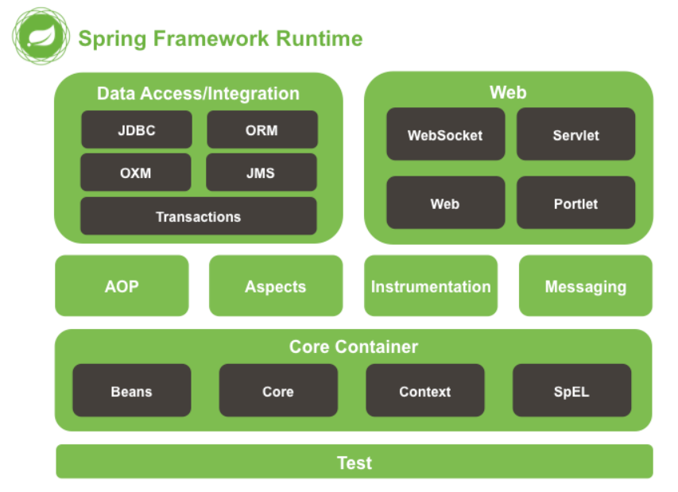

Spring 框架是一个分层架构，由多个定义良好的模块组成。Spring 模块构建在核心容器之上，核心容器定义了

创建、配置和管理 bean 的方式 。组成 Spring 框架的每个模块（或组件）都可以单独存在，或者与其他一个或

多个模块联合实现。

Spring**弊端：发展太久了后，违背了原来的理念！配置十分繁琐，人称	"配置地狱！"**


## Maven仓库导入包

>Spring5

```
<dependencies>
        <dependency>
            <groupId>org.springframework</groupId>
            <artifactId>spring-beans</artifactId>
            <version>5.2.8.RELEASE</version>
        </dependency>
        <dependency>
            <groupId>org.springframework</groupId>
            <artifactId>spring-context</artifactId>
            <version>5.2.8.RELEASE</version>
        </dependency>
        <dependency>
            <groupId>org.springframework</groupId>
            <artifactId>spring-core</artifactId>
            <version>5.2.8.RELEASE</version>
        </dependency>
        <dependency>
            <groupId>org.springframework</groupId>
            <artifactId>spring-expression</artifactId>
            <version>5.2.8.RELEASE</version>
        </dependency>
        <dependency>
            <groupId>commons-logging</groupId>
            <artifactId>commons-logging</artifactId>
            <version>1.2</version>
        </dependency>
    </dependencies>
```


>AOP

```xml
 <!-- AOP相关Jar -->
 <!-- https://mvnrepository.com/artifact/org.springframework/spring-aspects -->
 <dependency>
     <groupId>org.springframework</groupId>
     <artifactId>spring-aspects</artifactId>
     <version>5.2.0.RELEASE</version>
 </dependency>

<!-- https://mvnrepository.com/artifact/org.aspectj/aspectjweaver -->
<dependency>
    <groupId>org.aspectj</groupId>
    <artifactId>aspectjweaver</artifactId>
    <version>1.6.8</version>
</dependency>

<!-- https://mvnrepository.com/artifact/aopalliance/aopalliance -->
<dependency>
    <groupId>aopalliance</groupId>
    <artifactId>aopalliance</artifactId>
    <version>1.0</version>
</dependency>

<!-- https://mvnrepository.com/artifact/net.sourceforge.cglib/com.springsource.net.sf.cglib -->
<dependency>
    <groupId>net.sourceforge.cglib</groupId>
    <artifactId>com.springsource.net.sf.cglib</artifactId>
    <version>2.2.0</version>
</dependency>
```


>日志整合

```xml
<dependency>
        <groupId>org.apache.logging.log4j</groupId>
        <artifactId>log4j-api</artifactId>
        <version>2.11.2</version>
    </dependency>
    <dependency>
        <groupId>org.apache.logging.log4j</groupId>
        <artifactId>log4j-core</artifactId>
        <version>2.11.2</version>
    </dependency>
    <dependency>
        <groupId>org.slf4j</groupId>
        <artifactId>slf4j-api</artifactId>
        <version>1.7.30</version>
    </dependency>
    <dependency>
        <groupId>org.apache.logging.log4j</groupId>
        <artifactId>log4j-slf4j-impl</artifactId>
        <version>2.11.2</version>
    </dependency>
```


>JDBCTemplate

```
<dependency>
	<groupId>org.springframework</groupId>
	<artifactId>spring-jdbc</artifactId>
	<version>5.3.2</version>
</dependency>
<dependency>
	<groupId>org.springframework</groupId>
	<artifactId>spring-tx</artifactId>
	<version>5.3.2</version>
</dependency>
<dependency>
	<groupId>org.springframework</groupId>
	<artifactId>spring-orm</artifactId>
	<version>5.3.2</version>
</dependency>
<dependency>
	<groupId>mysql</groupId>
	<artifactId>mysql-connector-java</artifactId>
	<version>8.0.22</version>
</dependency>
<dependency>
	<groupId>com.alibaba</groupId>
	<artifactId>druid</artifactId>
	<version>1.2.4</version>
</dependency>
```


## Spring配置文件中的一些配置

> 别名（alias ）

alias 设置别名 , 为bean设置别名 , 可以设置多个别名

```xml
<!--设置别名：在获取Bean的时候可以使用别名获取-->
<alias name="userT" alias="userNew"/>
```

> Bean的配置

```xml
<!--bean就是java对象,由Spring创建和管理-->

<!--
   id是bean的标识符,要唯一,如果没有配置id,name就是默认标识符
   如果配置id,又配置了name,那么name是别名
   name：可以设置多个别名,可以用逗号,分号或空格隔开
   如果不配置id和name,可以根据applicationContext.getBean(.class)获取对象;

	class是bean的全限定名(全类名)=包名+类名
-->
<bean id="hello" name="hello2 h2,h3;h4" class="com.study.pojo.Hello">
   <property name="name" value="Spring"/>
</bean>
```

> import

团队的合作通过import来实现 ，它可以将多个配置文件，通过import导入的方式合并在一个配置文件中。

```xml
<import resource="{path}/beans.xml"/>
```

applicationContext.xml（总的文件）

```xml
<!--在一个总的配置文件中导入多个其他配置文件进行合并！--> 
<import resource="beans1.xml"/>
<import resource="beans2.xml"/>
<import resource="beans3.xml"/>
```


## IOC 容器

### IOC（概念和原理）

1、什么是 IOC 

（1）控制反转，把对象创建和对象之间的调用过程，交给Spring进行管理 

（2）使用 IOC 目的：为了降低程序的耦合度

（3）做入门案例就是 IOC 实现 

2、IOC 底层原理 

​		==xml 解析、工厂模式、反射==

3、IOC思想的进一步认识！

`控制` : 谁来控制对象的创建 , 传统应用程序的对象是由程序本身控制创建的 , 

​				==使用 Spring 后 , 对象是由 Spring 来管理和创建的。==

`反转 `: ==程序本身不创建对象 , 而变成被动的接收对象 。被动的等待IOC容器来创建并注入它所需要的资源了。==

`依赖注入` : 就是利用set方法来进行注入的。

 **IOC是一种编程思想，由主动的编程变成被动的接收。**


<font color=red>所谓的IOC,一句话搞定 : **对象由Spring【IOC容器】 来创建 , 管理 , 装配 !** </font>

<font color=red>在Spring中实现控制反转的是IOC容器，其实现方法是依赖注入（Dependency Injection,DI）</font>


### IOC 接口（BeanFactory） 

1、IOC 思想基于 IOC 容器完成，IOC 容器底层就是使用 IOC接口<font color=red>对象工厂</font>

==2、Spring 提供 IOC 容器实现两种方式==：（两个接口）

（1）`BeanFactory`：IOC 容器基本实现，是 Spring 内部的使用接口，不提供开发人员进行使用 

​	注：加载配置文件时候不会创建对象，在获取对象（使用）才去创建对象。

（2）`ApplicationContext`：BeanFactory 接口的子接口，提供更多更强大的功能，一般由开发人员进行使用。 

​	注：使用`ApplicationContext`加载配置文件时就会把在配置文件对象进行创建【开发中使用】

3、**ApplicationContext** 接口有实现类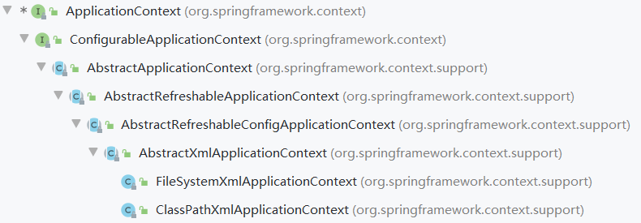


### IOC 操作 Bean 管理（概念）

> 1、什么是 Bean 管理 

（0）Bean 管理指的是两个操作 

（1）Spring 创建对象 

（2）Spirng 注入属性

> 2、Bean 管理操作有两种方式 

（1）基于 ==xml 配置文件方式==实现 

（2）基于==注解方式==实现


> 首先：进行操作前要导入Spring的依赖

```xml
<dependency>
    <groupId>org.springframework</groupId>
    <artifactId>spring-webmvc</artifactId>
    <version>5.2.6.RELEASE</version>
</dependency>
```


### IOC操作 Bean 管理对象（基于 xml 方式）

#### 1、基于 xml 方式创建对象 

```xml
<!--配置User对象进行创建-->
<bean id="user" class="com.study.pojo.User">
</bean>
```

（1）在 spring 配置文件中，使用 bean 标签，标签里面添加对应属性，就可以实现对象创建 

（2）在 bean 标签有很多属性，介绍常用的属性

- id 属性：唯一标识

- class 属性：类全路径（包类路径）

（3）创建对象时候，默认也是执行无参数构造方法完成对象创建


#### <font color=red>2、基于 xml 方式注入属性（DI）</font>

- 依赖注入（Dependency Injection,DI），就是注入属性（设置属性）
	- 依赖 : 指Bean对象的创建依赖于容器。
	- 注入 : 指Bean对象所依赖的资源 ，由容器来设置和装配 。

##### 2.1、构造器注入

（1）创建类，定义属性和对应的构造方法

（2）在 spring 配置文件配置对象创建，配置属性注入

```xml
<!-- 构造器注入
	1、采用<constructor-arg/>元素
	（1）使用name属性指定Bean的属性名称，即按参数名匹配入参
	（2）使用index属性指定Bean的属性名称索引位置，即按索引匹配入参
	（3）使用type属性指定Bean的属性名称类型，即按参数名匹配入参
	（4）value属性或<value>子节点指定属性值  
	（5）ref属性引用外部bean
	说明：boolean的值既可以用0/1填充，也可以用true/false填充
-->
<bean id="user" class="com.study.pojo.User">
    <constructor-arg name="username" value="spring"/>
    <constructor-arg index="1" value="123456"/>
    <constructor-arg type="boolean" value="false"/>
    <constructor-arg name="password" ref="otherBean"/>
</bean>
<bean id="otherBean" class="com.study.pojo.other">
```

（3）通过有参构造方法来创建（三种方式）

> ```java
> package com.study.pojo;
> public class User{
>     
>     private String username;
>     private String password;
>     
>     // 默认使用无参构造器
> 	public User() {
> 		super();
> 	}
>     // 构造器的重载
> 	public User(String username, String password) {
> 		super();
> 		this.username = username;
> 		this.password = password;
> 	}
> }
> ```

1. 按索引匹配入参

```xml
<!--方式一：通过下标赋值-->
<bean id="user" class="com.study.pojo.User">
    <constructor-arg index="0" value="spring"/>
    <constructor-arg index="1" value="123456"/>
</bean>
```

2. 按参数名匹配入参

```xml
<!--方式二：根据参数名创建-->
<bean id="user" class="com.study.pojo.User">
    <constructor-arg name="name" value="spring"/>
    <constructor-arg name="password" value="123456"/>
</bean>
```

3. 按类型匹配入参

```xml
<!--方式三：根据类型创建，不建议使用！-->i
<bean id="user" class="com.study.pojo.User">
    <constructor-arg type="java.lang.String" value="spring"/>
    <constructor-arg index="1" value="123456"/>
</bean>
```


##### <font color=red>2.2、Set 注入 （重点）【使用property】</font>

要求被注入的属性 , 必须有set方法 , set方法的方法名由set + 属性首字母大写 , 

如果属性是boolean类型 , 没有set方法 , 是 is

>```java
>package com.study.pojo;
>public class User {
>	private String username;
>	private String password;
>	private boolean sex;
>	
>	public String getUsername() {
>		return username;
>	}
>	public void setUsername(String username) {
>		this.username = username;
>	}
>	public String getPassword() {
>		return password;
>	}
>	public void setPassword(String password) {
>		this.password = password;
>	}
>	public boolean isSex() {
>		return sex;
>	}
>	public void setSex(boolean sex) {
>		this.sex = sex;
>	}
>```

###### <font color=red>2.2.1、普通属性注入</font>

（1）创建类，定义属性和对应的 set 方法

（2）在 spring 配置文件配置对象创建，配置属性注入

```xml
<!-- 
	setter方法注入：
		1、使用<property>元素
		(1) 使用name属性指定Bean的属性名称
		(2) value属性或<value>子节点指定属性值  
-->
<bean id="user" class="com.study.pojo.User">
	<!-- 为属性赋值 -->
	<property name="username" value="Spring"></property>
</bean>
```


###### <font color=red>2.2.2、字面值</font>

（1）null 值   

```xml
<!--null值的注入-->    
<property name="username">
    <null/>
</property>
```
（2）属性值包含特殊符号

```xml
<!--属性中包含特殊字符
	1.将<>进行转义 &lt: < &gt: >
	2.将特殊字符写到 <![CDATA[...]]> 中  -->
<property name="name">
   <value><![CDATA[ <<我爱学习>> ]]></value>
</property>
```


###### <font color=red>2.2.3、注入属性-外部 bean</font>

==外部bean：使用 ref 属性为bean中的类型进行引用==

 为 UserService对象的 UserDao属性赋值

```java
package com.study.dao.UserDao;
class UserDao {
    
    private String username;
	private String password;
}
```

```java
package com.study.service;
class UserService {
    //创建 UserDao 类型属性，生成 set 方法
    private UserDao userDao;

    public void setUserDao(UserDao userDao) {
        this.userDao = userDao;
    }
}
```

使用 ref 属性注入外部 bean

```xml
<!--service 和 dao 对象创建-->
<bean id="userService" class="com.study.service.UserService">
    <!--注入 userDao 对象
    name 属性：类里面属性名称
    ref 属性：创建 userDao 对象 bean 标签 id 值
    -->
    <property name="userDao" ref="userDaoImpl"></property>
</bean>
<bean id="userDaoImpl" class="com.study.dao.UserDao"/>
```


###### <font color=red>2.2.4、注入属性-内部 bean</font>

==内部bean：为 bean 中的对象类型进行注入==

（1）一对多关系：部门和员工 一个部门有多个员工，一个员工属于一个部门：部门是一，员工是多。

（2）在实体类之间表示一对多关系，员工表示所属部门，使用对象类型属性进行表示

```xml
<bean id="emp" class="com.study.spring5.bean.Emp">
    <!--设置两个普通属性-->
    <property name="ename" value="lucy"></property>
    <property name="gender" value="女"></property>
    <!--设置对象类型属性-->
    <property name="dept">
        <!--配置内部bean  也可以使用外部bean代替
			内部bean对外部不可见，即使有id也无法引用
		-->
        <bean id="dept" class="com.study.spring5.bean.Dept">
            <property name="dname" value="安保部"></property>
        </bean>
    </property>
</bean>
```


###### <font color=red>2.2.5、注入属性-级联赋值</font>

==级联赋值：为 bean 中的对象类型设置属性值的方式称为级联赋值==

（1）第一种写法【使用外部bean的方式】

```xml
<!--级联赋值-->
<bean id="emp" class="com.atguigu.spring5.bean.Emp">
    <!--设置两个普通属性-->
    <property name="ename" value="lucy"></property>
    <property name="gender" value="女"></property>
    <!--级联赋值-->
    <property name="dept" ref="dept"></property>
</bean>
<bean id="dept" class="com.atguigu.spring5.bean.Dept">
    <property name="dname" value="财务部"></property>
</bean>
```

（2）第二种写法【需要提供可获取对象的 get方法】

```xml
<!--级联赋值-->
<bean id="emp" class="com.study.spring5.bean.Emp">
    <!--设置两个普通属性-->
    <property name="ename" value="lucy"></property>
    <property name="gender" value="女"></property>
    <!--级联赋值-->
    <property name="dept" ref="dept2"></property>
    <!--该属性在类中必须提供可获取的get方法-->
    <property name="dept.dname" value="技术部"></property>
</bean>
<bean id="dept2" class="com.study.spring5.bean.Dept">
    <property name="dname" value="财务部"></property>
</bean>
```


###### <font color=red>2.2.6、注入属性-集合类型属性</font>

==1、在集合类型中设置普通属性值==

```xml
	<!--数组注入-->
    <property name="books">
        <array>
            <value>红楼梦</value>
            <value>西游记</value>
            <value>三国演义</value>
        </array>
    </property>

	<!--list集合注入-->
    <property name="hobbys">
        <list>
            <value>编程</value>
            <value>学习</value>
            <value>变强</value>
        </list>
    </property>
    <!--set集合注入-->
    <property name="games">
        <set>
            <value>正当防卫4</value>
            <value>文明6</value>
        </set>
    </property>

    <!--map集合注入(使用entry节点)-->
	<!--
		<entry>作为子标签. 每个条目包含一个键和一个值. 必须在 <key> 标签里定义键
		因为键和值的类型没有限制, 所以可以自由地为它们指定 <value>, <ref>, <bean> 或 <null> 元素
		可以将 Map 的键和值作为 <entry> 的属性定义:简单常量使用 key 和 value 来定义 
		Bean 引用通过 key-ref 和 value-ref 属性定义
 -->
    <property name="card">
        <map>
            <entry key="身份证" value="123456"/>
            <entry key="银行卡" value="123456"/>
            <entry key-ref="---" value-ref="---"/>
        </map>
    </property>

    <!--properties文件注入(外部资源！)-->
    <property name="info">
        <props>
            <prop key="root">root</prop>
            <prop key="password">123456</prop>
        </props>
    </property>
```
==2、在集合中设置对象类型值==

```xml
<!--创建多个 course 对象-->
<bean id="course1" class="com.study.spring5.collectiontype.Course"/>
<bean id="course2" class="com.study.spring5.collectiontype.Course"/>
<!--注入 list 集合类型，值是对象-->
<property name="courseList">
    <list>
        <ref bean="course1"></ref>
        <ref bean="course2"></ref>
    </list>
</property>
```

==3、将集合注入部分提取出来，使其成为公共部分，能被多个部分使用！==

（1）在 spring 配置文件中引入名称空间 util

（2）使用 util 标签完成 list 集合注入提取

```xml
<!--1 提取 list 集合类型属性注入-->
<util:list id="bookList">
    <value>易筋经</value>
    <value>九阴真经</value>
    <value>九阳神功</value>
</util:list>

<!--2 提取 list 集合类型属性注入使用-->
<bean id="book" class="com.study.spring5.collectiontype.Book">
    <!--使用ref进行引用提取的util集合-->
    <property name="list" ref="bookList"></property>
</bean>
```


##### 2.3、p命名和c命名注入（了解）

> p命名和c命名注入（底层是基于Set方法注入的！）

1、P命名空间注入【properties/属性】 : 

```xml
<!--使用p命名方式：代替原来的 property-->
<bean id="user" class="com.study.pojo.User" p:name="雪碧" p:age="180"/>
```

2、c 命名空间注入 【constructor-args/构造器】: (必须要有有参构造器！)

```xml
<!--使用c命名方式：代替原来的 constructor-arg-->
<bean id="user" class="com.study.pojo.User" c:name="可乐" c:age="120"/>
```


> p命名和c命名使用注意点：

1. 使用 p 或 c 命名方法必须对操作的属性要有对应的 set 方法
2. p命名和c命名空间不能直接使用，需要导入xml约束！

```xml-dtd
xmlns:p="http://www.springframework.org/schema/p"
xmlns:c="http://www.springframework.org/schema/c"
```


#### 3、FactoryBean（工厂bean的介绍）

> Spring 有两种类型 bean，一种普通 bean，另外一种工厂 bean（FactoryBean）

- `普通 bean`：在配置文件中定义 bean 类型就是返回类型

- `工厂 bean`：在配置文件定义 bean 类型可以和==返回类型不一样==

	第一步 创建类，让这个类作为工厂 bean，实现接口 FactoryBean。

	第二步 实现接口里面的方法，在实现的方法中定义返回的 bean 类型。


#### 4、Bean 作用域的管理（Scope）

在Spring中，那些组成应用程序的主体及由Spring IoC容器所管理的对象，被称之为bean。

简单地讲，bean 就是由 IoC容器 初始化、装配及管理的对象。

> 作用域的介绍和描述

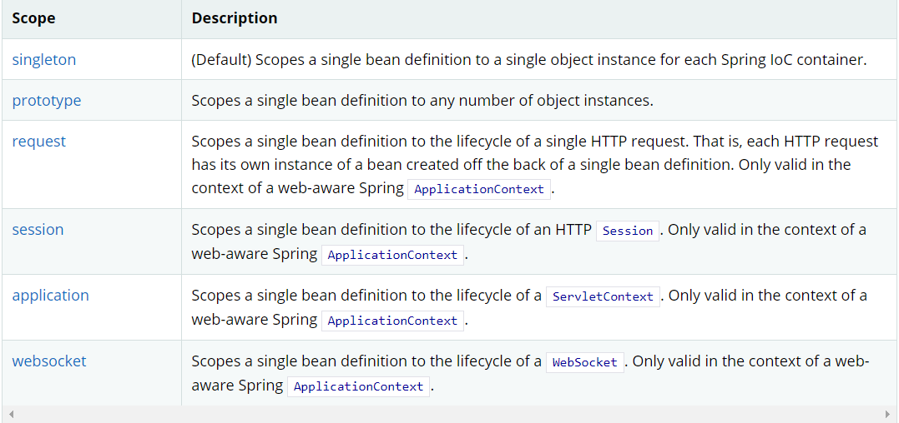


> 1、单例模式【scope="Singleton"】（Spring默认机制）

```xml
<bean id="accountService" class="com.something.DefaultAccountService" scope="singleton"/>
```

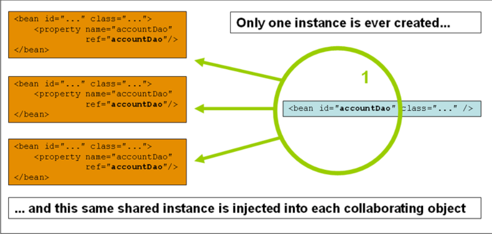


> 2、原型模式【scope="Prototype"】：每次从容器中getBean时，都会对应的产生一个新对象！

```xml
<bean id="user" class="com.study.pojo.User" p:name="雪碧" p:age="180" scope="prototype"/>
```

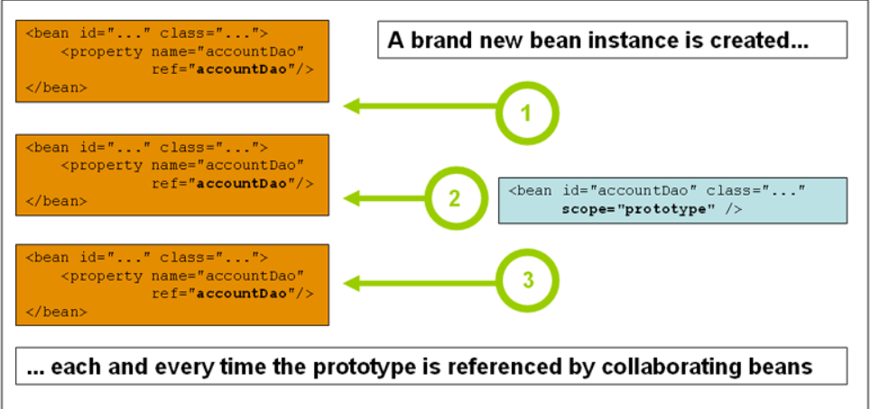


> singleton 和 prototype 区别

- singleton 单实例，prototype 多实例

-  设置 scope 值是 `singleton` 时候，==加载 spring 配置文件时候就会创建单实例对象。==

- 设置 scope 值是 `prototype` 时候，==不是在加载 spring 配置文件时候创建对象，==

	==而是在调用 getBean方法的时候才会创建多实例对象。==


> 3、其余的request、session、application、websocket这些个只有在web开发中才会使用到！

request、session、application：设置为这些的...指在创建该对象时就会默认放到对应的域中！


#### 5、Bean 的生命周期

1、生命周期 

从对象创建到对象销毁的过程


2、bean 的后置处理器，bean 生命周期有七步

（1）通过构造器==创建 bean 实例==（无参数构造）

（2）为 bean 的属性设置值和对其他 bean 引用（调用 set 方法 进行==依赖注入==）

（3）把 bean 实例传递 bean 后置处理器的方法 `postProcessBeforeInitialization`

（4）调用 bean 的==初始化==的方法（需要进行配置初始化的方法 init-method ）

（5）把 bean 实例传递 bean 后置处理器的方法 `postProcessAfterInitialization`

（6）bean 可以使用了（==对象获取到了== getBean）

（7）当容器关闭时候，调用 bean 的==销毁==的方法（需要进行配置销毁的方法 destroy-method ）


#### 6、xml方式的自动装配

> 自动装配说明

- 自动装配是使用spring满足bean依赖的一种方法
- spring会在应用上下文中为某个bean寻找其依赖的bean。


> 使用ByName自动装配

`byName`：根据==属性名称==自动注入。

在获取或创建对象会自动在 Spring容器 上下文中查找，<font color=red>与自己对象 **set方法后面的值** 对应的 bean id ！</font>

**当一个bean节点带有 autowire = "byName" 的属性时。**

`执行过程`：在执行 `bean id="person" class="com.study.pojo.Person" autowire="byName" ` 这一句的时侯

<font color=red>Spring框架就将 Person 这个实体类整个编译一下</font>，查看自己的这个类里面有几个**类属性**（类型是实体类的属性，

比如 Cat cat ）， 然后对着 ApplicationContext 的配置文件进行查找对比，如果有某个 bean 的 id 能跟自己的 set方法 （在 set 后面并且首字母小写的字符串）对上名字，就把这个 bean 装载（注入）到自己的这个类里面。


> 使用ByType自动装配

`byType`：根据==属性类型==自动注入。

在获取或创建对象会自动在 Spring容器 上下文中查找，<font color=red>与自己对象属性 **类型** 相同的 bean id ！</font>


**当一个bean节点带有 autowire = "byName" 的属性时。**

`执行过程`：与 byName 基本上是一样的道理，但是稍有不同的是，**byType是根据类型来的**，大多数在实际使用中，也就是使用的一个实体类（大多数）, 就上面的这个例子来说，<font color=red>Spring</font> 先看看Person这个类里面都有什么属性，有String、Cat 和 Dog 于是就开始通过这三个类的属性在 ApplicationContext 配置文件中查找对应的类型，

如果找到了就将其装载上（注入）。

 但是这里要==注意==一个问题，byType不能装载一个配置文件中同一个类型（但 id 不同）的实体类,。


#### 7、引入外部属性文件（数据库连接池）

配置数据库连接池的两种方式！

> 方式一：直接配置数据库信息 

（1）引入德鲁伊连接池依赖

（2）配置德鲁伊连接池

```xml
<!--直接配置连接池-->
<bean id="dataSource" class="com.alibaba.druid.pool.DruidDataSource">
    <property name="driverClassName" value="com.mysql.cj.jdbc.Driver"></property>
    <property name="url" value="jdbc:mysql://localhost:3306/user"></property>
    <property name="username" value="root"></property>
    <property name="password" value="123456"></property>
</bean>
```


> 方式二：引入外部属性文件配置数据库连接池

```xml
<!--引入外部属性文件--> 
<context:property-placeholder location="classpath:jdbc.properties"/>
```

- 第一步：创建外部属性文件，properties 格式文件，写数据库信息

```properties
prop.driverClass=com.mysql.cj.jdbc.Driver
prop.url=jdbc:mysql://localhost:3306/user
prop.username=root
prop.password=123456
```

- 第二步：把外部 properties 属性文件引入到 spring 配置文件中

（1）引入 context 名称空间

```xml
<beans xmlns="http://www.springframework.org/schema/beans"
       xmlns:xsi="http://www.w3.org/2001/XMLSchema-instance"
       xmlns:context="http://www.springframework.org/schema/context"
       xsi:schemaLocation="http://www.springframework.org/schema/beans
       http://www.springframework.org/schema/beans/spring-beans.xsd
 	   http://www.springframework.org/schema/context
	   http://www.springframework.org/schema/context/spring-context.xsd">
```
（2）在 spring 配置文件==使用标签引入外部属性文件==并进行配置

```XML
    <!--引入外部属性文件--> 
    <context:property-placeholder location="classpath:jdbc.properties"/>
```

```xml
    <!--配置连接池-->
    <bean id="dataSource" class="com.alibaba.druid.pool.DruidDataSource">
        <property name="driverClassName" value="${prop.driverClass}"></property>
        <property name="url" value="${prop.url}"></property>
        <property name="username" value="${prop.userName}"></property>
        <property name="password" value="${prop.password}"></property>
    </bean>
```


### IOC操作 Bean 管理对象（基于注解方式）

#### 1、什么是注解

（1）注解是代码特殊标记，格式：@注解名称(属性名称=属性值, 属性名称=属性值..)

（2）使用注解，注解作用在类上面，方法上面，属性上面

（3）使用注解目的：简化 xml 配置


> Spring 针对 Bean 管理中创建对象提供注解

为了更好的进行分层，Spring可以使用其它三个注解，它们的功能都和@Component是一样的。

- 普通Bean：【@Component】

- dao层：【@Repository】
- service层：【@Service】
- controller：【@Controller】


我们这些注解，就是替代了在配置文件当中配置步骤而已！更加的方便快捷！


#### <font color=red>2、基于注解方式实现对象创建</font>

> 第一步 引入依赖 开启注解支持（使用前提）

在spring4之后，想要使用注解形式，必须得要==引入aop的依赖==


使用注解需要==导入context约束==

```xml
<?xml version="1.0" encoding="UTF-8"?>
<beans xmlns="http://www.springframework.org/schema/beans"
       xmlns:xsi="http://www.w3.org/2001/XMLSchema-instance"
       xmlns:context="http://www.springframework.org/schema/context"
       xsi:schemaLocation="http://www.springframework.org/schema/beans
       http://www.springframework.org/schema/beans/spring-beans.xsd
       http://www.springframework.org/schema/context
       http://www.springframework.org/schema/context/spring-context.xsd">
</beans>
```


> 第二步 开启组件扫描

```xml
<!--开启组件扫描
 	1、如果扫描多个包，多个包使用逗号隔开
 	2、扫描包上层目录
-->
<context:component-scan base-package="com.study.dao1,com.study.dao2"></context:component-scan>
<context:component-scan base-package="com.study"></context:component-scan>
```


> 第三步 创建类，在类上面添加创建对象注解

```java
//在注解里面 value 属性值可以省略不写，
//默认值是类名称,首字母小写
//UserService --> userService

@Component (value = "userService") // <bean id="userService" class=".."/>
public class UserService {
    public void add() {
        System.out.println("service add.......");
    }
}
```


#### 3、开启组件扫描之细节配置

配置对哪些内容进行扫描、对哪些内容不扫描

>示例 1：context:include-filter ，设置扫描哪些内容

```xml
<!--
	use-default-filters="false" 表示现在不使用默认filter，自己配置filter
 	context:include-filter ，设置扫描哪些内容
-->
<context:component-scan base-package="com.atguigu" use-defaultfilters="false">
    <context:include-filter type="annotation"
                            expression="org.springframework.stereotype.Controller"/>
</context:component-scan>
```

> 示例 2：context:exclude-filter： 设置哪些内容不进行扫描

```xml
<!--
 	下面配置扫描包所有内容
 	context:exclude-filter： 设置哪些内容不进行扫描
-->
<context:component-scan base-package="com.atguigu">
    <context:exclude-filter type="annotation"
                            expression="org.springframework.stereotype.Controller"/>
</context:component-scan>
```


#### <font color=red>4、基于注解方式实现属性注入（重点）</font>

1. **`@Autowired`**：==根据**属性类型**进行自动装配==（注：需要导入 spring-aop的包！）


​        第一步 把 service 和 dao 对象创建，在 service 和 dao 类添加创建对象注解

​        第二步 在 service 注入 dao 对象，在 service 类添加 dao 类型属性，在属性上面使用注解

```java
@Service
public class UserService {
    //定义 dao 类型属性
    //不需要添加 set 方法
    //添加注入属性注解
    @Autowired
    private UserDao userDao;
}
```

注：@Autowired是先按类型（byType）自动装配的，有多个了类型相同时会自动支持 id（byName）匹配。


2. **`@Qualifier`**：==根据**名称**进行注入==

​        这个@Qualifier 注解的使用，和上面@Autowired 一起使用

```java
//定义 dao 类型属性
//不需要添加 set 方法
//添加注入属性注解
@Autowired //根据类型进行注入
@Qualifier(value = "userDaoImpl1") //根据名称进行注入
private UserDao userDao;
```


3. **`@Resource`**：==可以根据类型注入，可以根据名称注入==

```java
//@Resource //根据类型进行注入
@Resource(name = "userDaoImpl1") //根据名称进行注入
private UserDao userDao;
```


4. **`@Value`**：==注入普通类型属性==

-  可以不用提供set方法，直接在直接名上添加@value("值")
- 如果提供了set方法，也在set方法上添加@value("值");

```java
@Value(value = "abc")
private String name;
```


#### 5、Bean 作用域的管理（@Scope）

> 两种常用作用域（@Scope）

- singleton：默认的，Spring会采用单例模式创建这个对象。关闭工厂 ，所有的对象都会销毁。
- prototype：多例模式。关闭工厂 ，所有的对象不会销毁。内部的垃圾回收机制会回收

```java
@Scope("singleton")
@Scope("prototype")
public class User {
   @Value("abc")
   public String name;
}
```


#### 6、完全注解开发

- 第一步：创建配置类，添加`@Configuration`，替代 xml 配置文件

```java
@Configuration //作为配置类，替代xml配置文件
@ComponentScan (basePackages = {"com.stduy"})
public class SpringConfig {
}
```

- 第二步：编写测试类

```java
@Test
public void testService() {
    //加载配置类
    ApplicationContext context
            = new AnnotationConfigApplicationContext(SpringConfig.class);
    UserService userService = context.getBean("userService", UserService.class);
    System.out.println(userService);
    userService.add();
}
```


#### 7、导入其他配置类（@Improt(...) ）

1、我们再编写一个配置类！

```java
@Configuration  //代表这是一个配置类
public class MyConfig {
}
```

2、在之前的配置类中我们来选择使用`@Import`注解导入这个配置类

```java
@Configuration
@Import(MyConfig.class)  //导入合并其他配置类，类似于配置文件中的 import 标签
public class MyConfig {
}
```

关于这种Java类的配置方式，我们在之后的SpringBoot 和 SpringCloud中还会大量看到，知道这些注解的作用即可！


#### 8、注解开发小结

> xml与注解比较

- XML可以适用任何场景 ，结构清晰，维护方便
- 注解不是自己提供的类使用不了，维护相对复杂！开发简单方便

> xml与注解整合开发：推荐最佳实践

- xml用来管理Bean
- 注解完成属性注入
- 我们在使用的过程中， 只需要注意一个问题，必须要让注解生效，就需要==开启注解的支持==


## AOP

### AOP（概念）

1、什么是 AOP

（1）面向切面（方面）编程，利用 AOP 可以对业务逻辑的各个部分进行隔离，从而使得业务逻辑

​	各部分之间的耦合度降低，提高程序的可重用性，同时提高了开发的效率。

（2）通俗描述：==不通过修改源代码方式，在主干功能里面添加新功能。==

（3）使用登录例子说明 AOP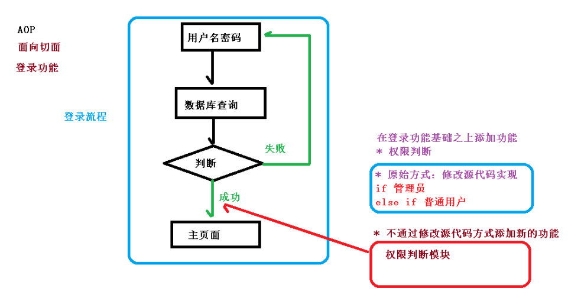

### AOP 底层原理（动态代理）

AOP 底层使用 <font color=red>动态代理</font> 动态代理的使用有两种情况

> 第一种 ==有接口情况，使用 JDK 动态代理==

JDK动态代理只能对实现了接口的类生成代理，而不能针对类

- 创建==接口实现类代理对象==，增强类的方法

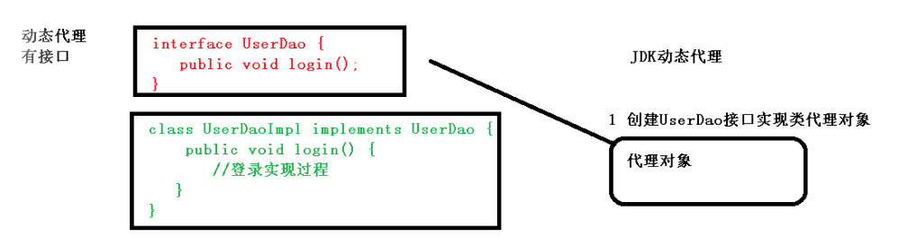


> 第二种情况 ==没有接口情况，使用 CGLIB 动态代理==

CGLIB是针对类实现代理，主要是对指定的类创建一个子类，重写其中父类的方法。

- 创建==作为子类的代理对象==，增强类的方法。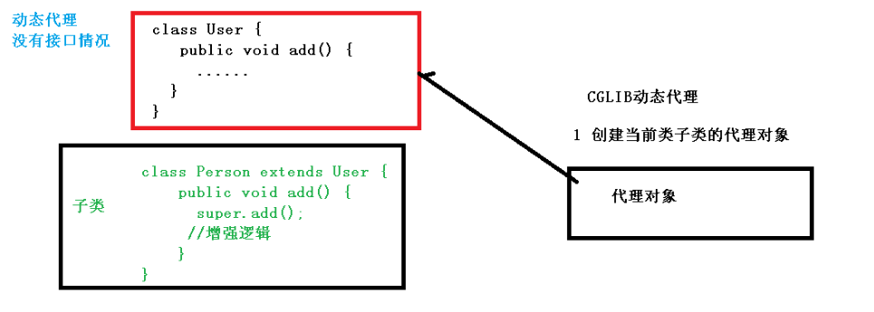


### AOP（JDK 动态代理的实现）

> 1、使用 JDK 动态代理，使用 Proxy 类里面的方法创建代理对象


（1）调用 newProxyInstance 方法 创建按 handler 增强的代理对象

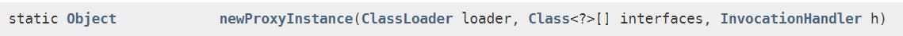

方法有三个参数： 

第一个参数	类加载器 

第二个参数	==增强方法所在的类，这个类实现的接口==，支持多个接口 

第三个参数	==实现这个接口 InvocationHandler，创建代理对象，写增强的部分==

方法的描述：


> 2、编写 JDK 动态代理代码

- 第一步：创建接口，定义方法

```java
public interface UserService {
    void add();
    void update();
}
```

- 第二步：创建接口实现类，实现方法

```java
public class UserServiceImpl implements UserService{
    @Override
    public void add() {
        System.out.println("这是一个add方法");
    }
    @Override
    public void update() {
        System.out.println("这是一个update方法");
    }
}
```

- 第三步：使用 handler 实现增强的代理对象的增强方法逻辑！

```java
class UserDaoProxy implements InvocationHandler {

    //1 把被代理对象传递过来
    //有参数构造传递
    private Object obj;
    public UserDaoProxy(Object obj) {
        this.obj = obj;
    }

    //增强的逻辑
    @Override
    public Object invoke(Object proxy, Method method, Object[] args) throws Throwable {
        //方法之前
        System.out.println("方法之前执行...."+method.getName()+" :传递的参数..."+ Arrays.toString(args));
        //被增强的方法执行
        Object res = method.invoke(obj, args);
        //方法之后
        System.out.println("方法之后执行...."+obj);
        return res;
    }
}
```

- 第四步：使用 Proxy 类创建接口代理对象，调用增强后的方法

```java
public class JDKProxy {
    public static void main(String[] args) {
        //创建接口实现类代理对象
        Class[] interfaces = {UserDao.class};
        UserDaoImpl userDao = new UserDaoImpl();
        // newProxyInstance(类加载器,接口类,增强的类)
        UserDao dao = (UserDao)Proxy.newProxyInstance(JDKProxy.class.getClassLoader(), interfaces, new UserDaoProxy(userDao));
        int result = dao.add(1, 2);
        System.out.println("result:"+result);
    }
}
```


### AOP 术语

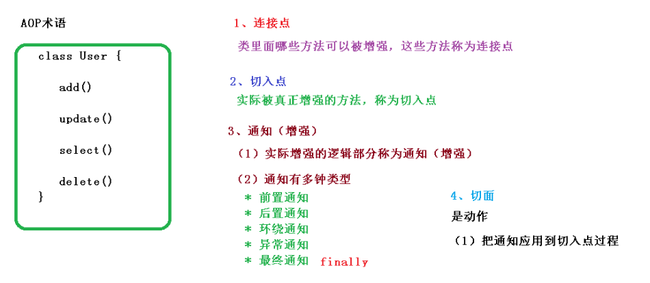

`连接点（Joinpoint）`：表示程序中可以使用通知的地方

`切入点（Pointcut）`: 实际中使用了通知的地方

`通知（Advice）`: 想要扩展的功能，实际增强的逻辑部分

通知的分类：前置通知（ @Before ）

​							 后置通知（ @AfterReturning ）

​							 环绕通知（ @Around ）

​							 异常通知（ @AfterThrowing ）								

​							 最终通知（ @After ）

```java
try{
        try{

            //@Before
            
            method.invoke(..);

        }finally{

            //@After

        }

        //@AfterReturning

}catch(){
    
    //@AfterThrowing

}
```

`切面（Aspect）`：把通知应用到切入点的过程！


### AOP 操作（准备工作）

1、Spring 框架一般都是基于 AspectJ 实现 AOP 操作 

AspectJ 不是 Spring的组成部分，是一个独立的AOP框架，一般把 AspectJ 和 Spirng 框架一起使用，进行 AOP操作 


2、基于AspectJ实现 AOP操作 

（1）基于 xml 配置文件实现 

（2）基于注解方式实现（开发中使用） 


3、在项目工程里面引入 AOP 相关 AspectJ依赖 

```xml
<!-- https://mvnrepository.com/artifact/org.aspectj/aspectjweaver -->
<dependency>
   <groupId>org.aspectj</groupId>
   <artifactId>aspectjweaver</artifactId>
   <version>1.9.5</version>
</dependency>
```


4、切入点表达式 

（1）切入点表达式作用：声明对哪个类里面的哪个方法进行增强 

（2）语法结构：==execution([权限修饰符] [返回类型] [类全路径] [方法名称] ([参数列表]) )==

其中：修饰符可以不写，返回值可以用通配符*

> 举例 1：对 com.study.dao.BookDao 类里面的 add 进行增强

execution(*  com.study.dao.BookDao.add(..))

> 举例 2：对 com.study.dao.BookDao 类里面的所有的方法进行增强

execution(*  com.study.dao.BookDao.* (..))

> 举例 3：对 com.study.dao 包里面所有类，类里面所有方法进行增强

execution(*  com.study.dao.*. *(..))


### <font color=red>AOP 操作（AspectJ 注解方式）</font>

#### 1、创建类，在类里面定义方法

```java
//被增强的类
@Component
public class User {
    public void add() {
        System.out.println("add.......");
    }
}
```

#### 2、创建增强类

在增强类里面，创建方法，让不同方法代表不同通知类型

```java
//增强的类
@Component
@Aspect
public class UserProxy {
    @Before
    public void before() {//前置通知
        System.out.println("before......");
    }
}
```


#### 3、进行通知（增强）的配置

- 第一步：在 spring 配置文件中，开启注解扫描   

```xml
<?xml version="1.0" encoding="UTF-8"?>
<beans xmlns="http://www.springframework.org/schema/beans"
       xmlns:xsi="http://www.w3.org/2001/XMLSchema-instance"
       xmlns:context="http://www.springframework.org/schema/context"
       xmlns:aop="http://www.springframework.org/schema/aop"
       xsi:schemaLocation="http://www.springframework.org/schema/beans
        https://www.springframework.org/schema/beans/spring-beans.xsd
         http://www.springframework.org/schema/context
		http://www.springframework.org/schema/context/spring-context.xsd
         http://www.springframework.org/schema/aop
        https://www.springframework.org/schema/aop/spring-aop.xsd">

    <!-- 开启注解扫描 -->
    <context:component-scan base-package="com.study.ano"/>
 
    <!--开启Aspect生成代理对象-->
	<aop:aspectj-autoproxy 	proxy-target-class=true/>
</beans>
```

- 第二步：使用注解在 Spring 中创建 User 和 UserProxy 对象

```java
//被增强的类
@Component
public class User {}

//增强的类
@Component
public class UserProxy {}
```

- 第三步：在增强类上面添加注解 @Aspect

```java
//增强的类
@Component
@Aspect //生成代理对象
public class UserProxy {}
```

- 第四步：在 spring 配置文件中==开启生成代理对象==

```xml
<!--开启Aspect生成代理对象-->
<aop:aspectj-autoproxy 	proxy-target-class=true/>
```

> 关于AOP生成代理对象的方式

`proxy-target-class` 属性值决定这里的AOP底层是<font color=red>基于接口</font>的还是<font color=red>基于类</font>的代理被创建。

- 为**false**则是<font color=red>基于接口</font>的`JDK动态代理`将起作用。(默认)

- 为**true**或未声明接口则是<font color=red>基于类</font>的`CGLIB动态代理`将起作用。

当使用CGLIB时，当注入的类是接口时，CGLIB会为真实注入的接口实现类创建子类代理对象。


> 拓展小知识

1、Spring 5.x中AOP默认依旧使用JDK动态代理。

2、从SpringBoot 2.x开始，为了解决使用JDK动态代理可能导致的类型转换异常，而使用CGLIB。

3、在SpringBoot 2.x中，如果需要替换使用JDK动态代理可以通过配置项spring.aop的 proxy-target-class = false

​		来进行修改，proxyTargetClass配置已无效。


#### 4、配置不同类型的通知（@...）

在增强类的里面，在作为通知方法上面==添加通知类型注解，使用切入点表达式配置。==

```java
//增强的类
@Component
@Aspect //生成代理对象
public class UserProxy {
    
    // @Before 注解表示作为前置通知
    @Before(value = "execution(* com.atguigu.spring5.aopanno.User.add(..))")
    public void before() {
        System.out.println("before.........");
    }
    
    // @AfterReturning 后置通知（返回通知）(有异常不通知)
    @AfterReturning (value = "execution(*
            com.atguigu.spring5.aopanno.User.add(..))")
    public void afterReturning() {
        System.out.println("afterReturning.........");
    }
    
    //@After 最终通知（无论如何都通知）
    @After(value = "execution(* com.atguigu.spring5.aopanno.User.add(..))")
    public void after() {
        System.out.println("after.........");
    }
    
    //@AfterThrowing 异常通知
    @AfterThrowing(value = "execution(* com.stduy.spring5.aopanno.User.add(..))")
    public void afterThrowing() {
        System.out.println("afterThrowing.........");
    }
    
    //@Around 环绕通知
    @Around (value = "execution(* com.study.spring5.aopanno.User.add(..))")
    public void around(ProceedingJoinPoint proceedingJoinPoint) throws Throwable {
        System.out.println("环绕之前.........");
        // 被增强的方法执行
        proceedingJoinPoint.proceed();
        System.out.println("环绕之后.........");
    }
}
```


#### 5、相同的切入点抽取（@Pointcut）

使用 @Pointcut 注解抽取出相同切入点！

```java
    //相同切入点抽取
    @Pointcut (value = "execution(* com.study.spring5.aopanno.User.add(..))")
    public void pointdemo() {
    }

    //前置通知
    //@Before 注解表示作为前置通知
    @Before(value = "pointdemo()")
    public void before() {
            System.out.println("before.........");
    }
```


#### 6、设置增强类优先级（@Order）

在增强类上面添加注解 @Order (数字类型值)，**数字类型值越小优先级越高。**

```java
@Component
@Aspect
@Order(1)
public class PersonProxy{}
```


#### 7、完全使用注解开发 

 创建配置类，不需要创建 xml 配置文件

```java
@Configuration
@ComponentScan (basePackages = {"com.study"})
@EnableAspectJAutoProxy (proxyTargetClass = true)
public class ConfigAop {}
```


### AOP 操作（AspectJ 配置文件方式）

- 第一步：创建两个类，增强类和被增强类，创建方法

```java
package com.atguigu.spring5.aopxml;
public class Book {
    public void buy() {
        System.out.println("buy.............");
    }
}
```

```java
package com.atguigu.spring5.aopxml;
public class BookProxy {
    public void before() {
        System.out.println("before.........");
    }
}
```

- 第二步：在 Spring 配置文件中创建两个类对象

```xml
<!--创建对象-->
<bean id="book" class="com.atguigu.spring5.aopxml.Book"></bean>
<bean id="bookProxy" class="com.atguigu.spring5.aopxml.BookProxy"></bean>
```

- 第三步：在 spring 配置文件中配置切入点

```xml
    <!--配置 aop 增强-->
    <aop:config>
        <!--切入点-->
        <aop:pointcut id="p" expression=
                      "execution(*com.study.spring5.aopxml.Book.buy(..))"/>
        <!--配置切面-->
        <!--ref：增强类，bean的id-->
        <aop:aspect ref="bookProxy">
            <!--增强作用在具体的方法上-->
            <!--以前置通知为例-->
            <aop:before method="before" pointcut-ref="p"/>
        </aop:aspect>
    </aop:config>
```


## JDBCTemplate

### JdbcTemplate(概念和准备)

> 1、什么是 JdbcTemplate 

Spring 框架对 JDBC 进行封装，使用 JdbcTemplate 方便实现对数据库操作

JdbcTemplate 的操作与 Apache的 DBUtils实现CRUD的操作非常类似！！！

> 2、准备工作 

- 第一步：引入相关依赖

```xml
<dependency>
    <groupId>org.springframework</groupId>
    <artifactId>spring-jdbc</artifactId>
    <version>5.2.6.RELEASE</version>
</dependency>
<!-- https://mvnrepository.com/artifact/com.alibaba/druid -->
<dependency>
    <groupId>com.alibaba</groupId>
    <artifactId>druid</artifactId>
    <version>1.1.22</version>
</dependency>
```

- 第二步：在 spring 配置文件配置要连接的数据源

```xml
<!--在spring中配置文件配置数据库连接池-->
<bean id="dataSources" class="com.alibaba.druid.pool.DruidDataSource"
      destroy-method="close">
    <property name="username" value="root"/>
    <property name="password" value="123456"/>
    <property name="driverClassName" value="com.mysql.cj.jdbc.Driver"/>
    <property name="url" value="jdbc:mysql:///user"/>
</bean>
```

- 第三步：配置 JdbcTemplate 对象，注入 DataSource

```xml
 <!--配置JdbcTemplate对象，注入DataSources-->
    <bean id="jdbcTemplate" class="org.springframework.jdbc.core.JdbcTemplate">
        <property name="dataSource" ref="dataSources"/>
    </bean>
```

- 第四步：创建 service 类，创建 dao 类，在 dao 注入 jdbcTemplate 对象

	配置文件

```xml
<!-- 组件扫描 -->
<context:component-scan base-package="com.study"></context:component-scan>
```

​	Service

```java
@Service
public class BookService {
    //注入 dao
    @Autowired
    private BookDao bookDao;
}
```

​	Dao

```java
@Repository
public class BookDaoImpl implements BookDao {
    //注入 JdbcTemplate
    @Autowired
    private JdbcTemplate jdbcTemplate;
}
```


### JdbcTemplate 操作数据库

JdbcTemplate 的 CRUD操作与 Apache的 DBUtils实现CRUD的操作非常类似！！！

添加、修改、删除（通过调用 update方法，由sql语句实现控制使用何种方式！）

#### 初始化

（1）对应的数据库创建实体类

```Java
public class Book {
    private String userId;
    private String username;
    private String ustatus;

	// 此处省略get、set以及toString方法
}
```

（2）创建dao、service

```java
public class BookDaoImpl implements BookDao {
    //注入jdbcTemplate
    @Autowired
    private JdbcTemplate jdbcTemplate;
}
```


#### 1、添加、修改、删除（update）

 ```java
 	public int update(String sql, @Nullable Object... args)
 ```

- 第一个参数：sql 语句
- 第二个参数：可变参数，设置 sql 语句值


```Java
	// 添加数据
	@Override
    public void add(Book book) {
        String sql = "insert into t_book values(?,?,?)";
        Object[] obj = {book.getUserId(), book.getUsername(), book.getUstatus()};
        int update = jdbcTemplate.update(sql, obj);
        System.out.println(update);
    }
	
	// 修改数据
    @Override
    public void updateBook(Book book) {
        String sql = "UPDATE t_book SET username=?,ustatus=? WHERE user_id=?";
        int i = jdbcTemplate.update(sql, book.getUsername(), book.getUstatus(), book.getUserId());
        System.out.println(i);
    }
	// 删除数据
    @Override
    public void delete(int id) {
        String sql = "DELETE FROM t_book WHERE user_id=?";
        int i = jdbcTemplate.update(sql, id);
        System.out.println(i);
    }
```


#### 2、查询

> （1）返回某个值

```java
	public <T> T queryForObject(String sql, Class<T> requiredType)
```

- 第一个参数：sql 语句
- 第二个参数：返回类型 Class

```Java
    public int selectCount() {
        String sql = "SELECT COUNT(*) FROM t_book";
        Integer i = jdbcTemplate.queryForObject(sql, Integer.class);
        return i;
    }
```


> （2）返回对象

```java
	public <T> T queryForObject(String sql,
                           	 org.springframework.jdbc.core.RowMapper<T> rowMapper,
                           	 @Nullable Object... args)
```

- 第一个参数：sql 语句
- 第二个参数：RowMapper 是接口，针对返回不同类型数据，使用这个接口里面实现类完成
  数据封装
- 第三个参数：sql 语句值

```Java
    public Book findOne(int id) {
        String sql = "SELECT * FROM t_book WHERE user_id=?";
        Book book = jdbcTemplate.queryForObject(sql, 
                           	 new BeanPropertyRowMapper<Book>(Book.class), id);
        return book;
    }
```

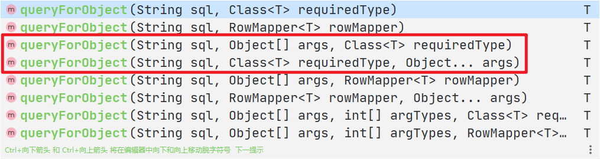


> （3）查询返回集合

```java
	public <T> java.util.List<T> query(String sql,
                                  org.springframework.jdbc.core.RowMapper<T> rowMapper, 
                                  @Nullable Object... args))
```

- 第一个参数：sql 语句
- 第二个参数：RowMapper 是接口，针对返回不同类型数据，使用这个接口里面实现类完成
  数据封装
- 第三个参数：sql 语句值

```Java
    @Override
    public List<Book> findAll() {
        String sql = "SELECT * FROM t_book";
        List<Book> bookList = jdbcTemplate.query(sql, new BeanPropertyRowMapper<Book>(Book.class));
        return bookList;
    }
```

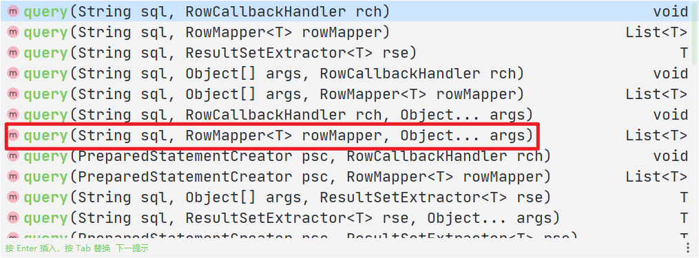


> （4）批量操作

```java
	public int[] batchUpdate(String sql,
                         java.util.List<Object[]> batchArgs)
```

- 第一个参数：sql 语句
- 第二个参数：List 集合，添加多条记录数据

```Java
    @Override
    public void batchAdd(List<Object[]> batchArgs) {
        String sql = "insert into t_book values(?,?,?)";
        int[] ints = jdbcTemplate.batchUpdate(sql, batchArgs);
        System.out.println(ints.length);
    }

    @Override
    public void batchUpdate(List<Object[]> batchArgs) {
        String sql = "UPDATE t_book SET username=?,ustatus=? WHERE user_id=?";
        int[] ints = jdbcTemplate.batchUpdate(sql, batchArgs);
        System.out.println(ints.length);
    }

    @Override
    public void batchDelete(List<Object[]> batchArgs) {
        String sql = "DELETE FROM t_book WHERE user_id=?";
        int[] ints = jdbcTemplate.batchUpdate(sql, batchArgs);
        System.out.println(ints.length);
    }
```

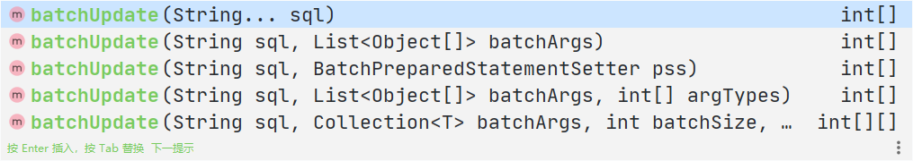


## Spring 整合 MyBatis

### 1、回忆MyBatis

**编写pojo实体类**

```java
@Data
public class User {
   private int id;  //id
   private String name;   //姓名
   private String pwd;   //密码
}
```

**实现mybatis的核心配置文件**

```xml-dtd
<?xml version="1.0" encoding="UTF-8" ?>
<!DOCTYPE configuration
        PUBLIC "-//mybatis.org//DTD Config 3.0//EN"
        "http://mybatis.org/dtd/mybatis-3-config.dtd">
<!--核心配置文件-->
<configuration>
    <environments default="development">
        <environment id="development">
            <transactionManager type="JDBC"/>
            <dataSource type="POOLED">
                <property name="driver" value="com.mysql.cj.jdbc.Driver"/>
                <property name="url" value="jdbc:mysql://localhost:3306/mybatis?
                                            useSSL=true&amp;
                                            useUnicode=true&amp;characterEncoding=UTF-8&amp;
                                            serverTimezone=UTC"/>
                <property name="username" value="root"/>
                <property name="password" value="sfz200108"/>
            </dataSource>
        </environment>
    </environments>

    <!--每一个Mapper.xml都需要在MyBatis核心配置文件中注册！-->
    <mappers>
        <mapper class="com.study.mapper.UserMapper"/>
    </mappers>
</configuration>
```

**UserMapper接口编写**

```java
public interface UserMapper {
   public List<User> selectUser();
}
```

**接口对应的Mapper.xml映射文件**

```xml
<?xml version="1.0" encoding="UTF-8" ?>
<!DOCTYPE mapper
       PUBLIC "-//mybatis.org//DTD Mapper 3.0//EN"
       "http://mybatis.org/dtd/mybatis-3-mapper.dtd">
<mapper namespace="com.kuang.dao.UserMapper">

   <select id="selectUser" resultType="User">
    	select * from user
   </select>

</mapper>
```

**测试类**

```java
@Test
public void selectUser() throws IOException {

   String resource = "mybatis-config.xml";
   InputStream inputStream = Resources.getResourceAsStream(resource);
   SqlSessionFactory sqlSessionFactory = newSqlSessionFactoryBuilder().build(inputStream);
   SqlSession sqlSession = sqlSessionFactory.openSession();

   UserMapper mapper = sqlSession.getMapper(UserMapper.class);

   List<User> userList = mapper.selectUser();
   for (User user: userList){
       System.out.println(user);
  }

   sqlSession.close();
}
```


### 2、MyBatis-Spring 学习

#### **什么是 MyBatis-Spring？**

MyBatis-Spring 会帮助你将 MyBatis 代码无缝地整合到 Spring 中。（用于整合MyBatis  和 Spring 的东西 ）

官方文档：http://www.mybatis.org/spring/zh/index.html


#### 准备工作: 导入 Mybatis-Spring 和 相关依赖

如果使用 Maven 作为构建工具，需要在 pom.xml 中加入以下代码：

```xml
 <dependencies>
        <!--mybatis-->
        <dependency>
            <groupId>org.mybatis</groupId>
            <artifactId>mybatis</artifactId>
            <version>3.5.4</version>
        </dependency>
        <!--mysql-connector-java-->
        <dependency>
            <groupId>mysql</groupId>
            <artifactId>mysql-connector-java</artifactId>
            <version>8.0.19</version>
        </dependency>
        <!--spring相关-->
        <dependency>
            <groupId>org.springframework</groupId>
            <artifactId>spring-webmvc</artifactId>
            <version>5.2.6.RELEASE</version>
        </dependency>
        <dependency>
            <groupId>org.springframework</groupId>
            <artifactId>spring-jdbc</artifactId>
            <version>5.2.6.RELEASE</version>
        </dependency>
        <!--aspectJ AOP 织入器-->
        <dependency>
            <groupId>org.aspectj</groupId>
            <artifactId>aspectjweaver</artifactId>
            <version>1.9.5</version>
        </dependency>
        <!--mybatis-spring整合包 【重点】-->
        <dependency>
            <groupId>org.mybatis</groupId>
            <artifactId>mybatis-spring</artifactId>
            <version>2.0.4</version>
        </dependency>
    </dependencies>

    <!--配置Maven静态资源过滤问题！-->
    <build>
        <resources>
            <resource>
                <directory>src/main/java</directory>
                <includes>
                    <include>**/*.properties</include>
                    <include>**/*.xml</include>
                </includes>
                <filtering>true</filtering>
            </resource>
        </resources>
    </build>
```


#### MyBatis-Spring 入门

要在 Spring 中 整合MyBatis，需要在 Spring 应用上下文（也即配置文件）中定义至少两样东西：

一个 `SqlSessionFactory` 和 至少一个数据源映射器类（`dataSources`）。

在 MyBatis-Spring 中，可使用 `SqlSessionFactoryBean` 来创建 `SqlSessionFactory`。

> 配置数据源（dataSource）

SqlSessionFactory 有一个唯一的必要属性：DataSource。所以在配置 SqlSessionFactory 前应先配置这个DataSource。

这可以是任意的 DataSource 对象（比如c3p0、dbcp、druid），它的配置方法和其它 Spring 数据库连接是一样的。

```xml
<!--配置dataSources数据源：在Spring中使用了这个数据源配置后会取代掉 MyBatis中的数据源配置
    我们这里使用的数据源是Spring提供的JDBC: DriverManagerDataSource  ...也可以使用druid、c3p0、dbcp等
-->
<bean name="dataSource" class="org.springframework.jdbc.datasource.DriverManagerDataSource">
    <property name="username" value="root"/>
    <property name="password" value="sfz200108"/>
    <property name="driverClassName" value="com.mysql.cj.jdbc.Driver"/>
    <property name="url" value="jdbc:mysql://localhost:3306/mybatis?useSSL=true&amp;
        useUnicode=true&amp;characterEncoding=UTF-8&amp;serverTimezone=UTC"/>
</bean>
```


> 认识工厂bean（sqlSessionFactory）

在工厂bean 创建 sqlSessionFactory对象，Spring 可以为 sqlSessionFactory对象 的所有信息进行配置！！！

**可以做到几乎完全取代Mybatis的配置！**

> 配置工厂bean 生产 sqlSessionFactory对象

要配置这个工厂 bean，只需要把下面代码放在 Spring 的 XML 配置文件中：

```xml
<bean id="sqlSessionFactory" class="org.mybatis.spring.SqlSessionFactoryBean">
 	<property name="dataSource" ref="dataSource" />
</bean>
```

> 工厂bean（即 SqlSessionFactoryBean ） 中可设置的属性  

常用的属性有： `configLocation`，它可以用来指定 MyBatis 的 XML 配置文件路径。

`configLocation`：<font color=red>用于引入 MyBatis 的配置信息、将其作为sqlSessionFactory的配置信息。</font>

常用的属性有：`mapperLocations` ，它可以对 MyBatis 中的映射器进行配置。

`mapperLocations`：注册 Mapper.xml文件

```xml
<bean id="sqlSessionFactory" class="org.mybatis.spring.SqlSessionFactoryBean">
    <!--将MyBatis配置文件中的配置加入到这里来-->
    <property name="configLocation" value="classpath:mybatis-config.xml"/>
    <!--配置数据源-->
    <property name="dataSource" ref="dataSource"/>
    <!--配置映射器-->
    <property name="mapperLocations" value="classpath:com/study/dao/*.xml"/>
</bean>
```

> 解释 classpath 含义： 

classpath也即 war包中对应的 classes 对应着 原项目中的 java 和 resoures 目录

用maven构建项目时候 resources目录就是默认的 classpath。classPath即为java文件编译之后的class文件的编译目录

一般也为web-inf/classes，src下的xml在编译时也会复制到classPath下。

1. `存放各种资源配置文件`  mybatis-config.xml 、beans.xml 、spring-dao.xml 
2. 存放class文件 对应的是项目开发时的src目 录编译文件 
3. 存放模板文件 Spring-09-MyBatis.kotlin_module 

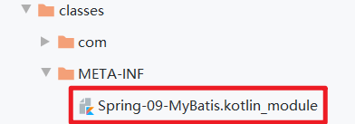

==总结 classpath的作用 ：是一个用于定位资源的入口==

> classpath 和 classpath 的区别： 

classpath：只会到你的class路径中查找找文件；

classpath*：不仅包含class路径，还包括jar文件中(class路径)进行查找。


>认识SqlSessionTemplate

`SqlSessionTemplate` 是 MyBatis-Spring 的核心。

作为 `SqlSession` 的一个实现，这意味着可以使用它无缝代替你代码中已经在使用的 `SqlSession`。

`SqlSessionTemplate` 是线程安全的，是可以被多个 DAO 或映射器所共享使用。

> sqlSessionTemplate的作用

- 获取 Mapper 接口的代理实现类。			getMapper( )
- 实现 CRUD 的操作。	     调用自身的方法直接对数据库进行操作

>SqlSessionTemplate 的配置与使用

**在 Spring 中配置 SqlSessionTemplate**

可以使用 `SqlSessionFactory` 作为构造方法的参数来创建 `SqlSessionTemplate对象`。

```xml
    <!--在Spring中配置sqlSession-->
    <bean id="sqlSession" class="org.mybatis.spring.SqlSessionTemplate">
        <!--只能使用构造器注入，因为SqlSessionTemplate中没有set方法-->
        <constructor-arg index="0" ref="sqlSessionFactory"/>
    </bean>
```

现在，这个 bean 就可以直接注入到你的 DAO bean 中了。你需要在你的 bean 中添加一个 SqlSession 属性，并注入

就像下面这样：

```java
@Repository
public class UserDaoImpl implements UserDao {
	@Autowired
 	private SqlSession sqlSession;
}
```


#### MyBatis-Spring实操

##### 方式一：基于使用 SqlSessionTemplate

> 整合实现一

第一步：引入`Spring配置文件`beans.xml

```xml
<?xml version="1.0" encoding="UTF-8"?>
<beans xmlns="http://www.springframework.org/schema/beans"
      xmlns:xsi="http://www.w3.org/2001/XMLSchema-instance"
      xsi:schemaLocation="http://www.springframework.org/schema/beans
       http://www.springframework.org/schema/beans/spring-beans.xsd">
<beans>
```

第二步：`配置数据源`替换mybaits的数据源

```xml
	<!--配置dataSources数据源：在Spring中使用了这个数据源配置后会取代掉 MyBatis中的数据源配置
	我们这里使用的数据源是Spring提供的JDBC: DriverManagerDataSource  ...也可以使用druid、c3p0、dbcp等
    -->
    <bean name="dataSource" 
          class="org.springframework.jdbc.datasource.DriverManagerDataSource">
        <property name="username" value="root"/>
        <property name="password" value="sfz200108"/>
        <property name="driverClassName" value="com.mysql.cj.jdbc.Driver"/>
        <property name="url" value="jdbc:mysql://localhost:3306/mybatis?useSSL=true&amp;
            useUnicode=true&amp;characterEncoding=UTF-8&amp;serverTimezone=UTC"/>
    </bean>
```

第三步：`配置SqlSessionFactory`，关联MyBatis和用于创建sqlSessionTemplate

```xml
    <!--配置 sqlSessionFactory 对象-->
    <bean id="sqlSessionFactory" class="org.mybatis.spring.SqlSessionFactoryBean">
        <!--配置数据源-->
        <property name="dataSource" ref="dataSource"/>
        <!--将MyBatis配置文件中的配置加入到这里来-->
        <property name="configLocation" value="classpath:mybatis-config.xml"/>
        <!--配置映射器-->
        <property name="mapperLocations" value="classpath:com/study/dao"/>
    </bean>
```

第四步：`注册sqlSessionTemplate`，关联sqlSessionFactory；

```xml
	<!--在 Spring 中配置 sqlSession -->
    <bean id="sqlSession" class="org.mybatis.spring.SqlSessionTemplate">
        <!--只能使用构造器注入，因为SqlSessionTemplate中没有set方法-->
        <constructor-arg index="0" ref="sqlSessionFactory"/>
    </bean>
```

第五步：`增加Dao接口的实现类`，实现自动装配sqlSessionTemplate

```java
public class UserDaoImpl implements UserMapper {
	//sqlSession不用我们自己创建了，Spring来管理
    @Autowired
    private SqlSessionTemplate sqlSession;
    
    public List<User> selectUser() {
        UserMapper mapper = sqlSession.getMapper(UserMapper.class);
        return mapper.selectUser();
    }
}
```

第六步：`测试`

```java
    @Test
    public void test() {
        ApplicationContext context =
            new ClassPathXmlApplicationContext("beans.xml");
        UserMapper userMapper = (UserMapper) context.getBean("userMapper");
        
        List<User> users = userMapper.queryAll();
        users.forEach(System.out::println);
    }
```


##### 方式二：基于使用 SqlSessionDaoSupport

> 整合实现二

继承了 SqlSessionDaoSupport 类后 ， SqlSession 可以直接利用 getSqlSession（） 获得 ，然后直接注入SqlSessionFactory 。比起方式1 ，可以不用管理SqlSessionTemplate ， 而且对事务的支持更加友好 。

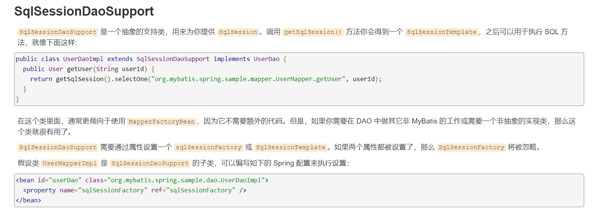

第一步：我们使用UserDaoImpl 继承 SqlSessionDaoSupport类

```java
public class UserMapperImpl extends SqlSessionDaoSupport implements UserMapper {
    @Override
    public List<User> queryAll() {
        UserMapper mapper = getSqlSession().getMapper(UserMapper.class);
        return mapper.queryAll();
    }
}
```

第二步：修改bean的配置

```xml
    <bean id="userMapper" class="com.study.dao.UserMapperImpl">
        <property name="sqlSessionFactory" ref="sqlSessionFactory"/>
<!--        <property name="sqlSessionTemplate" ref="sqlSession"/>-->
    </bean>
```

第三步：测试

```java
@Test
public void test() {
    ApplicationContext context =
        new ClassPathXmlApplicationContext("beans.xml");
    UserMapper userMapper = (UserMapper) context.getBean("userMapper");
    
    List<User> users = userMapper.queryAll();
    users.forEach(System.out::println);
}
```


> 总结 : 

整合到spring以后可以完全不要mybatis的配置文件，除了这些方式可以实现整合之外，我们还可以使用注解来

实现，这个等我们后面学习SpringBoot的时候还会测试整合！


## 事务操作

### 事务概念

> 1、什么是事务?

（1）==事务是数据库操作最基本的单元==，逻辑上的一组操作，要么都成功，如果有一个失败所有操作都失败 。

（2）典型场景：银行转账 

* lucy 转账 100 元 给 mary 
* lucy 少 100，mary 多 100 
* 两步都成功算转账成功，但凡有一步失败转账都失败

> 2、事务的作用

- 事务在项目开发过程非常重要，涉及到数据的一致性的问题，不容马虎！
- 事务管理是企业级应用程序开发中必备技术，用来确保数据的完整性和一致性。

> 3、事务四个特性（ACID） 

- ==原子性==：事务是原子性操作，由一系列动作组成。事务的原子性确保动作要么全部完成，要么完全不起作用。

- ==一致性==：一旦所有事务动作完成，事务就要被提交。数据和资源处于一种满足业务规则的一致性状态中。

- ==隔离性==：可能多个事务会同时处理相同的数据，因此每个事务都应该与其他事务隔离开来，防止数据损坏

- ==持久性==：事务一旦完成，无论系统发生什么错误，结果都不会受到影响。通常情况下，事务的结果被写到

​								持久化存储器中。


### 搭建事务操作环境

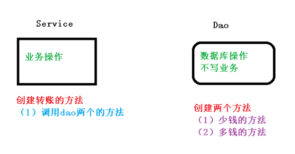

1、创建数据库表，添加记录

2、创建 service，搭建 dao，完成对象创建和注入关系 

service 注入 dao，在 dao 注入 JdbcTemplate，在 JdbcTemplate 注入 DataSource

```java
@Service
public class UserService {
    //注入 dao
    @Autowired
    private UserDao userDao;
}
@Repository
public class UserDaoImpl implements UserDao {
    @Autowired
    private JdbcTemplate jdbcTemplate;
}
```

3、在 dao 创建两个方法：多钱和少钱的方法，在 service 创建方法（转账的方法）

```java
@Repository
public class UserDaoImpl implements UserDao {
    @Autowired
    private JdbcTemplate jdbcTemplate;
    //lucy 转账 100 给 mary
    //少钱
    @Override
    public void reduceMoney() {
        String sql = "update t_account set money=money-? where username=?";
        jdbcTemplate.update(sql,100,"lucy");
    }
    //多钱
    @Override
    public void addMoney() {
        String sql = "update t_account set money=money+? where username=?";
        jdbcTemplate.update(sql,100,"mary");
    }
}

@Service
public class UserService {
    //注入 dao
    @Autowired
    private UserDao userDao;
    //转账的方法
    public void accountMoney() {
        //lucy 少 100
        userDao.reduceMoney();
        //mary 多 100
        userDao.addMoney();
    }
}
```

4、上面代码，如果正常执行没有问题的，但是如果代码执行过程中==出现异常，有问题==

```java
//转账的方法出现异常！！！
public void accountMoney() {
    userDao.reduceMoney();

    //出现异常
    int i = 1 / 0;

    userDao.addMoney();
}
```

上面问题如何解决呢？ 使用事务进行解决 

> 事务操作过程

```java
try {
    //1、开启事务

    //2、执行业务操作
    userDao.reduceMoney();
    //3、出现异常
    int i = 1 / 0;
    userDao.addMoney();

    //3.1、出现异常，事务异常回滚
    //3.2、没有异常，事务正常提交
} catch (Exception e) {
    e.printStackTrace();
}
```


### Spring 事务管理介绍

1、事务 一般添加到 JavaEE三层架构中的 ==Service层（业务逻辑层）==

2、在 Spring 进行事务管理操作

- 有两种方式：编程式事务管理和==声明式事务管理（使用）==

**声明式事务管理**

- 一般情况下比编程式事务好用。
- 将事务管理代码从业务方法中分离出来，以声明的方式来实现事务管理。
- 将事务管理作为横切关注点，通过aop方法模块化。Spring中通过Spring AOP框架支持声明式事务管理。

3、声明式事务管理

（1）==基于注解方式（开发中使用）==

（2）基于 xml 配置文件方式

4、在 Spring 进行声明式事务管理，==底层使用 AOP 原理==

5、Spring 提供事务管理的 API

Spring中对事务管理提供一个接口，代表事务管理器，这个接口针对不同的框架提供了不同的实现类！！！

`DataSourceTransactionManager`：为 `JdbcTemplate` 和 `Mybatis框架` 提供事务管理器的支持

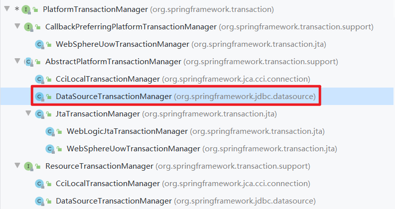


### 注解声明式事务管理

#### 1、在 spring 配置文件，==配置事务管理器==

```xml
<!--创建事务管理器-->
<bean id="transactionManager" 
      class="org.springframework.jdbc.datasource.DataSourceTransactionManager">
    <!--指定要注入的数据源-->
    <property name="dataSource" ref="dataSource"/>
</bean>
```


#### 2、在 spring 配置文件，==开启事务注解== 

- 第一步：在 spring 配置文件引入名称空间 tx

```xml-dtd
xmlns:tx="http://www.springframework.org/schema/tx"
xsi:schemaLocation="http://www.springframework.org/schema/tx
	http://www.springframework.org/schema/tx/spring-tx.xsd">
```

- 第二步：在配置文件中`配置开启事务注解`

```xml
<!--开启事务注解-->
<tx:annotation-driven transaction-manager="transactionManager"/>
```


#### 3、在 service 类上面（或者 service 类里面方法上面）==添加事务注解==

- `@Transactional`，这个注解添加到类上面，也可以添加方法上面

- 如果把这个注解添加类上面，这个类里面所有的方法都添加事务

- 如果把这个注解添加方法上面，为这个方法添加事务

```java
@Service
@Transactional
public class UserService {}
```


### XML 声明式事务管理

在 spring 配置文件中进行配置

1. 配置事务管理器

2. 配置通知

3.  配置切入点和切面

```xml
<!--1、创建事务管理器-->
<bean id="transactionManager" class="org.springframework.jdbc.datasource.DataSourceTransactionManager">
    <!--指定要注入的数据源-->
    <property name="dataSource" ref="dataSource"/>
</bean>

<!--2、配置事务通知-->
<tx:advice id="txAdvice">
    <!--配置事务参数-->
    <tx:attributes>
         <!--配置在哪些方法(可以配置方法匹配规则)上使用事务-->
        <tx:method name="accountMoney" propagation="REQUIRED" isolation="REPEATABLE_READ"/>
    </tx:attributes>
</tx:advice>

<!--3、配置切入点和切面-->
<aop:config>
    <!--配置切入点-->
    <aop:pointcut id="pointCut" expression=
                  "execution(* com.study.service.UserService.*(..))"/>
    <!--配置切面-->
    <aop:advisor advice-ref="txAdvice" pointcut-ref="pointCut"/>
</aop:config>
```


### 声明式事务管理参数配置

> 初步认识

在 service 类上面添加注解@Transactional，在这个注解里面可以配置事务相关参数。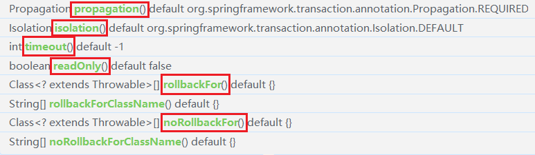


#### 1、propagation：事务传播行为

**`事务传播行为`**：就是==多个事务方法之间进行调用的过程中，事务是如何进行管理的！！！==

**`事务方法`**：==对数据库表中数据进行变化的方法！！！==

事务的传播行为是由传播属性指定的。

Spring 种最常用的事务传播行为是 ==REQUIRED 和 REQUIRED_NEW==，默认的传播行为是 ==REQUIRED==。

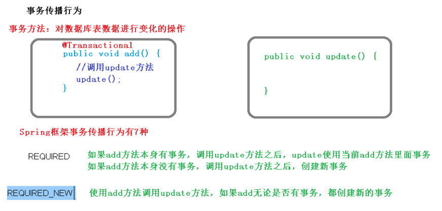

在 Spring 中共定义了7种传播行为。

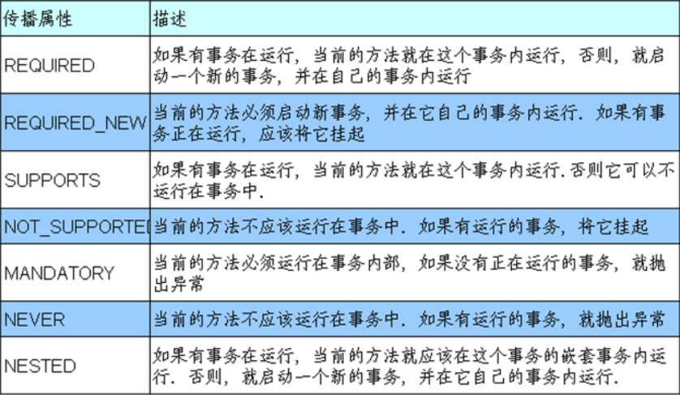


####  2、ioslation：事务隔离级别

（1）事务有个特性称为隔离性，可以使多事务操作之间不会产生影响。但是如果不考虑隔离性就产生很多问题！

（2）有三个读问题（并发产生的问题）：**脏读、不可重复读、幻读**

- ==脏读==：一个未提交事务读取到了另外一个事务未提交的数据

- ==不可重复读==：一个未提交事务读取到另一提交事务==修改数据==

	（比如：淘宝在购物时产品的销量和库存的变化）

- ==幻读==：一个未提交事务读取到另一提交事务==添加数据==

	（比如：淘宝在浏览时刷新页面后，页面中的商品添加了！）

（3）解决：通过设置事务隔离级别，解决读问题（并发问题）

​	注：MySQL中默认的隔离级别是 `REPEATABLE_READ` （可重复读）

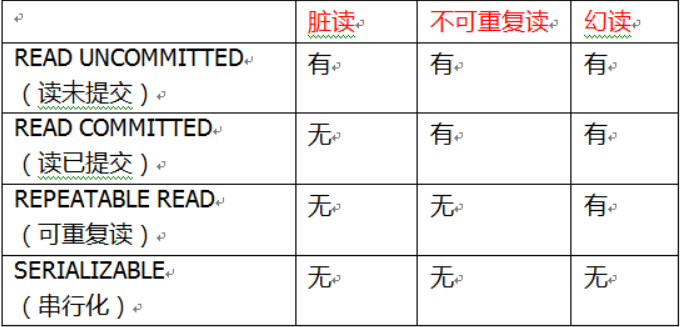

**设置事务的隔离性！**

```java
@Service
@Transactional(isolation = Isolation.REPEATABLE_READ)
public class UserService {}
```


#### 3、timeout：超时时间

（1）事务需要在一定时间内进行提交，==如果不提交进行回滚==

（2）默认值是 -1 ，设置时间==以秒单位==进行计算


#### 4、readOnly：是否只读

（1）读：查询操作，写：添加修改删除操作

（2）readOnly ==默认值 false==，表示可以查询，可以添加修改删除操作

（3）设置 readOnly 值是 true，==设置成 true 之后，只能查询==


#### 5、rollbackFor：回滚

设置出现哪些异常进行事务回滚


#### 6、noRollbackFor：不回滚

设置出现哪些异常不进行事务回滚


### 完全注解声明式事务管理

创建配置类，使用 配置类 完全替代 xml配置文件

```java
@Configuration  //作为配置类
@ComponentScan (basePackages = "com.study")  //开启组件扫描
@EnableTransactionManagement    //开启事务
public class TxConfig {

    //创建数据库连接池
    @Bean
    public DruidDataSource getDruidDataSource() {
        DruidDataSource dataSource = new DruidDataSource();
        dataSource.setDriverClassName("com.mysql.jdbc.Driver");
        dataSource.setUrl("jdbc:mysql:///user_db");
        dataSource.setUsername("root");
        dataSource.setPassword("123456");
        return dataSource;
    }

    //创建 JdbcTemplate 对象
    @Bean
    public JdbcTemplate getJdbcTemplate(DataSource dataSource) {
        //到 ioc 容器中根据类型找到 dataSource
        JdbcTemplate jdbcTemplate = new JdbcTemplate();
        //注入 dataSource
        jdbcTemplate.setDataSource(dataSource);
        return jdbcTemplate;
    }

    //创建事务管理器
    @Bean
    public DataSourceTransactionManager 
        getDataSourceTransactionManager(DataSource dataSource) {
            DataSourceTransactionManager transactionManager = new
                    DataSourceTransactionManager();
            transactionManager.setDataSource(dataSource);
            return transactionManager;
    }
    
}
```


## Spring5 框架新功能

> 1、整个 Spring5 框架的代码基于 Java8，运行时兼容 JDK9，许多不建议使用的类和方法在代码库中删除

> 2、Spring 5.0 框架自带了通用的日志封装

Spring5 已经移除 Log4jConfigListener，官方建议使用 Log4j2

使用 Spring5 框架整合 Log4j2

> 第一步 引入 log4j2 的依赖

```xml
<dependency>
    <groupId>org.apache.logging.log4j</groupId>
    <artifactId>log4j-api</artifactId>
    <version>2.13.3</version>
</dependency>
<dependency>
    <groupId>org.apache.logging.log4j</groupId>
    <artifactId>log4j-core</artifactId>
    <version>2.13.3</version>
</dependency>

<dependency>
    <groupId>org.apache.logging.log4j</groupId>
    <artifactId>log4j-web</artifactId>
    <version>2.13.3</version>
</dependency>
```

> 第二步 创建 log4j2.xml 配置文件

```xml
<?xml version="1.0" encoding="UTF-8"?>
<!--日志级别以及优先级排序: OFF > FATAL > ERROR > WARN > INFO > DEBUG > TRACE > ALL -->
<!--Configuration后面的status用于设置log4j2自身内部的信息输出，可以不设置，
	当设置成trace时，可以看到log4j2内部各种详细输出-->
<configuration status="DEBUG">
    <!--先定义所有的appender-->
    <appenders>
        <!--输出日志信息到控制台-->
        <console name="Console" target="SYSTEM_OUT">
            <!--控制日志输出的格式-->
            <PatternLayout pattern="%d{yyyy-MM-dd HH:mm:ss.SSS} [%t] %-5level 
                                    %logger{36} - %msg%n"/>
        </console>
    </appenders>
    <!--然后定义logger，只有定义了logger并引入的appender，appender才会生效-->
    <!--root：用于指定项目的根日志，如果没有单独指定Logger，则会使用root作为默认的日志输出-->
    <loggers>
        <root level="info">
            <appender-ref ref="Console"/>
        </root>
    </loggers>
</configuration>
```


> 3、Spring5 框架核心容器支持 `@Nullable` 注解

@Nullable 注解可以使用在方法上面，方法参数上面，属性上面，使用在方法上、方法参数上、属性上

表示方法返回可以为空，属性值可以为空，参数值可以为空


> 4、Spring5 核心容器支持函数式风格 GenericApplicationContext

```java
//函数式风格创建对象，交给 spring 进行管理
@Test
public void testGenericApplicationContext() {
    //1 创建 GenericApplicationContext 对象
    GenericApplicationContext context = new GenericApplicationContext();
    //2 调用 context 的方法对象注册
    context.refresh();
    context.registerBean("user1",User.class,() -> new User());
    //3 获取在 spring 注册的对象
    // User user = (User)context.getBean("com.atguigu.spring5.test.User");
    User user = (User)context.getBean("user1");
    System.out.println(user);
}
```


> 5、Spring5 支持整合 JUnit5 

准备工作：引入 Spring 相关针对测试依赖

```xml
<dependency>
    <groupId>org.springframework</groupId>
    <artifactId>spring-test</artifactId>
    <version>5.2.6.RELEASE</version>
</dependency>
```


> 5.1、整合 JUnit4 

- 第一步 引入 Junit4 的依赖

```xml
<dependency>
    <groupId>junit</groupId>
    <artifactId>junit</artifactId>
    <version>4.12</version>
</dependency>
```

- 第二步 创建测试类，使用注解方式完成测试

```java
@RunWith(SpringJUnit4ClassRunner.class) //指定Junit4的单元测试框架
@ContextConfiguration("classpath:bean1.xml")   //指定要加载的配置文件
public class JTest4 {
    @Autowired
    private UserService userService;
    
    @Test
    public void test() {
        userService.accountMoney();
    }
}
```


> 5.2、Spring5 整合 JUnit5

- 第一步 引入 JUnit5 的 依赖

```xml
<dependency>
    <groupId>org.junit.jupiter</groupId>
    <artifactId>junit-jupiter-api</artifactId>
    <version>5.4.2</version>
</dependency>
```

- 第二步 创建测试类 
- 方式一：使用 @ExtendWith(SpringExtension.class) 注解完成

```java
@ExtendWith(SpringExtension.class)
@ContextConfiguration("classpath:bean1.xml")
public class JTest5 {
    @Autowired
    private UserService userService;

    @Test
    public void test() {
        userService.accountMoney();
    }
}
```

- 方式二：使用一个复合注解（`@SpringJUnitConfig`）替代上面两个注解完成整合

```java
@SpringJUnitConfig(locations = "classpath:bean1.xml")
public class JTest5 {
    @Autowired
    private UserService userService;
    @Test
    public void test() {
        userService.accountMoney();
    }
}
```


## 课程总结

> 1、Spring 框架概述

（1）轻量级开源 JavaEE 框架，为了解决企业复杂性，两个核心组成：==IOC 和 AOP==

（2）Spring5.2.6 版本

> 2、IOC 容器

（1）==IOC 底层原理（工厂、反射等）==

（2）IOC 接口（BeanFactory）

（3）==IOC 操作 Bean 管理（基于 xml）==

（4）==IOC 操作 Bean 管理（基于注解）==

> 3、Aop

（1）==AOP 底层原理：动态代理，有接口（JDK 动态代理），没有接口（CGLIB 动态代理）==

（2）术语：==切入点、增强（通知）、切面==

（3）==基于 AspectJ 实现 AOP 操作==

>4、JdbcTemplate

（1）==使用 JdbcTemplate 实现数据库的CRUD操作==

（2）==使用 JdbcTemplate 实现数据库批量操作==

> 5、事务管理

（1）事务概念

（2）重要概念（==传播行为和隔离级别==）

（3）==基于注解实现声明式事务管理==

（4）完全注解方式实现声明式事务管理

> 6、Spring5 新功能

（1）==整合日志框架==

（2）==@Nullable 注解==

（3）函数式注册对象

（4）==整合 JUnit5 单元测试框架==

（5）==SpringWebflux 使用==