# 一、Spring Boot 入门

## 1、Spring Boot 简介

> 简化Spring应用开发的一个框架；
>
> 整个Spring技术栈的一个大整合；
>
> J2EE开发的一站式解决方案；

[SpringBoot 官方文档](https://docs.spring.io/spring-boot/docs/2.3.2.RELEASE/reference/htmlsingle/)

## 2、微服务

2014，martin fowler

微服务：架构风格（服务微化）

一个应用应该是一组小型服务；可以通过HTTP的方式进行互通；

单体应用：ALL IN ONE

微服务：每一个功能元素最终都是一个可独立替换和独立升级的软件单元。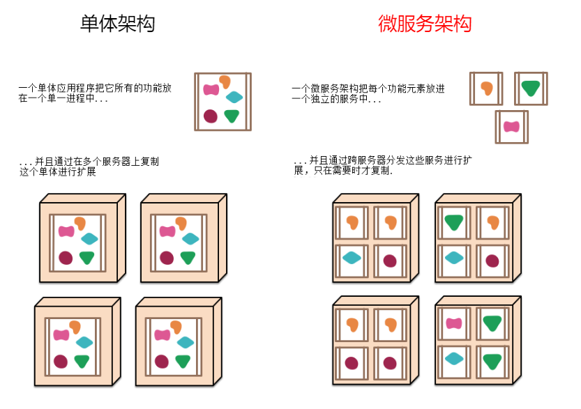

[详细参照微服务文档](https://martinfowler.com/articles/microservices.html#MicroservicesAndSoa)


## 3、Spring Boot-HelloWorld

实现一个功能：

浏览器发送hello请求，服务器接受请求并处理，响应Hello World字符串；

### 1、创建一个maven工程（环境准备）

### 2、导入spring boot相关的依赖

```xml
    <parent>
        <artifactId>spring-boot-starter-parent</artifactId>
        <groupId>org.springframework.boot</groupId>
        <version>2.3.1.RELEASE</version>
    </parent>
    <dependencies>
        <dependency>
            <groupId>org.springframework.boot</groupId>
            <artifactId>spring-boot-starter-web</artifactId>
        </dependency>
    </dependencies>
```

### 3、编写一个主程序，启动 SpringBoot应用

```java
// @SpringBootApplication 来标注一个主程序类，说明这是一个Spring Boot应用
@SpringBootApplication
public class HelloWorldMainApplication {

    public static void main(String[] args) {
        // Spring应用启动起来
        SpringApplication.run(HelloWorldMainApplication.class,args);
    }
}
```

### 4、编写相关的Controller、Service

```java
@Controller
public class HelloController {

    @ResponseBody
    @RequestMapping("/hello")
    public String hello(){
        return "Hello World!";
    }
}
```

### 5、运行主程序测试

### 6、简化部署

```xml
 <!-- 这个插件，可以将应用打包成一个可执行的jar包；-->
<build>
    <plugins>
        <plugin>
            <groupId>org.springframework.boot</groupId>
            <artifactId>spring-boot-maven-plugin</artifactId>
        </plugin>
    </plugins>
</build>
```

部署：可以直接将这个应用打成jar包，使用java -jar的命令进行执行。


## 4、Hello World探究

### 4.1、POM文件

#### 4.1.1、父项目

```xml
<parent>
    <artifactId>spring-boot-starter-parent</artifactId>
    <groupId>org.springframework.boot</groupId>
    <version>2.3.1.RELEASE</version>
</parent>

它的父项目是

<!--真正管理Spring Boot应用里面的所有依赖版本;-->
<parent>
    <groupId>org.springframework.boot</groupId>
    <artifactId>spring-boot-dependencies</artifactId>
    <version>2.3.1.RELEASE</version>
</parent>
```

Spring Boot的版本仲裁中心；

以后我们导入依赖默认是不需要写版本；（没有在dependencies里面管理的依赖自然需要声明版本号）

#### 4.1.2、场景启动器

```xml
<dependency>
    <groupId>org.springframework.boot</groupId>
    <artifactId>spring-boot-starter-web</artifactId>
</dependency>
```

`spring-boot-starter`-==web==：

 spring-boot-starter：spring-boot场景启动器，帮我们导入了web模块正常运行所依赖的组件。

Spring Boot将所有的功能场景都抽取出来，做成一个个的starters（启动器），只需要在项目里面引入这些starter相关场景的所有依赖

都会导入进来。要用什么功能就导入什么场景的启动器。


### 4.2、主程序类，主入口类

```java
// @SpringBootApplication 来标注一个主程序类，说明这是一个 SpringBoot应用
@SpringBootApplication
public class HelloWorldMainApplication {

    public static void main(String[] args) {
        // Spring应用启动起来
        SpringApplication.run(HelloWorldMainApplication.class,args);
        
    }
}
```

@**SpringBootApplication**: SpringBoot应用注解标注在某个类上说明这个类是SpringBoot的主配置类，

SpringBoot就应该运行这个类的main方法来启动SpringBoot应用。


> @SpringBootApplication的探究

```java
@SpringBootConfiguration
@EnableAutoConfiguration
@ComponentScan(excludeFilters = { 
    	@Filter(type = FilterType.CUSTOM, classes = TypeExcludeFilter.class),
      	@Filter(type = FilterType.CUSTOM, classes = AutoConfigurationExcludeFilter.class) })
public @interface SpringBootApplication {...}
```

**`@SpringBootConfiguration`**：Spring Boot的配置类；标注在某个类上，表示这是一个Spring Boot的配置类。

@Configuration：配置类上来标注这个注解；

​		  配置类 ----- 配置文件；配置类也是容器中的一个组件（@Component）


**`@EnableAutoConfiguration`**：开启自动配置功能，SpringBoot会帮我们自动配置以前需要手动配置的东西。

```java
@AutoConfigurationPackage
@Import(AutoConfigurationImportSelector.class)
public @interface EnableAutoConfiguration {...}
```

- `@AutoConfigurationPackage`：自动配置包

	- 使用Spring的底层注解@Import，给容器中导入一个组件；导入的组件由AutoConfigurationPackages.Registrar.class

		==将主配置类（@SpringBootApplication标注的类）的所在包及下面所有子包里面的所有组件扫描到Spring容器。==

		

- `@Import(AutoConfigurationImportSelector.class)`： 给容器中导入**SpringBoot导入自动配置的选择器**组件。

	```java
	AutoConfigurationImportSelector.selectImports: 将所有需要导入的组件以全类名的方式返回,这些组件就会被添加到容器中。
	```

	AutoConfigurationImportSelector 会给容器中导入非常多的自动配置类（xxxAutoConfiguration）；就是给容器中导入这个场景需要的

	所有组件，并配置好这些组件。有了自动配置类，免去了我们手动编写配置注入功能组件等的工作。

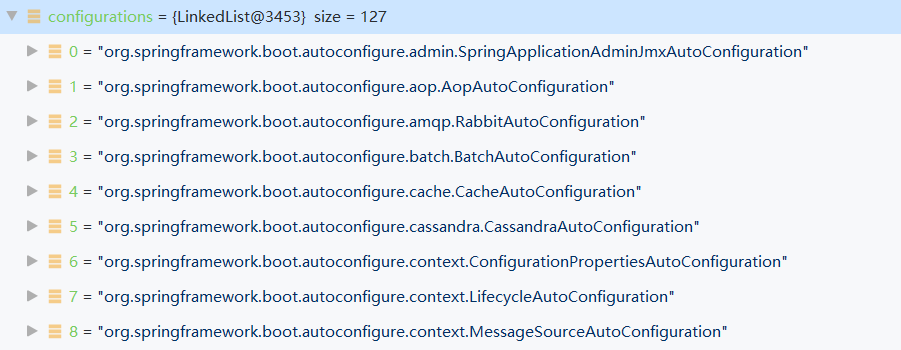


加载自动配置的信息：SpringFactoriesLoader.loadFactoryNames(EnableAutoConfiguration.class，classLoader)；

==Spring Boot在启动的时从类路径下的 META-INF/spring.factories 中获取EnableAutoConfiguration指定的值，将这些值作为自动配置类导入到==

==容器中，自动配置类就生效，帮我们进行自动配置工作。==

J2EE的整体整合解决方案和自动配置都在spring-boot-autoconfigure-2.3.1.RELEASE.jar 


# 二、Spring Boot 配置

## 1、配置文件

SpringBoot使用一个全局的配置文件，配置文件名是固定的；

- application.properties

- application.yml


配置文件的作用：修改SpringBoot自动配置的默认值；SpringBoot在底层都给我们自动配置好；

YAML（YAML Ain’t Markup Language）

 YAML：**以数据为中心**，比json、xml等更适合做配置文件；

YAML：配置实例

```yaml
server:
  port: 8081
12
```

 XML：

```xml
<server>
	<port>8081</port>
</server>
```


## 2、YAML语法

### 1、基本语法

k: (空格) v：表示一对键值对（空格必须有）；

以**空格**的缩进来控制层级关系；只要是左对齐的一列数据，都是同一个层级的；

```yaml
server:
    port: 8081
    path: /hello
```

属性和值也是大小写敏感。


### 2、值的写法

> 字面量：普通的值（数字，字符串，布尔）

 k: v：字面直接来写；

 字符串默认不用加上单引号或者双引号；

- `""`：双引号；`不会转义`字符串里面的特殊字符；特殊字符会作为本身想表示的意思。

	name: " zhangsan \n lisi "：输出；zhangsan 换行 lisi

- `''`：单引号；`会转义`特殊字符，特殊字符最终只是一个普通的字符串数据

	name: ' zhangsan \n lisi ' ：输出；zhangsan \n lisi

	

> 对象、Map（属性和值）（键值对）：

 k: v：在下一行来写对象的属性和值的关系；注意缩进

 对象还是k: v的方式

```yaml
friends:
    lastName: zhangsan
    age: 20
```

行内写法：

```yaml
friends: {lastName: zhangsan,age: 18}
```


> 数组（List、Set）：

用- 值表示数组中的一个元素

```yaml
pets:
 - cat
 - dog
 - pig
```

行内写法

```yaml
pets: [cat,dog,pig]
```


## 3、配置文件值注入

> 使用 ==@ConfigurationProperties== 进行注入绑定

@ConfigurationProperties 添加在指定类对象上，并使其能与配置文件绑定。（但要先将这个类初始化到IOC容器中）

步骤一：导入配置文件处理器，配置文件进行绑定就会有提示。

```xml
<dependency>
    <groupId>org.springframework.boot</groupId>
    <artifactId>spring-boot-configuration-processor</artifactId>
    <optional>true</optional>
</dependency>
```

步骤二：编写JavaBean：

- 标记这个 JavaBean 为 Spring 容器的组件：@Component

- 告诉 SpringBoot 将本类中的所有属性和配置文件中相关的配置进行绑定： `@ConfigurationProperties(prefix="...")` 

```java
@Component
@ConfigurationProperties(prefix = "person")
public class Person {
    
    private String lastName;
    private Integer age;
    private Boolean boss;
    private Date birth;
    
    private Map<String,Object> maps;
    private List<Object> lists;
    private Dog dog;
}
```

步骤三：使用配置文件进行配置：

```yml
person:
    lastName: hello
    age: 18
    boss: false
    birth: 2017/12/12
    maps: {k1: v1,k2: 12}
    lists:
      - lisi
      - zhaoliu
    dog:
      name: 小狗
      age: 12
```


> @Value 获取值和 @ConfigurationProperties 获取值比较

|                      | @ConfigurationProperties |   @Value   |
| :------------------: | :----------------------: | :--------: |
|         功能         | 批量注入配置文件中的属性 | 一个个指定 |
| 松散绑定（松散语法） |           支持           |   不支持   |
|         SpEL         |          不支持          |    支持    |
|    JSR303数据校验    |           支持           |   不支持   |
|     复杂类型封装     |           支持           |   不支持   |

场景选择：

如果说，我们只是在某个业务逻辑中需要获取一下配置文件中的某项值，使用@Value。

如果说，我们专门编写了一个JavaBean来和配置文件进行映射，我们就直接使用@ConfigurationProperties。

> 配置文件注入值使用==数据校验 @Validated==

```java
@Component
@ConfigurationProperties(prefix = "person")
@Validated
public class Person {

   //lastName必须是邮箱格式
    @Email	
    //@Value("${person.last-name}")
    private String lastName;
}
```

ps：可能要引 `spring-boot-starter-validation`

> ==@PropertySource==& ~~@ImportResource~~ &==@Bean==

**@PropertySource**：加载指定的配置文件，自动注入到对应变量名的属性上。

```java
@PropertySource(value = {"classpath:person.properties"})
@Component
public class Person {

    private String lastName;
    private Integer age;
    private Boolean boss;
}
```


**@ImportResource**：导入 Spring 的 xml 配置文件，让配置文件内容生效。

```java
@ImportResource(locations = {"classpath:beans.xml"})
@SpringBootApplication // 注: @ImportResource 标注在一个配置类上
```


SpringBoot推荐给容器中添加组件的方式：推荐使用全注解的方式。

使用**@Bean**给容器中添加组件：

```java
/**
 * @Configuration：指明当前类是一个配置类；就是来替代之前的Spring配置文件
 * 在配置文件中用<bean><bean/>标签添加组件
 */
@Configuration
public class MyAppConfig {

    //将方法的返回值添加到容器中；容器中这个组件默认的id就是方法名
    @Bean
    public HelloService helloService02(){
        System.out.println("配置类 @Bean 给容器中添加了组件...");
        return new HelloService();
    }
}
```


## 4、配置文件占位符

**1、随机数**

```java
${random.value}、${random.int}、${random.long}
${random.int(10)}、${random.int[1024,65536]}
```

**2、占位符获取之前配置的值，如果没有可以是用：指定默认值**

```properties
person.last-name=张三${random.uuid}
person.age=${random.int}
person.lists=a,b,c
person.dog.name=${person.hello:hello}_dog
```


## 5、Profile 指定环境

### 1、多Profile文件

我们在主配置文件编写的时候，文件名可以是 `application-{profile}.properties/yml`

默认使用application.properties的配置；

### 2、yml支持多文档块方式

```yml
server:
  port: 8081
spring:
  profiles:
    active: prod # 激活指定文档块

---
server:
  port: 8082
spring:
  profiles: dev  # 指定属于dev环境

---
server:
  port: 8083
spring:
  profiles: prod  # 指定属于prod环境
```

### 3、激活指定profile

 1、在配置文件中指定 `spring.profiles.active=dev`

 2、命令行方式指定：

java -jar spring-boot-config-1.0.jar --spring.profiles.active=dev

 可以直接在测试的时候，配置传入命令行参数

 3、虚拟机参数；

 -Dspring.profiles.active=dev


## 6、配置文件加载位置

springboot 启动会扫描以下位置的 application.properties 或者 application.yml 文件作为 Spring Boot 的默认配置文件

- file：/config/	
- file：/
- classpath：/config/
- classpath：/

优先级==从高到低的顺序==，高优先级的配置会覆盖低优先级的配置；

SpringBoot会从这四个位置全部加载主配置文件，**并实现互补配置**。


==我们还可以通过spring.config.location来改变默认的配置文件位置。==

**项目打包好以后，我们可以使用命令行参数的形式，启动项目的时候来指定配置文件的新位置；**

**指定配置文件和默认加载的这些配置文件共同起作用形成==互补配置！==**

```bash
java -jar spring-boot-config-1.0.jar --spring.config.location= G:/application.properties
```


## 7、外部配置加载顺序

SpringBoot也可以从以下位置加载配置：优先级从高到低；高优先级的配置覆盖低优先级的配置，所有的配置会形成互补配置。

==1.命令行参数==

==所有的配置都可以在命令行上进行指定：多个配置用空格分开， --配置项=值 。==

```java
java -jar spring-boot-02-config-02-0.0.1-SNAPSHOT.jar --server.port=8888 --server.context-path=/abc
```

2.来自java:comp/env的JNDI属性

3.Java系统属性（System.getProperties()）

4.操作系统环境变量

5.RandomValuePropertySource配置的random.*属性值

==由jar包外向jar包内进行寻找：==

==优先加载带profile==

**6.jar包外部的application-{profile}.properties或application.yml(带spring.profile)配置文件**

**7.jar包内部的application-{profile}.properties或application.yml(带spring.profile)配置文件**

==再来加载不带profile==

**8.jar包外部的application.properties或application.yml(不带spring.profile)配置文件**

**9.jar包内部的application.properties或application.yml(不带spring.profile)配置文件**

10.@Configuration注解类上的@PropertySource

11.通过SpringApplication.setDefaultProperties指定的默认属性

所有支持的配置加载来源：[参考官方文档](https://docs.spring.io/spring-boot/docs/1.5.9.RELEASE/reference/htmlsingle/#boot-features-external-config)


## 8、自动配置原理

### 1、**自动配置原理：**

1）SpringBoot启动的时候加载主配置类，开启了自动配置功能 ==@EnableAutoConfiguration== 

**2）@EnableAutoConfiguration 调用原理：**

- 导入了 `AutoConfigurationImportSelector `类给容器中导入一些组件；

- 查看`selectImports()`方法的内容：返回导入类全类名的字符串数组；

- 调用`getAutoConfigurationEntry()`返回 AutoConfigurationEntry

- `List configurations = getCandidateConfigurations( annotationMetadata，attributes )`：获取候选的配置

	（获取所有自动配置的类的全类名）

- `SpringFactoriesLoader.loadFactoryNames().loadSpringFactories()`

	- 扫描所有jar包类路径下  **META-INF/spring.factories**
	- 把扫描到的这些文件的内容包装成 **properties** 对象
	- 从 **properties** 中获取到 **EnableAutoConfiguration.class** 类对应的值，然后把他们添加在容器中。

==作用：将类路径下 META-INF/spring.factories 里面配置的所有 EnableAutoConfiguration 的值加入到了容器中。==

```java
org.springframework.boot.autoconfigure.EnableAutoConfiguration=\
org.springframework.boot.autoconfigure.admin.SpringApplicationAdminJmxAutoConfiguration,\
org.springframework.boot.autoconfigure.aop.AopAutoConfiguration,\
org.springframework.boot.autoconfigure.amqp.RabbitAutoConfiguration,\
org.springframework.boot.autoconfigure.batch.BatchAutoConfiguration,\
org.springframework.boot.autoconfigure.cache.CacheAutoConfiguration,\
    ...
```

每一个这样的 `xxxAutoConfiguration` 类都是容器中的一个组件，都加入到容器中，用它们来做自动配置。


3）每一个自动配置类进行自身的自动配置功能；

4）以**HttpEncodingAutoConfiguration（Http编码自动配置）**为例解释自动配置原理；

```java
// 表示这是一个配置类
@Configuration
// @EnableConfigurationProperties注解的作用: 使使用 @ConfigurationProperties 注解的类生效。
// @ConfigurationProperties 添加在指定类对象上,生效后会将这个类初始化到IOC容器中,并使其能与配置文件绑定。
@EnableConfigurationProperties(ServerProperties.class)  


// @Conditionalxxx,根据不同的条件,如果满足指定的条件,整个配置类里面的配置才会生效。
// 判断当前应用是否是web应用: 如果是,当前配置类生效。
@ConditionalOnWebApplication(type = ConditionalOnWebApplication.Type.SERVLET)
// 判断当前项目是否有 CharacterEncodingFilter这个类: SpringMVC中进行乱码解决的过滤器。
@ConditionalOnClass(CharacterEncodingFilter.class)  
// 判断配置文件中是否存在某个配置: server.servlet.encoding.enabled,即使不存在,判断也是成立的,配置类也会生效。
@ConditionalOnProperty(prefix = "server.servlet.encoding", value = "enabled", matchIfMissing = true) 
public class HttpEncodingAutoConfiguration {

	private final Encoding properties;
  
   // 在只有一个有参构造器的情况下,参数的值会被IOC容器进行自动装配
	public HttpEncodingAutoConfiguration(ServerProperties properties) {
		this.properties = properties.getServlet().getEncoding();
	}

    @Bean   //给容器中添加一个组件，这个组件的某些值需要从 properties配置 中获取
	@ConditionalOnMissingBean(CharacterEncodingFilter.class)  // 判断容器中是否有这个组件
	public CharacterEncodingFilter characterEncodingFilter() {
		CharacterEncodingFilter filter = new OrderedCharacterEncodingFilter();
		filter.setEncoding(this.properties.getCharset().name());
		filter.setForceRequestEncoding(this.properties.shouldForce(Type.REQUEST));
		filter.setForceResponseEncoding(this.properties.shouldForce(Type.RESPONSE));
		return filter;
	}

```

总结：根据当前不同的条件判断，决定这个配置类是否生效；一旦这个配置类生效，这个配置类就会给容器中添加各种组件；这些组件的属性

是从对应的properties类中获取的，这些类里面的每一个属性又是和配置文件绑定的。


5）所有在配置文件中能配置的属性都是在`xxxxProperties类`中封装着，配置文件能配置什么就可以参照某个功能对应的这个属性类。

```java
// 从配置文件中获取指定的值和bean的属性进行绑定。
@ConfigurationProperties(prefix = "server", ignoreUnknownFields = true)
public class ServerProperties {...}
```


> ==Spring Boot 精髓==

 1）SpringBoot启动会加载大量的自动配置类；

 2）我们看我们需要的功能有没有SpringBoot默认写好的自动配置类；

 3）我们再来看这个自动配置类中到底配置了哪些组件；（只要我们要用的组件有，我们就不需要再来配置了）

 4）给容器中自动配置类添加组件的时候，会从properties类中获取某些属性。我们就可以在配置文件中指定这些属性的值。


xxxxAutoConfigurartion：自动配置类；给容器中添加组件。

xxxxProperties：封装配置文件中相关属性。


### 2、细节

#### @Conditional派生注解（Spring注解版原生的@Conditional作用）

作用：必须是@Conditional指定的条件成立，才给容器中添加组件，配置配里面的所有内容才生效；

| @Conditional扩展注解            | 作用（判断是否满足当前指定条件） |
| ------------------------------- | -------------------------------- |
| @ConditionalOnJava              | 系统的java版本是否符合要求       |
| @ConditionalOnBean              | 容器中存在指定Bean               |
| @ConditionalOnMissingBean       | 容器中不存在指定Bean             |
| @ConditionalOnExpression        | 满足SpEL表达式指定               |
| @ConditionalOnClass             | 系统中有指定的类                 |
| @ConditionalOnMissingClass      | 系统中没有指定的类               |
| @ConditionalOnProperty          | 系统中指定的属性是否有指定的值   |
| @ConditionalOnResource          | 类路径下是否存在指定资源文件     |
| @ConditionalOnWebApplication    | 当前是web环境                    |
| @ConditionalOnNotWebApplication | 当前不是web环境                  |

**自动配置类必须在一定的条件下才能生效；**那我们怎么知道哪些自动配置类生效；

==我们可以通过启用 debug=true属性；来让控制台打印自动配置报告==，这样我们就可以很方便的知道哪些自动配置类生效。

```java
============================
CONDITIONS EVALUATION REPORT: 条件匹配评估报告
============================

Positive matches:(自动配置类匹配成功的)
-----------------

   AopAutoConfiguration matched:
      - @ConditionalOnProperty (spring.aop.auto=true) matched (OnPropertyCondition)

   AopAutoConfiguration.ClassProxyingConfiguration matched:
      - @ConditionalOnMissingClass did not find unwanted class 'org.aspectj.weaver.Advice' (OnClassCondition)
      - @ConditionalOnProperty (spring.aop.proxy-target-class=true) matched (OnPropertyCondition)          
          
Negative matches:(自动配置类没有匹配成功的)
-----------------

   ActiveMQAutoConfiguration:
      Did not match:
         - @ConditionalOnClass did not find required class 'javax.jms.ConnectionFactory' (OnClassCondition)

   AopAutoConfiguration.AspectJAutoProxyingConfiguration:
      Did not match:
         - @ConditionalOnClass did not find required class 'org.aspectj.weaver.Advice' (OnClassCondition)
```


# 三、Spring Boot 日志

## 1、日志框架

小张；开发一个大型系统；

 1、System.out.println("")；将关键数据打印在控制台；去掉？写在一个文件？

 2、框架来记录系统的一些运行时信息；日志框架 ； zhanglogging.jar；

 3、高大上的几个功能？异步模式？自动归档？xxxx？ zhanglogging-good.jar？

 4、将以前框架卸下来？换上新的框架，重新修改之前相关的API；zhanglogging-prefect.jar；

 5、JDBC—数据库驱动；

 写了一个统一的接口层；日志门面（日志的一个抽象层）；logging-abstract.jar；

 给项目中导入具体的日志实现就行了；我们之前的日志框架都是实现的抽象层；

**市面上的日志框架；**

JUL、JCL、Jboss-logging、logback、log4j、log4j2、slf4j…

| 日志门面 （日志的抽象层）                                    | 日志实现                                           |
| ------------------------------------------------------------ | -------------------------------------------------- |
| ~~JCL（Jakarta Commons Logging）~~ SLF4j（Simple Logging Facade for Java） ~~**jboss-logging**~~ | Log4j JUL（java.util.logging） Log4j2  **Logback** |

左边选一个门面（抽象层）、右边来选一个实现；

日志门面： SLF4J；

日志实现：Logback；

SpringBoot：底层是Spring框架，Spring框架默认是用JCL；

==SpringBoot选用 SLF4j 和 logback；==


## 2、SLF4j 使用

### 1、如何在系统中使用 SLF4j

 [SLF4j官网]( https://www.slf4j.org)

以后开发的时候，日志记录方法的调用，不应该来直接调用日志的实现类，而是调用日志抽象层里面的方法；

给系统里面导入slf4j的jar和 logback的实现jar

```java
import org.slf4j.Logger;
import org.slf4j.LoggerFactory;

public class HelloWorld {
  public static void main(String[] args) {
    Logger logger = LoggerFactory.getLogger(HelloWorld.class);
    logger.info("Hello World");
  }
}
```

图示：


每一个日志的实现框架都有自己的配置文件。使用slf4j以后，**配置文件还是做成日志实现框架自己本身的配置文件；**

### 2、遗留问题

a（slf4j+logback）: Spring（commons-logging）、Hibernate（jboss-logging）、MyBatis、xxxx

统一日志记录，即使是别的框架和我一起统一使用slf4j进行输出？

**如何让系统中所有的日志都统一到slf4j：**

==1、将系统中其他日志框架先排除出去；==

==2、用中间包来替换原有的日志框架；==

==3、我们导入slf4j其他的实现。==


## 3、Spring Boot 日志关系

```xml
    <dependency>
        <groupId>org.springframework.boot</groupId>
        <artifactId>spring-boot-starter</artifactId>
    </dependency>
```

SpringBoot使用它来做日志功能；

```xml
    <dependency>
        <groupId>org.springframework.boot</groupId>
        <artifactId>spring-boot-starter-logging</artifactId>
    </dependency>
```

底层依赖关系


总结：

 1）SpringBoot底层也是使用slf4j+logback的方式进行日志记录

 2）SpringBoot也把其他的日志都替换成了`slf4j`；

 3）中间替换包？

```java
@SuppressWarnings("rawtypes")
public abstract class LogFactory {

    static String UNSUPPORTED_OPERATION_IN_JCL_OVER_SLF4J = 
        "http://www.slf4j.org/codes.html#unsupported_operation_in_jcl_over_slf4j";

    static LogFactory logFactory = new SLF4JLogFactory();
```


4）如果我们要引入其他框架，一定要把这个框架的默认日志依赖移除掉；

 Spring 框架用的是 commons-logging；

```xml
    <dependency>
        <groupId>org.springframework</groupId>
        <artifactId>spring-core</artifactId>
        <exclusions>
            <exclusion>
                <groupId>commons-logging</groupId>
                <artifactId>commons-logging</artifactId>
            </exclusion>
        </exclusions>
    </dependency>
```

==SpringBoot能自动适配所有的日志，而且底层使用slf4j+logback的方式记录日志；==

==引入其他框架的时候，只需要把这个框架依赖的日志框架排除掉即可。==


## 4、日志使用

### 1、默认配置

SpringBoot默认帮我们配置好了日志；

```java
	//记录器
	Logger logger = LoggerFactory.getLogger(getClass());
	@Test
	public void contextLoads() {

		//日志的级别；
		//由低到高   trace < debug < info < warn < error
		//可以调整输出的日志级别；日志就只会在这个级别以以后的高级别生效
		logger.trace("这是trace日志...");
		logger.debug("这是debug日志...");
		//SpringBoot默认给我们使用的是info级别的，没有指定级别的就用SpringBoot默认规定的级别；root级别
		logger.info("这是info日志...");
		logger.warn("这是warn日志...");
		logger.error("这是error日志...");

	}
	<!--
    日志输出格式：
		%d表示日期时间，
		%thread表示线程名，
		%-5level：级别从左显示5个字符宽度
		%logger{50} 表示logger名字最长50个字符，否则按照句点分割。 
		%msg：日志消息，
		%n是换行符
    -->
    %d{yyyy-MM-dd HH:mm:ss.SSS} [%thread] %-5level %logger{50} - %msg%n
```

SpringBoot修改日志的默认配置

```properties
logging.level.com.study=trace

# 不指定路径在当前项目下生成springboot.log日志
# 可以指定完整的路径；
logging.file=G:/springboot.log

# 在当前磁盘的根路径下创建spring文件夹和里面的log文件夹；使用 spring.log 作为默认文件
logging.path=/spring/log

#  在控制台输出的日志的格式
logging.pattern.console=%d{yyyy-MM-dd} [%thread] %-5level %logger{50} - %msg%n
# 指定文件中日志输出的格式
logging.pattern.file=%d{yyyy-MM-dd} == [%thread] == %-5level == %logger{50} == %msg%n
```

| logging.file | logging.path | Example  | Description                        |
| ------------ | ------------ | -------- | ---------------------------------- |
| (none)       | (none)       |          | 只在控制台输出                     |
| 指定文件名   | (none)       | my.log   | 输出日志到my.log文件               |
| (none)       | 指定目录     | /var/log | 输出到指定目录的 spring.log 文件中 |

### 2、指定配置

给类路径下放上每个日志框架自己的配置文件即可；SpringBoot就不使用它默认配置的了。

| Logging System          | Customization                                                |
| ----------------------- | ------------------------------------------------------------ |
| Logback                 | `logback-spring.xml`、 `logback-spring.groovy`、`logback.xml` or `logback.groovy` |
| Log4j2                  | `log4j2-spring.xml` or `log4j2.xml`                          |
| JDK (Java Util Logging) | `logging.properties`                                         |


logback.xml：直接就被日志框架识别了；

**`logback-spring.xml`**：日志框架就不直接加载日志的配置项，由SpringBoot解析日志配置，可以使用SpringBoot的高级Profile功能。

```xml
<springProfile name="dev">
    <!-- configuration to be enabled when the "dev" profile is active -->
  	可以使用配置文件指定某段配置只在某个环境下生效
</springProfile>
```

`logback-spring.xml`的配置如：

```xml
<appender name="stdout" class="ch.qos.logback.core.ConsoleAppender">
        <!--
        日志输出格式：
			%d表示日期时间，
			%thread表示线程名，
			%-5level：级别从左显示5个字符宽度
			%logger{50} 表示logger名字最长50个字符，否则按照句点分割。 
			%msg：日志消息，
			%n是换行符
        -->
        <layout class="ch.qos.logback.classic.PatternLayout">
            <springProfile name="dev">
                <pattern>
                    %d{yyyy-MM-dd HH:mm:ss.SSS} ----> [%thread] ---> %-5level %logger{50} - %msg%n
                </pattern>
            </springProfile>
            <springProfile name="!dev">
                <pattern>
                    %d{yyyy-MM-dd HH:mm:ss.SSS} ==== [%thread] ==== %-5level %logger{50} - %msg%n
                </pattern>
            </springProfile>
        </layout>
    </appender>
```

如果使用logback.xml作为日志配置文件，还要使用profile功能，会有以下错误

```java
no applicable action for [springProfile]
```


## 5、切换日志框架

可以按照slf4j的日志适配图，进行相关的切换；

slf4j+log4j的方式：(不推荐)

```xml
<dependency>
  <groupId>org.springframework.boot</groupId>
  <artifactId>spring-boot-starter-web</artifactId>
  <exclusions>
    <exclusion>
      <artifactId>logback-classic</artifactId>
      <groupId>ch.qos.logback</groupId>
    </exclusion>
    <exclusion>
      <artifactId>log4j-over-slf4j</artifactId>
      <groupId>org.slf4j</groupId>
    </exclusion>
  </exclusions>
</dependency>

<dependency>
  <groupId>org.slf4j</groupId>
  <artifactId>slf4j-log4j12</artifactId>
</dependency>
```

切换为log4j2：

```xml
<dependency>
    <groupId>org.springframework.boot</groupId>
    <artifactId>spring-boot-starter-web</artifactId>
    <exclusions>
        <exclusion>
            <artifactId>spring-boot-starter-logging</artifactId>
            <groupId>org.springframework.boot</groupId>
        </exclusion>
    </exclusions>
</dependency>

<dependency>
  <groupId>org.springframework.boot</groupId>
  <artifactId>spring-boot-starter-log4j2</artifactId>
</dependency>
```


# 四、Spring Boot Web开发

## 1、简介

使用SpringBoot：

1）创建SpringBoot应用，选中我们需要的模块；

2）SpringBoot已经默认将这些场景配置好了，只需要在配置文件中指定少量配置就可以运行起来；

3）自己编写业务代码。

自动配置原理？

这个场景SpringBoot帮我们配置了什么？能不能修改？能修改哪些配置？能不能扩展？xxx

```java
xxxxAutoConfiguration: 帮我们给容器中自动配置组件;(可以使用唯一的构造器自动装配并使用xxxxProperties)
xxxxProperties: 配置类来封装配置文件的内容;
```


## 2、Spring Boot 静态资源的映射规则

```java
WebMvcAuotConfiguration: 
@Override
public void addResourceHandlers(ResourceHandlerRegistry registry) {
   
    ...
   if (!registry.hasMappingForPattern("/webjars/**")) {
      customizeResourceHandlerRegistration(
          registry
          	// 设置资源请求路径	/webjars/**
           	.addResourceHandler("/webjars/**")
          	// 设置资源映射的实际路径	classpath:/META-INF/resources/webjars/
            .addResourceLocations("classpath:/META-INF/resources/webjars/")
            .setCachePeriod(getSeconds(cachePeriod)).setCacheControl(cacheControl));
   }
    
    ...
   if (!registry.hasMappingForPattern(staticPathPattern)) {
      customizeResourceHandlerRegistration(
          registry
          	// 设置资源请求路径 staticPathPattern = '/**'
          	.addResourceHandler( staticPathPattern)
          	// 设置资源映射的实际路径 
            .addResourceLocations(getResourceLocations(this.resourceProperties.getStaticLocations()))
            .setCachePeriod(getSeconds(cachePeriod)).setCacheControl(cacheControl));
   }
    
}

@Bean
public WelcomePageHandlerMapping welcomePageHandlerMapping(
        ApplicationContext applicationContext,
        FormattingConversionService mvcConversionService, 
        ResourceUrlProvider mvcResourceUrlProvider) {

    WelcomePageHandlerMapping welcomePageHandlerMapping = new WelcomePageHandlerMapping(
        new TemplateAvailabilityProviders(applicationContext), applicationContext, 
        // 获取资源映射的实际路径 
        getWelcomePage(),
        // 获取资源请求的文件路径
        this.mvcProperties.getStaticPathPattern());
    
	...
    return welcomePageHandlerMapping;
}
```

==1）当请求资源路径为：`/webjars/**` ，会被映射到 `classpath:/META-INF/resources/webjars/` 路径下找资源。==

 `webjars`：以jar包的方式引入静态资源；[webjars官网](http://www.webjars.org/)

例如：访问 localhost:8080/webjars/jquery/3.3.1/jquery.js

等价于：访问对应 jar包 中的 META-INF/resources/webjars/ 路径下的资源


==2）当请求资源路径为：`"/**"` ：试图访问当前项目的任何资源，无法成功被 Handler 映射时，就会在**静态资源文件夹**下找映射。==

```java
// 可映射的路径: 
"classpath:/META-INF/resources/", 
"classpath:/resources/",
"classpath:/static/", 
"classpath:/public/" 
"/"：当前项目的根路径
```

例如：访问 localhost:8080/assert/css/bootstrap.min.css

等价于：去静态资源文件夹(`如：static`)]目录下里面找 assert/css/bootstrap.min.css 文件


==3）欢迎页的资源映射，当请求资源路径为：`"/"` 或 `"/index.html"`时，会映射到静态资源文件夹下的 `index.html`==

```java
// 可映射的路径: 
"classpath:/META-INF/resources/index.html", 
"classpath:/resources/index.html",
"classpath:/static/index.html", 
"classpath:/public/index.html" 
"/index.html"：当前项目的根路径
```

例如：访问 localhost:8080/ 

等价于：去静态资源文件夹下找 index.html 页面


## 3、模板引擎

JSP、Velocity、Freemarker、Thymeleaf

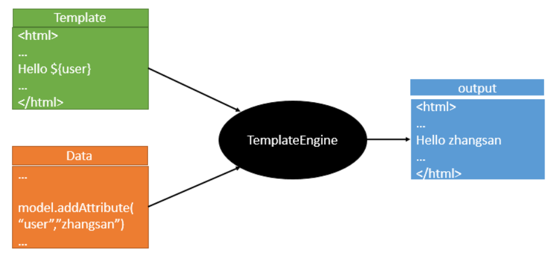

SpringBoot推荐的Thymeleaf：语法更简单，功能更强大。

### 1、引入thymeleaf！

```xml
<!--引入thymeleaf的依赖-->
<dependency>
    <groupId>org.springframework.boot</groupId>
    <artifactId>spring-boot-starter-thymeleaf</artifactId>
</dependency>
```


### 2、Thymeleaf使用

```java
@ConfigurationProperties(prefix = "spring.thymeleaf")
public class ThymeleafProperties {

	private static final Charset DEFAULT_ENCODING = StandardCharsets.UTF_8;

	public static final String DEFAULT_PREFIX = "classpath:/templates/";

	public static final String DEFAULT_SUFFIX = ".html";
    ...
}
```

#### 2.1、配置 thymeleaf 对应的yml文件

```yml
spring:
  thymeleaf:
    prefix: classpath:/templates/
    suffix: .html
# SpringMVC配置访问jsp页面时使用
#  mvc.view.suffix= /WEB-INF/
#  mvc.view.prefix= .jsp
```

只要我们把HTML页面放在`classpath:/templates/`，thymeleaf就能自动渲染；

#### 2.2、thymeleaf 的使用

```html
<!DOCTYPE html>
<!--1、导入thymeleaf的名称空间-->
<html lang="zh-CN" xmlns:th="http://www.thymeleaf.org">
<head>
    <meta charset="UTF-8">
    <title>Title</title>
</head>
<body>
    <h1>成功！</h1>
    <!--2、使用thymeleaf语法-->
    <!--th:text 将div里面的文本内容设置为 -->
    <div th:text="${hello}">这是显示欢迎信息</div>
</body>
</html>
```


### 3、语法规则

1）`th:text`：改变当前元素里面的文本内容；

**`th:任意html属性`**：可以来替换原生属性的值。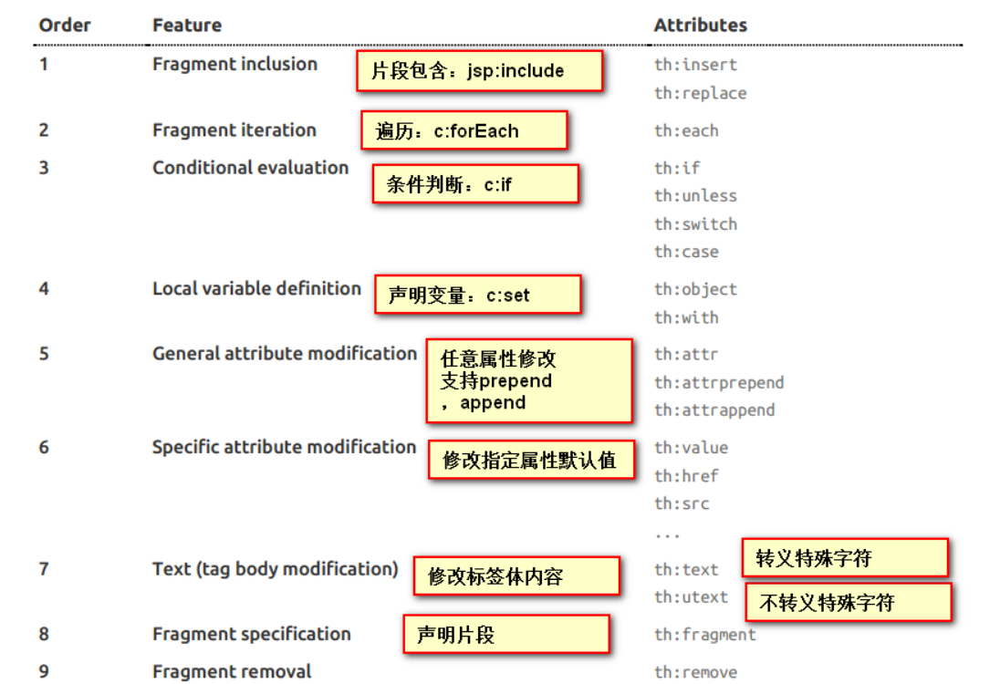


2）表达式：表达式语法：

- `${...}`：获取变量值，OGNL； 

	① 获取对象的属性、调用方法

	② 使用内置的基本对象：

	```properties
	#ctx：上下文对象
	#vars: 上下文变量
	#locale：上下文语言环境
	#request：（仅在Web上下文中）HttpServletRequest对象
	#response：（仅在Web上下文中）HttpServletResponse对象
	#session：（仅在Web上下文中）HttpSession对象
	#servletContext：（仅在Web上下文中）ServletContext对象
	```

	③ 内置的一些工具对象：

	```properties
	#execInfo：获取页面模板的处理信息
	#messages：在变量表达式中获取外部消息的方法，与使用＃{…}语法获取的方法相同
	#uris：转义部分 URL / URI 的方法
	#conversions：用于执行已配置的转换服务的方法
	#dates：	java.util.Date对象的方法：格式化，组件提取等。
	#calendars：类似于#dates，但用于java.util.Calendar对象。
	#numbers：格式化数字对象的方法。
	#strings：字符串工具类
	#objects：一般对象的工具类，通常用来判断非空。
	#bools：布尔工具类
	#arrays：数组工具类
	#lists：list工具类
	#sets：set工具类
	#maps：map工具类
	#aggregates：在数组或集合上创建聚合的方法
	#ids：处理可能重复的id属性的方法
	```

- `*{...}`：选择表达式，在功能上和`${}`是一致的。

```html
<!--补充：配合 th:object="${session.user}-->
<div th:object="${session.user}">
    <p>Name: <span th:text="*{firstName}">Sebastian</span>.</p>
    <p>Surname: <span th:text="*{lastName}">Pepper</span>.</p>
    <p>Nationality: <span th:text="*{nationality}">Saturn</span>.</p>
</div>
```

- `#{...}`：获取国际化内容

- `@{...}`：定义URL

	```html
	<!--默认指定为当前项目下，省略主机名加工程名-->
	<a th:href={/order/process(execId=${execId},execType='FAST')}></a>
	```

- ` ~{...}`：片段引用表达式

	```html
	<!--声明代码片段-->
	<div th:fragment="myPart">
	    <p th:text="声明的代码片段"></p>
	</div>
	
	<!--属性左边是代码片段所在的用于拼接的地址
	    属性右边是该地址下的声明片段的片段名-->
	<!--以插入形式引入:将整个标签插入到原标签中-->
	<div th:insert="~{test::myPart}"></div>
	
	<!--以替换形式引入:用整个标签替换掉原标签中-->
	<div th:replace="~{test::myPart}"></div>
	
	<!--以包含形式引入:将整个标签包含的子标签插入到原标签中-->
	<div th:include="~{test::myPart}"></div>
	```


3）其他操作

```properties
Literals（字面量）
      Text literals: 'one text' , 'Another one!' ,…
      Number literals: 0 , 34 , 3.0 , 12.3 ,…
      Boolean literals: true , false
      Null literal: null
      Literal tokens: one , sometext , main ,…
Text operations:（文本操作）
    String concatenation: +
    Literal substitutions: |The name is ${name}|
Arithmetic operations:（数学运算）
    Binary operators: + , - , * , / , %
    Minus sign (unary operator): -
Boolean operations:（布尔运算）
    Binary operators: and , or
    Boolean negation (unary operator): ! , not
Comparisons and equality:（比较运算）
    Comparators: > , < , >= , <= ( gt , lt , ge , le )
    Equality operators: == , != ( eq , ne )
Conditional operators:条件运算（三元运算符）
    If-then: (if) ? (then)
    If-then-else: (if) ? (then) : (else)
    Default: (value) ?: (defaultvalue)
Special tokens:
    No-Operation: _ 
```


## 4、Spring MVC 自动配置

[ Spring MVC 自动配置官方文档](https://docs.spring.io/spring-boot/docs/2.3.2.RELEASE/reference/htmlsingle/#boot-features-spring-mvc-auto-configuration) 

### 1、Spring MVC Auto-configuration

Spring Boot为Spring MVC提供了自动配置，可以很好地与大多数应用程序一起工作。

以下是 Spring Boot 的自动配置在 Spring 默认设置的基础上增加了以下特性：**==（WebMvcAutoConfiguration）==**

- 包含 `ContentNegotiatingViewResolver` 和`BeanNameViewResolver` 

	- 自动配置了ViewResolver（视图解析器：根据方法的返回值得到视图对象（View），由视图对象决定如何渲染（转发 or 重定向））；
	- ContentNegotiatingViewResolver：组合所有的视图解析器的；
	- ==如何定制：我们可以自己给容器中添加一个视图解析器，继承 ViewResolver ，使用 @Bean 将其注册进来。==


- 支持提供静态资源，包括对WebJars的支持

- 静态`index.html`支持

- 定制`Favicon`支持

	

- 自动注册了 `Converter` ， `GenericConverter` ， `Formatter` beans。

	- Converter：转换器；  public String hello(User user)：类型转换使用Converter
	- `Formatter`：格式化器；  2020.12.25 = = = > Date ；
	
	```java
	@Bean
	@ConditionalOnProperty(prefix = "spring.mvc", name = "date-format") // 在文件中配置日期格式化的规则
	public Formatter<Date> dateFormatter() {
	    return new DateFormatter(this.mvcProperties.getDateFormat()); // 日期格式化组件
	}
	```

​	==自己添加的格式化器转换器，我们只需要放在容器中即可。==


- 支持`HttpMessageConverters`

	- HttpMessageConverter：SpringMVC用来转换Http请求和响应的。例如：可以将对象自动转换为JSON：User - - - > Json。

	- `HttpMessageConverters` 是从容器中确定，用于获取所有的HttpMessageConverter。

		==如果需要添加或定制转换器 HttpMessageConverter，只需要将自定义的组件注册容器中即可（@Bean，@Component）==

		

- 自动注册`MessageCodesResolver`：定义错误代码渲染错误消息的生成规则的。

- 自动使用 `ConfigurableWebBindingInitializer` bean：

	作用：用于初始化 WebDataBinder（数据绑定器），将请求数据绑定封装为 JavaBean对象。

	==我们可以自定义创建一个 ConfigurableWebBindingInitializer 来替换 Spring Boot 默认的数据绑定器，将其注册到容器中即可。==

	 

**org.springframework.boot.autoconfigure.web：web的所有自动场景；**

如果要保留这些Spring Boot 对 MVC的定制功能，而且只是想额外的添加一些功能（比如：interceptors，formatters，view controllers etc），

则可以添加自己的`@Configuration`的配置类，类型为：`WebMvcConfigurer`，并且不能标注 `@EnableWebMvc`。

 If you wish to provide custom instances of `RequestMappingHandlerMapping`, `RequestMappingHandlerAdapter` or `ExceptionHandlerExceptionResolver` you can declare a `WebMvcRegistrationsAdapter` instance providing such components.

If you want to take complete control of Spring MVC, you can add your own `@Configuration` annotated with `@EnableWebMvc`.

如果你想全面接管 Spring MVC，你可以添加自己的`@Configuration`注解为`@EnableWebMvc`。


### 2、扩展 Spring MVC

SpringMVC的写法：

```xml
    <mvc:view-controller path="/hello" view-name="success"/>
    <mvc:interceptors>
        <mvc:interceptor>
            <mvc:mapping path="/hello"/>
            <bean></bean>
        </mvc:interceptor>
    </mvc:interceptors>
```

SpringBoot扩展SpringMVC：

**==编写一个配置类（@Configuration），是WebMvcConfigurer类型；不能标注@EnableWebMvc==**;

既保留了所有的自动配置，也能用我们扩展的配置；

```java
//使用 WebMvcConfigurer 可以来扩展 SpringMVC 的功能
@Configuration
public class MyMvcConfig extends WebMvcConfigurer {

    @Override
    public void addViewControllers(ViewControllerRegistry registry) {
        //浏览器发送 /study 请求来到 success 页面
        registry.addViewController("/study").setViewName("success");
    }
}
```

原理：

​	1）`WebMvcAutoConfiguration` 是SpringMVC的自动配置类

​	2）在做其他自动配置时会导入：`@Import(EnableWebMvcConfiguration.class)`

```java
@Configuration
public static class EnableWebMvcConfiguration extends DelegatingWebMvcConfiguration {
    private final WebMvcConfigurerComposite configurers = new WebMvcConfigurerComposite();

    //从容器中获取所有的WebMvcConfigurer
    @Autowired(required = false)
    public void setConfigurers(List<WebMvcConfigurer> configurers) {
        if (!CollectionUtils.isEmpty(configurers)) {
            this.configurers.addWebMvcConfigurers(configurers);
            //一个参考实现；将所有的WebMvcConfigurer相关配置都来一起调用；  
            @Override
            public void addViewControllers(ViewControllerRegistry registry) {
                for (WebMvcConfigurer delegate : this.delegates) {
                   delegate.addViewControllers(registry);
               }
            }
        }
    }
}
```

​	3）容器中所有的 `WebMvcConfigurer` 都会在这里被调用；

​	4）我们的配置类实现了WebMvcConfigurer 接口，也会被调用。

​	效果：SpringMVC的自动配置和我们的扩展配置都会起作用。


### 3、全面接管 Spring MVC

SpringBoot对SpringMVC的自动配置不需要了，所有都是我们自己配置； SpringBoot 提供所有的MVC自动配置都失效了。

**我们只需在配置类中添加@EnableWebMvc即可；**

```java
//使用 WebMvcConfigurer 可以来扩展SpringMVC的功能
@EnableWebMvc
@Configuration
public class MyMvcConfig extends WebMvcConfigurer {

    @Override
    public void addViewControllers(ViewControllerRegistry registry) {
        //浏览器发送 /study 请求来到 success 页面
        registry.addViewController("/study").setViewName("success");
    }
}
```

原理：

为什么加了@EnableWebMvc注解，自动配置就失效了？

1）@EnableWebMvc的核心：`@Import(DelegatingWebMvcConfiguration.class)`

```java
@Import(DelegatingWebMvcConfiguration.class)
public @interface EnableWebMvc {
}
```

2）导入了`DelegatingWebMvcConfiguration`，继承 WebMvcConfigurationSupport 类，作为这个类一个子类。

```java
@Configuration
public class DelegatingWebMvcConfiguration extends WebMvcConfigurationSupport {
```

3）因为@EnableWebMvc 导入有 `WebMvcConfigurationSupport` 类，

​	  所以对应的 **`WebMvcAutoConfiguration 失效`**，不会被容器注册加载。

```java
@Configuration
@ConditionalOnWebApplication
@ConditionalOnClass({ Servlet.class, DispatcherServlet.class,
		WebMvcConfigurerAdapter.class })
//容器中没有这个组件的时候，这个自动配置类才生效
@ConditionalOnMissingBean(WebMvcConfigurationSupport.class)

@AutoConfigureOrder(Ordered.HIGHEST_PRECEDENCE + 10)
@AutoConfigureAfter({ DispatcherServletAutoConfiguration.class,
		ValidationAutoConfiguration.class })
public class WebMvcAutoConfiguration {...}
```

4）导入的 WebMvcConfigurationSupport 只实现了 SpringMVC 最基本的功能，所以我们基本上是**全面接管了SpringMVC的配置。**


## 5、如何修改SpringBoot的默认配置

SpringBoot 自动配置模式：

​	1）SpringBoot 在自动配置很多组件的时候，先看容器中有没有用户自己配置的（@Bean、@Component）如果有就启用用户配置的，

​	如果没有，才自动配置；如果有些组件可以有多个（ViewResolver）将用户配置的和自己默认的组合起来。

​	2）在 SpringBoot 中会有非常多的 `xxxConfigurer` 帮助我们进行扩展配置。

​	3）在 SpringBoot 中会有很多的 `xxxCustomizer` 帮助我们进行定制配置。


## 6、RestfulCRUD

### 1、默认访问首页

```java
//实现 WebMvcConfigurer 接口完成 SpringMVC 功能的拓展
// 配置 view-controller
@Configuration
public class MyMvcConfig implements WebMvcConfigurer {
    //将组件注册在容器
    @Bean  
    public WebMvcConfigurer webMvcConfigurer() {
        return new WebMvcConfigurer() {
            @Override
            public void addViewControllers(ViewControllerRegistry registry) {
                // 配置默认访问首页
                registry.addViewController("/").setViewName("index");
            }
        };
    }
}
```

### 2、国际化

> SpringMVC使用国际化的步骤

1）编写国际化配置文件；

2）使用ResourceBundleMessageSource管理国际化资源文件；

3）在页面使用fmt:message取出国际化内容。

> **SpringBoot 使用国际化的步骤：**

1）编写国际化配置文件，抽取页面需要显示的国际化消息；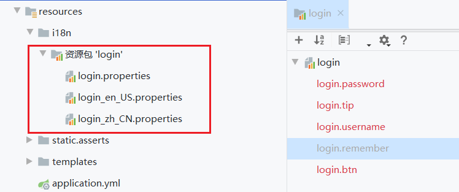

2）SpringBoot 已经自动配置好了管理国际化资源文件的组件：`ResourceBundleMessageSource`

```java
@ConfigurationProperties(prefix = "spring.messages")
public class MessageSourceAutoConfiguration {

    //我们可以直接将配置文件放在类路径下命名为 messages.properties；
	private String basename = "messages";  
    
    @Bean
	public MessageSource messageSource(MessageSourceProperties properties) {
		ResourceBundleMessageSource messageSource = new ResourceBundleMessageSource();
		if (StringUtils.hasText(properties.getBasename())) {
             //设置国际化资源文件的基础名（去掉语言国家代码的）
			messageSource.setBasenames(StringUtils.commaDelimitedListToStringArray(
                    StringUtils.trimAllWhitespace(properties.getBasename())));
		}
		if (properties.getEncoding() != null) {
			messageSource.setDefaultEncoding(properties.getEncoding().name());
		}
		messageSource.setFallbackToSystemLocale(properties.isFallbackToSystemLocale());
		Duration cacheDuration = properties.getCacheDuration();
		if (cacheDuration != null) {
			messageSource.setCacheMillis(cacheDuration.toMillis());
		}
		messageSource.setAlwaysUseMessageFormat(properties.isAlwaysUseMessageFormat());
		messageSource.setUseCodeAsDefaultMessage(properties.isUseCodeAsDefaultMessage());
		return messageSource;
	}
}
```

3）使用 yml 配置文件指定国际化文件的**基础名**（去掉语言国家代码的），修改 `basename` 属性：

```yml
spring:
  messages:
    basename: i18n.login
```

4）使用 `#{...}` 在页面上获取国际化的信息：

```html
<h1 th:text="#{login.tip}">Please sign in</h1>
<label th:text="#{login.username}">Username</label>
<label th:text="#{login.password}">Password</label>
```


5）修改SpringBoot的默认配置，实现点击链接切换国际化：

原理：国际化Locale（区域信息对象），SpringBoot中使用 LocaleResolver（获取区域信息对象）；

```java
@Bean
@ConditionalOnMissingBean
@ConditionalOnProperty(prefix = "spring.mvc", name = "locale")
public LocaleResolver localeResolver() {
    if (this.mvcProperties.getLocaleResolver() == WebMvcProperties.LocaleResolver.FIXED) {
    	return new FixedLocaleResolver(this.mvcProperties.getLocale());
    }
    // 默认的是根据请求头带来的区域信息获取Locale进行国际化
    AcceptHeaderLocaleResolver localeResolver = new AcceptHeaderLocaleResolver();
    localeResolver.setDefaultLocale(this.mvcProperties.getLocale());
    return localeResolver;
}
```
实践：配置自定义的 `LocaleResolver` 实现点击链接切换国际化的操作。

```java
//@Component
public class MyLocaleResolver implements LocaleResolver {
    
    // 通过请求参数改变国际化信息
    @Override
    public Locale resolveLocale(HttpServletRequest request) {
        String l = request.getParameter("l");
        Locale locale = Locale.getDefault();
        if (!StringUtils.isEmpty(l)) {
            String[] localeInfo = l.split("-");
            locale = new Locale(localeInfo[0], localeInfo[1]);
        }
        return locale;
    }

    @Override
    public void setLocale(HttpServletRequest request, HttpServletResponse response, Locale locale) {
    }
}
```

### 3、登陆

开发小技巧：开发期间模板引擎页面修改以后，要使其能实时生效：

1）禁用模板引擎的缓存

```yml
# 禁用缓存
spring.thymeleaf.cache=false 
```

2）页面修改完成以后`Ctrl+F9`：重新编译；


登陆错误消息的显示

```html
<p style="color: red" th:text="${msg}" th:if="${not #strings.isEmpty(msg)}"></p>
```


### 4、拦截器进行登陆检查

编写拦截器代码

```java
// 登陆检查
public class LoginHandlerInterceptor implements HandlerInterceptor {

    // 目标方法执行前
    @Override
    public boolean preHandle(HttpServletRequest request, HttpServletResponse response, Object handler) 
        throws Exception {
        String loginUser = (String) request.getSession().getAttribute("loginUser");
        if (!StringUtils.isEmpty(loginUser)){
            // 已登录,放行请求
            return true;
        }else {
            // 未登录,返回登录页面
            request.setAttribute("msg","没有权限访问请先登录！");
            request.getRequestDispatcher("/index.html").forward(request,response);
            return false;
        }
    }
}
```

注册拦截器

```java
@Bean
public WebMvcConfigurer webMvcConfigurer() {
    return new WebMvcConfigurer() {
        @Override
        public void addViewControllers(ViewControllerRegistry registry) {
            registry.addViewController("/").setViewName("login");
            registry.addViewController("/index.html").setViewName("login");
            registry.addViewController("/main.html").setViewName("dashboard");
        }

        // 注册拦截器
        @Override
        public void addInterceptors(InterceptorRegistry registry) {
            registry.addInterceptor(new LoginHandlerInterceptor()).addPathPatterns("/**")
                .excludePathPatterns("/index.html", "/", "/user/login");
        }
    };
```


### 5、CRUD-员工列表

实验要求：

1）RestfulCRUD：CRUD满足Rest风格；

URI：  /资源名称/资源标识       HTTP请求方式区分对资源CRUD操作

| 普通CRUD（uri来区分操作） |      |       RestfulCRUD       |
| :-----------------------: | :--: | :---------------------: |
|          getEmp           | 查询 |     emp - - - > GET     |
|        addEmp?xxx         | 添加 |    emp - - - > POST     |
|  updateEmp?id=xxx&xxx=xx  | 修改 |  emp/{id} - - - > PUT   |
|      deleteEmp?id=1       | 删除 | emp/{id} - - - > DELETE |

2）实验的请求架构

|               实验功能               | 请求URI | 请求方式 |
| :----------------------------------: | :-----: | :------: |
|             查询所有员工             |  emps   |   GET    |
|      查询某个员工(来到修改页面)      |  emp/1  |   GET    |
|             来到添加页面             |   emp   |   GET    |
|               添加员工               |   emp   |   POST   |
| 来到修改页面（查出员工进行信息回显） |  emp/1  |   GET    |
|               修改员工               |   emp   |   PUT    |
|               删除员工               |  emp/1  |  DELETE  |

3）员工列表：thymeleaf实现公共页面元素抽取

```html
1、抽取公共片段
<!--声明代码片段-->
<div th:fragment="myPart">
    <p th:text="声明的代码片段"></p>
</div>

2、引入公共片段
<div th:insert="~{includePage :: myPart}"></div>
~{templatename::selector}:		模板名::选择器
~{templatename::fragmentname}:	模板名::片段名

3、默认效果：
insert的公共片段在div标签中
如果使用th:insert等属性进行引入，可以不用写~{}：
行内写法可以加上：[[~{}]];[(~{})]；
```

三种引入公共片段的 th 属性：

```html
<!--以插入形式引入:将整个标签插入到原标签中-->
<div th:insert="~{test::myPart}"></div>

<!--以替换形式引入:用整个标签替换掉原标签中-->
<div th:replace="~{test::myPart}"></div>

<!--以包含形式引入:将整个标签包含的子标签插入到原标签中-->
<div th:include="~{test::myPart}"></div>
```

引入片段的时可以传入参数：(进行属性的判断)


### 6、CRUD-员工添加

添加页面

```html
<form>
    <div class="form-group">
        <label>LastName</label>
        <input type="text" class="form-control" placeholder="zhangsan">
    </div>
    <div class="form-group">
        <label>Email</label>
        <input type="email" class="form-control" placeholder="zhangsan@atguigu.com">
    </div>
    <div class="form-group">
        <label>Gender</label><br/>
        <div class="form-check form-check-inline">
            <input class="form-check-input" type="radio" name="gender"  value="1">
            <label class="form-check-label">男</label>
        </div>
        <div class="form-check form-check-inline">
            <input class="form-check-input" type="radio" name="gender"  value="0">
            <label class="form-check-label">女</label>
        </div>
    </div>
    <div class="form-group">
        <label>department</label>
        <select class="form-control">
            <option>1</option>
            <option>2</option>
            <option>3</option>
            <option>4</option>
            <option>5</option>
        </select>
    </div>
    <div class="form-group">
        <label>Birth</label>
        <input type="text" class="form-control" placeholder="zhangsan">
    </div>
    <button type="submit" class="btn btn-primary">添加</button>
</form>
```


### 7、CRUD-员工修改

修改添加二合一表单

...


### 8、CRUD-员工删除

```html
<tr th:each="emp:${emps}">
    <td th:text="${emp.id}"></td>
    <td>[[${emp.lastName}]]</td>
    <td th:text="${emp.email}"></td>
    <td th:text="${emp.gender}==0?'女':'男'"></td>
    <td th:text="${emp.department.departmentName}"></td>
    <td th:text="${#dates.format(emp.birth, 'yyyy-MM-dd HH:mm')}"></td>
    <td>
        <a class="btn btn-sm btn-primary" th:href="@{/emp/}+${emp.id}">编辑</a>
        <button th:attr="del_uri=@{/emp/}+${emp.id}" class="btn btn-sm btn-danger deleteBtn">删除</button>
    </td>
</tr>

<script>
    $(".deleteBtn").click(function(){
        // 删除当前员工的信息
        $("#deleteEmpForm").attr("action",$(this).attr("del_uri")).submit();
        return false;
    });
</script>
```


## 7、错误处理机制

### 1、SpringBoot默认的错误处理机制

1）:arrow_down_small: 浏览器，默认返回的错误页面：  																	 			:arrow_down_small: 浏览器发送请求的请求头：`Accept: text/html`

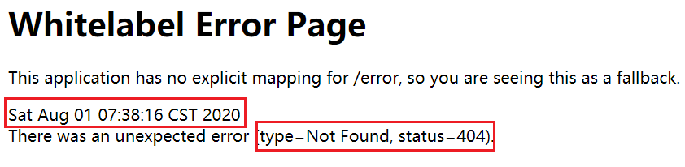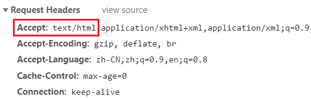


2）:arrow_down_small: 其他客户端返回的json数据类型：																		:arrow_down_small: 浏览器发送的请求头携带的数据：`Accept: */*`

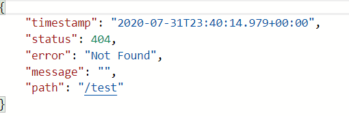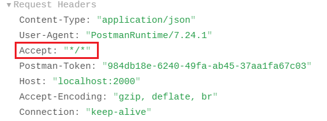


错误处理机制的原理：可以参照ErrorAutoConfiguration：错误处理的自动配置。

错误处理中添加的几大重要组件：

1）`ErrorPageCustomizer`：定制错误的响应规则（响应的错误页面）

```java
@Value("${error.path:/error}")		// 可以通过yml指定修改错误请求路径
private String path = "/error";  	// 系统出现错误以后来到error请求进行处理(web.xml注册的错误页面规则)
```

2）`BasicErrorController`：请求的分发与处理：处理请求并响应数据

```java
@Controller
@RequestMapping("${server.error.path:${error.path:/error}}")
public class BasicErrorController extends AbstractErrorController {
    
    // 浏览器发送的请求来到这个方法处理: 返回html类型的数据；
    @RequestMapping(produces = "text/html")
	public ModelAndView errorHtml(HttpServletRequest request,HttpServletResponse response) {
		HttpStatus status = getStatus(request);
		Map<String, Object> model = Collections.unmodifiableMap(
            // 
            getErrorAttributes(request, isIncludeStackTrace(request, MediaType.TEXT_HTML)));
		response.setStatus(status.value());
        
        // 交由错误页面解析器解析,解析到目标的错误页面 (包含页面地址和页面内容) 
		ModelAndView modelAndView = resolveErrorView(request, response, status, model);
		return (modelAndView == null ? new ModelAndView("error", model) : modelAndView);
	}

    // 其他客户端来到这个方法处理: 返回json数据，
    @RequestMapping
	public ResponseEntity<Map<String, Object>> error(HttpServletRequest request) {
		HttpStatus status = getStatus(request);
		if (status == HttpStatus.NO_CONTENT) {
			return new ResponseEntity<>(status);
		}
		Map<String, Object> body = 
            // 
            getErrorAttributes(request, getErrorAttributeOptions(request, MediaType.ALL));
		return new ResponseEntity<>(body, status);
	}
}
```

3）`DefaultErrorAttributes`：处理并返回页面携带的错误信息。

```java
@Override
public Map<String, Object> getErrorAttributes(WebRequest webRequest, boolean includeStackTrace) {
    Map<String, Object> errorAttributes = new LinkedHashMap<>();

    // 在请求域中返回各种错误信息
    errorAttributes.put("timestamp", new Date());
    addStatus(errorAttributes, webRequest);
    addErrorDetails(errorAttributes, webRequest, includeStackTrace);
    addPath(errorAttributes, webRequest);
    return errorAttributes;
}
```

4）`DefaultErrorViewResolver`：错误页面解析器，解析并返回要去的目标页面。

```java
// viewName: 状态码
private ModelAndView resolve(String viewName, Map<String, Object> model) {
    // 默认SpringBoot可以去找到一个页面:  error/404
    String errorViewName = "error/" + viewName;
    
    // 模板引擎可以解析这个页面地址就用模板引擎解析
    TemplateAvailabilityProvider provider = this.templateAvailabilityProviders
        	.getProvider(errorViewName,this.applicationContext);
    
    if (provider != null) {
        // 模板引擎可用的情况下返回到 errorViewName 指定的视图地址
        return new ModelAndView(errorViewName, model);
    }
    
    // 模板引擎不可用,就在静态资源文件夹下找errorViewName对应的页面   error/404.html
    return resolveResource(errorViewName, model);
}
```


错误处理的流程：

一旦系统出现了4xx或5xx之类的错误，`ErrorPageCustomizer` 就会生效，指定请求路径为/error ，会来到/error请求；

然后由 `BasicErrorController` 进行请求的处理：选择由页面形式返回(text/html)，还是由json数据形式返回(/)

返回响应的错误信息；错误信息由 `DefaultErrorAttributes` 解析得到；

返回响应的错误页面；去哪个页面是由 `DefaultErrorViewResolver` 解析得到的。

```java
protected ModelAndView resolveErrorView(HttpServletRequest request, 
				HttpServletResponse response,HttpStatus status,Map<String, Object> model) {
    
    // 遍历所有实现的错误页面解析器,得到 ModelAndView
    for (ErrorViewResolver resolver : this.errorViewResolvers) {
        ModelAndView modelAndView = resolver.resolveErrorView(request, status, model);
        if (modelAndView != null) {
            return modelAndView;
        }
    }
    return null;
}
```


### 2、如何定制错误响应

#### 	1、如何定制错误的页面（error/）

1）有模板引擎的情况下：在模板引擎文件夹下找，如：`templates/error/4xx.html`

2）没有模板引擎（模板引擎找不到这个错误页面）静态资源文件夹下找，如：`static/error/4xx.html`

3）以上都没有错误页面，就是默认来到SpringBoot默认的错误提示页面。

将错误页面命名为  **`错误状态码.html`** 放在对应文件夹下的 **`error文件夹`** 中，发生此状态码的错误就会来到对应的页面。

SpringBoot提供可以使用`4xx`和`5xx`作为错误页面的文件名来匹配对应类型的所有错误；

但如果能精确匹配时，优先精确匹配，如会先精确匹配`404.html`，再匹配`4xx.html`。


页面能获取的信息：

timestamp：时间戳

status：状态码

error：错误提示

exception：异常对象

message：异常消息

errors：JSR303数据校验的错误都在这里


#### 	2、如何定制错误的json数据

1）使用 SpringMVC 的自定义异常处理机制 & 返回定制的json数据

​		缺点：没有自适应效果，无法区别 返回页面 或 返回json数据

```java
@ResponseBody
@ExceptionHandler(UserNotExistException.class)
public Map<String,Object> handleException(Exception e){
    Map<String,Object> map = new HashMap<>();
    map.put("code","user.notexist");
    map.put("message",e.getMessage());
    return map;
}
```

2）转发到 `/error` 交由 SpringBoot 进行自适应响应效果处理：

```java
@ExceptionHandler(UserNotExistException.class)
public String handleException(Exception e, HttpServletRequest request){
    Map<String,Object> map = new HashMap<>();
    map.put("code","user.notexist");
    map.put("message",e.getMessage());
    
    // 传入我们自己的错误状态码  4xx 5xx，否则就不会进入定制错误页面的解析流程
    // Integer statusCode = (Integer) request.getAttribute("javax.servlet.error.status_code");
    request.setAttribute("javax.servlet.error.status_code",500);
    
    //转发到: /error
    return "forward:/error";
}
```


#### 	3、将我们的定制数据携带出去

出现错误后，容器会发起 /error 请求，被`BasicErrorController`处理，响应出去可以获取的数据是由`getErrorAttributes`获取到的。

方式一：编写一个 `ErrorController`的实现类 或 AbstractErrorController的子类，注册到容器中；实现处理的逻辑，完成自定义携带数据。

​	...

方式二：页面上展示的数据，或json返回的数据都是 SpringBoot 处理请求 /error 时，通过 `errorAttributes.getErrorAttributes` 得到。

容器中使用 `ErrorAttributes` 定义数据的处理：

默认使用 `DefaultErrorAttributes.getErrorAttributes()`来进行数据处理的。


**实现**：要想自定义异常返回数据，可以在容器中注册我们自定义的`ErrorAttributes`：

```java
@Component
public class MyErrorAttributes extends DefaultErrorAttributes {
    @Override
    public Map<String, Object> getErrorAttributes(RequestAttributes requestAttributes, 
                                                  boolean includeStackTrace) {
        // 调用父类的方法,获取SpringBoot本身处理的响应数据
        Map<String, Object> map = super.getErrorAttributes(requestAttributes, includeStackTrace);
        // 存入自己定制的数据
        map.put("company","study");
        return map;
    }
}
```

最终的效果：响应是自适应的，可以通过定制ErrorAttributes改变需要返回的内容。


## 8、配置嵌入式Servlet容器

SpringBoot默认使用Tomcat作为嵌入式的Servlet容器；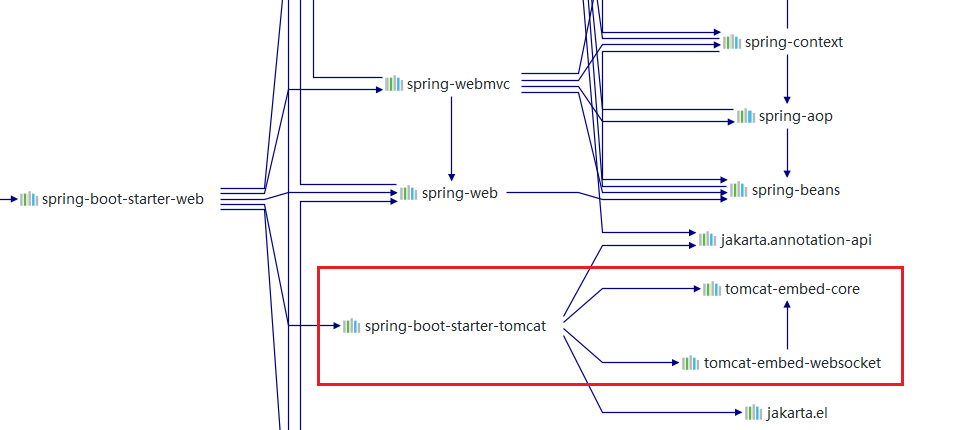


### 1、如何定制和修改Servlet容器的相关配置

1、修改配置文件中和server有关的配置（**`ServerProperties`**）。

```properties
server.port=8081
server.context-path=/crud

server.tomcat.uri-encoding=UTF-8

//通用的Servlet容器设置
server.xxx
//Tomcat的设置
server.tomcat.xxx
```

2、编写一个**`WebServerFactoryCustomizer`**：嵌入式的Servlet容器的定制器，来修改Servlet容器的配置。

```java
// 一定要将这个定制器加入到容器中
@Bean
public WebServerFactoryCustomizer<ConfigurableWebServerFactory> webServerFactoryCustomizer() {
    return new WebServerFactoryCustomizer<ConfigurableWebServerFactory>() {
        // 定制嵌入式的Servlet容器相关的规则
        @Override
        public void customize(ConfigurableWebServerFactory factory) {
            factory.setPort(1000);
        }
    };
}
```


### 2、注册Servlet三大组件（Servlet、Filter、Listener）

由于SpringBoot默认是以 jar包 的方式启动嵌入式的Servlet容器来启动SpringBoot的web应用，没有web.xml文件。

注册三大组件用以下方式：

**`Servlet`**`RegistrationBean`

```java
//注册三大组件
@Bean
public ServletRegistrationBean myServlet(){
    ServletRegistrationBean registrationBean = 
        	new ServletRegistrationBean(new MyServlet(),"/myServlet");
    return registrationBean;
}
```

**`Filter`**`RegistrationBean`

```java
@Bean
public FilterRegistrationBean myFilter(){
    FilterRegistrationBean registrationBean = new FilterRegistrationBean();
    
    registrationBean.setFilter(new MyFilter());
    registrationBean.setUrlPatterns(Arrays.asList("/hello","/myServlet"));
    return registrationBean;
}
```

**`ServletListener`**`RegistrationBean`

```java
@Bean
public ServletListenerRegistrationBean myListener(){
       return new ServletListenerRegistrationBean<>(new MyListener());
}
```


使用实例：

SpringBoot帮我们自动配置 SpringMVC 的时候，会自动的注册 SpringMVC 的前端控制器：DispatcherServlet；

DispatcherServletAutoConfiguration 中配置了这个`DispatcherServlet`：

```java
@Bean(name = "dispatcherServletRegistration")
@ConditionalOnBean(value = DispatcherServlet.class, name = "dispatcherServlet")
public DispatcherServletRegistrationBean dispatcherServletRegistration(
    	DispatcherServlet dispatcherServlet,WebMvcProperties webMvcProperties, 
    	ObjectProvider<MultipartConfigElement> multipartConfig) {
    DispatcherServletRegistrationBean registration = 
        new DispatcherServletRegistrationBean(dispatcherServlet,
                                              // getPath() => /
                                              webMvcProperties.getServlet().getPath());
    // 默认拦截: / 所有请求,包括静态资源,但不会拦截jsp请求;		/* 会拦截jsp
    registration.setName("dispatcherServlet");
    registration.setLoadOnStartup(webMvcProperties.getServlet().getLoadOnStartup());
    multipartConfig.ifAvailable(registration::setMultipartConfig);
    return registration;
}
```


### 3、替换为其他嵌入式Servlet容器

默认支持：Tomcat（默认使用）

```xml
<dependency>
   <groupId>org.springframework.boot</groupId>
     <!-- 引入web模块默认就是使用嵌入式的Tomcat作为Servlet容器。 -->
   <artifactId>spring-boot-starter-web</artifactId>
</dependency>
```

Jetty

```xml
<!-- 引入web模块 -->
<dependency>
   <groupId>org.springframework.boot</groupId>
   <artifactId>spring-boot-starter-web</artifactId>
   <exclusions>
      <exclusion>
         <artifactId>spring-boot-starter-tomcat</artifactId>
         <groupId>org.springframework.boot</groupId>
      </exclusion>
   </exclusions>
</dependency>

<!--引入其他的Servlet容器-->
<dependency>
   <artifactId>spring-boot-starter-jetty</artifactId>
   <groupId>org.springframework.boot</groupId>
</dependency>
```

Undertow

```xml
<!-- 引入web模块 -->
<dependency>
   <groupId>org.springframework.boot</groupId>
   <artifactId>spring-boot-starter-web</artifactId>
   <exclusions>
      <exclusion>
         <artifactId>spring-boot-starter-tomcat</artifactId>
         <groupId>org.springframework.boot</groupId>
      </exclusion>
   </exclusions>
</dependency>

<!--引入其他的Servlet容器-->
<dependency>
   <artifactId>spring-boot-starter-undertow</artifactId>
   <groupId>org.springframework.boot</groupId>
</dependency>
```


### 4、嵌入式Servlet容器启动原理

什么时候创建嵌入式的Servlet容器工厂？什么时候获取嵌入式的Servlet容器并启动Tomcat；

获取嵌入式的Servlet容器工厂：

1）SpringBoot应用启动运行**`run`**方法；

2）**`refreshContext(context)`**：SpringBoot刷新IOC容器，创建IOC容器对象，并初始化容器，创建容器中的每一个组件；

如果是servlet应用则创建`AnnotationConfigServletWebServerApplicationContext`，

如果是reactive应用则创建`AnnotationConfigReactiveWebServerApplicationContext`，

否则创建：`AnnotationConfigApplicationContext`。

3）**`refresh(context)`**：**初始化刚才创建好的ioc容器；**

```java
@Override
public void refresh() throws BeansException, IllegalStateException {
    synchronized (this.startupShutdownMonitor) {
      	...
        try {
           ...
            // Initialize other special beans in specific context subclasses.
            onRefresh();
          	...
        }
        catch (BeansException ex) {
         ...
        }
        finally {
           ...
        }
    }
}
```

4）**`onRefresh()`**：web的ioc容器重写了onRefresh方法；

5）onRefresh方法中调用webIOC容器会创建特定的Web容器：**`createWebServer()`**；

**6）获取嵌入式的Servlet容器工厂：**ServletWebServerFactory factory = **`getWebServerFactory()`**；

从ioc容器中获取 ServletWebServerFactory 组件；**TomcatServletWebServerFactory**创建对象，

7）**使用容器工厂获取嵌入式的Servlet容器**：this.webServer = factory.**`getWebServer(getSelfInitializer())`**；

8）嵌入式的Servlet容器创建对象并启动Servlet容器；

IOC容器在onRefresh()方法上先启动Web容器，再调用 finishBeanFactoryInitialization 等方法将IOC容器中剩下没有创建出的对象创建出来。

总结：**==IOC容器启动时，就会创建嵌入式的Servlet容器。==**


## 9、使用外置的Servlet容器

嵌入式Servlet容器：应用打成可执行的jar；

- 优点：简单、便携；

- 缺点：默认不支持JSP、优化定制比较复杂（使用定制器ServerProperties）

外置的Servlet容器：外面安装Tomcat---应用war包的方式打包。


# 五、Docker

## 1、简介

**Docker**是一个开源的应用容器引擎；是一个轻量级容器技术；

Docker支持将软件编译成一个镜像；然后在镜像中各种软件做好配置，将镜像发布出去，其他使用者可以直接使用这个镜像；

运行中的这个镜像称为容器，容器启动是非常快速的。


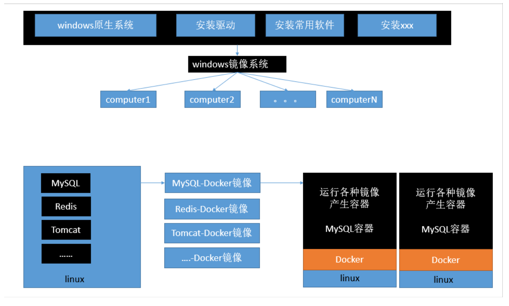

## 2、核心概念

docker主机(Host)：安装了Docker程序的机器（Docker直接安装在操作系统之上）；

docker客户端(Client)：连接docker主机进行操作；

docker仓库(Registry)：用来保存各种打包好的软件镜像；

docker镜像(Images)：软件打包好的镜像；放在docker仓库中；

docker容器(Container)：镜像启动后的实例称为一个容器；容器是独立运行的一个或一组应用

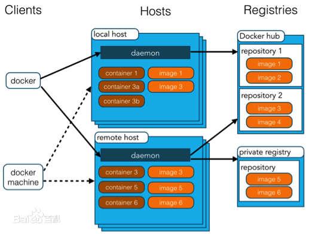


> 使用Docker的步骤：

1）安装Docker

2）去Docker仓库找到这个软件对应的镜像；

3）使用Docker运行这个镜像，这个镜像就会生成一个Docker容器；

4）对容器的启动停止就是对软件的启动停止；

## 3、安装Docker

### 1）安装linux虚拟机

### 2）在linux虚拟机上安装docker

docker安装使用步骤：

1、检查内核版本，必须是3.10及以上

```shell
uname -r
```

2、安装docker

```bash
yum install docker
```

3、输入y确认安装

4、启动docker

```shell
[root@localhost ~]# systemctl start docker
# 查看版本
[root@localhost ~]# docker -v
Docker version 1.12.6, build 3e8e77d/1.12.6
```

5、开机启动docker

```shell
[root@localhost ~]# systemctl enable docker
Created symlink from /etc/systemd/system/multi-user.target.wants/docker.service to /usr/lib/systemd/system/docker.service.
```

6、停止docker

```shell
systemctl stop docker
```

## 4、Docker常用命令&操作

### 1）镜像操作

| 操作 | 命令                                               | 说明                                                     |
| ---- | -------------------------------------------------- | -------------------------------------------------------- |
| 检索 | docker  search 关键字  例如：docker  search  redis | 我们经常去docker  hub上检索镜像的详细信息，如镜像的TAG。 |
| 拉取 | docker  pull  镜像名:tag                           | :tag是可选的，tag表示标签，多为软件的版本，默认是latest  |
| 查看 | docker  images                                     | 查看所有本地镜像                                         |
| 删除 | docker  rmi  image-id                              | 删除指定的本地镜像                                       |

### 2）容器操作

| 操作     | 命令                                                         | 说明                                                         |
| -------- | ------------------------------------------------------------ | ------------------------------------------------------------ |
| 运行     | ==docker  run== --name  容器名  -d  镜像名<br />例如：docker  run  --name  mytomcat  -d  tomcat:latest | --name：自定义容器名<br />-d：后台运行<br />image-name：指定镜像名 |
| 查看     | docker  ps（查看运行中的容器）                               | 加上-a，可以查看所有容器                                     |
| 停止     | docker  stop   容器id / 容器名                               | 停止当前运行的指定容器                                       |
| 启动     | docker  start  容器id / 容器名                               | 启动容器                                                     |
| 删除     | docker  rm  容器id                                           | 删除指定容器                                                 |
| 端口映射 | -p  6379:6379 <br />例如：docker  run  -d  -p  6379:6379  --name  mytomcat  tomcat | -p: 主机端口(映射到)容器内部的端口                           |
| 容器日志 | docker  logs  容器id / 容器名                                |                                                              |
| 更多命令 | https://docs.docker.com/engine/reference/commandline/docker/ |                                                              |

### 3）安装MySQL示例

```shell
docker pull mysql
```

错误的启动：docker run --name mysql01 -d mysql

```shell
[root@localhost ~]# docker run --name mysql01 -d mysql
42f09819908bb72dd99ae19e792e0a5d03c48638421fa64cce5f8ba0f40f5846

# mysql退出了
[root@localhost ~]# docker ps -a
CONTAINER ID    IMAGE     	 COMMAND        		  CREATED           STATUS     PORTS              NAMES
42f09819908b    mysql   "docker-entrypoint.sh"   34 seconds ago      Exited (1) 33 seconds ago       mysql01
538bde63e500    tomcat  "catalina.sh run"        About an hour ago   Exited (143) About an hour ago  myTomcat              
# 错误日志
[root@localhost ~]# docker logs 42f09819908b
error: database is uninitialized and password option is not specified 
  You need to specify one of MYSQL_ROOT_PASSWORD, MYSQL_ALLOW_EMPTY_PASSWORD and MYSQL_RANDOM_ROOT_PASSWORD；这个三个参数必须指定一个
```

正确的启动： `docker run --name mysql01 -e MYSQL_ROOT_PASSWORD=123456 -d mysql`

```shell
[root@localhost ~]# docker run --name mysql01 -e MYSQL_ROOT_PASSWORD=123456 -d mysql
b874c56bec49fb43024b3805ab51e9097da779f2f572c22c695305dedd684c5f
[root@localhost ~]# docker ps
CONTAINER ID   IMAGE    	COMMAND    			 CREATED              STATUS   		PORTS              NAMES
cbd3cc43ab51   mysql   "docker-entrypoint..."   3 seconds ago    Up 2 seconds   3306/tcp, 33060/tcp   mysql01
```

做了端口映射：

```shell
[root@localhost ~]# docker run -p 3306:3306 --name mysql02 -e MYSQL_ROOT_PASSWORD=123456 -d mysql
ad10e4bc5c6a0f61cbad43898de71d366117d120e39db651844c0e73863b9434
[root@localhost ~]# docker ps
CONTAINER ID   IMAGE    	COMMAND    			 CREATED           STATUS   		PORTS              NAMES
cbd3cc43ab51   mysql   "docker-entrypoint..."  4 seconds ago   Up 2 seconds   0.0.0.0:3306->3306/tcp  mysql02
```


其他一些高级操作

```shell
# 把主机的/conf/mysql文件夹挂载到 mysqldocker容器的/etc/mysql/conf.d文件夹里面
# 改mysql的配置文件就只需要把mysql配置文件放在自定义的文件夹下（/conf/mysql）
docker run --name mysql01  -v  /conf/mysql:/etc/mysql/conf.d  -e MYSQL_ROOT_PASSWORD=my-secret-pw -d mysql:tag

# 指定mysql的一些配置参数
docker run --name some-mysql -e MYSQL_ROOT_PASSWORD=my-pwd -d mysql:tag --character-set-server=utf8mb4 --collation-server=utf8mb4_unicode_ci
```


# 六、Spring Boot 与 数据访问

## 1、JDBC

引入的依赖

```xml
<dependency>
    <groupId>org.springframework.boot</groupId>
    <artifactId>spring-boot-starter-jdbc</artifactId>
</dependency>
<dependency>
    <groupId>mysql</groupId>
    <artifactId>mysql-connector-java</artifactId>
    <scope>runtime</scope>
</dependency>
```

配置yml文件

```yml
spring:
  datasource:
    username: root
    password: sfz200108
    driver-class-name: com.mysql.cj.jdbc.Driver
    url: jdbc:mysql://localhost:3306/data?serverTimezone=UTC&useSSL=true
```

> SpringBoot 与 JDBC整合的认识

SpringBoot默认是用`com.zaxxer.hikari.HikariDataSource`作为数据源；

数据源的相关配置都在`DataSourceProperties`里面。


> 自动配置原理：

参考：org.springframework.boot.autoconfigure.jdbc包下的 `DataSourceConfiguration` 

1、DataSourceConfiguration：根据配置创建数据源，默认使用Hikari连接池；可以使用spring.datasource.type指定自定义的数据源类型；

2、SpringBoot默认可以支持：org.apache.tomcat.jdbc.pool.DataSource、HikariDataSource、BasicDataSource。

3、自定义数据源类型

```java
/**
 * Generic DataSource configuration.
 */
@ConditionalOnMissingBean(DataSource.class)
@ConditionalOnProperty(name = "spring.datasource.type")
static class Generic {

   @Bean
   public DataSource dataSource(DataSourceProperties properties) {
      // 使用DataSourceBuilder创建数据源,利用反射创建响应type的数据源,并且绑定相关属性。
      return properties.initializeDataSourceBuilder().build();
   }

}
```

4、`DataSourceInitializer`的作用：

1）createSchema()：SpringBoot启动时可以运行建表语句；(DML)

2）initSchema()：SpringBoot启动时可以运行插入数据的sql语句；(DDL)

默认只需要将文件命名为：

```properties
默认文件加载规则：schema.sql、data.sql
		 	   schema-${plateform}.sql，schema-${platform}.sql；
```

也可以在yml中指定文件运行语句

```yml
spring:
  datasource:
    schema:
      - classpath:department.sql
    # SpringBoot启动时初始化数据库脚本
    initialization-mode: always
```

5、操作数据库：自动配置了JdbcTemplate操作数据库。

## 2、整合Druid数据源

配置yml文件

```yml
spring:
  datasource:
    username: root
    password: sfz200108
    driver-class-name: com.mysql.cj.jdbc.Driver
    url: jdbc:mysql://localhost:3306/data?serverTimezone=UTC&useSSL=true
    type: com.alibaba.druid.pool.DruidDataSource
    ...
```

配置DruidConfig配置类：可以与yml绑定配置属性；可以注册三大组件。

```java

@Configuration
public class DruidConfig {

    @ConfigurationProperties(prefix = "spring.datasource")
    @Bean
    public DataSource druid(){
       return  new DruidDataSource();
    }

    //配置Druid的监控
    //1、配置一个管理后台的Servlet
    @Bean
    public ServletRegistrationBean statViewServlet(){
        ServletRegistrationBean bean = new ServletRegistrationBean(new StatViewServlet(), "/druid/*");
        Map<String,String> initParams = new HashMap<>();

        initParams.put("loginUsername","admin");
        initParams.put("loginPassword","123456");
        initParams.put("allow","");//默认就是允许所有访问
        initParams.put("deny","192.168.15.21");

        bean.setInitParameters(initParams);
        return bean;
    }

    //2、配置一个web监控的filter
    @Bean
    public FilterRegistrationBean webStatFilter(){
        FilterRegistrationBean bean = new FilterRegistrationBean();
        bean.setFilter(new WebStatFilter());

        Map<String,String> initParams = new HashMap<>();
        initParams.put("exclusions","*.js,*.css,/druid/*");

        bean.setInitParameters(initParams);
        bean.setUrlPatterns(Arrays.asList("/*"));

        return  bean;
    }
}
```

## 3、整合MyBatis

引入的依赖

```xml
<dependency>
    <groupId>org.mybatis.spring.boot</groupId>
    <artifactId>mybatis-spring-boot-starter</artifactId>
    <version>2.1.3</version>
</dependency>
```

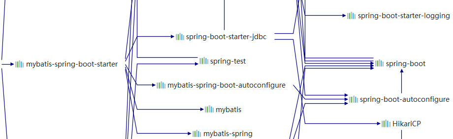

步骤：

1）配置数据源相关属性

2）给数据库建表

3）创建JavaBean

4）使用MyBatis

### 	注解版

```java
//指定这是一个操作数据库的mapper
@Mapper
public interface UserMapper {

    @Select ("select * from user where id=#{id};")
    public User getUserById(int id);

    @Delete ("delete from user where id=#{id} ")
    public void deleteUserById(int id);

    @Insert ("insert into user (id,name, pwd) values (#{id},#{name} ,#{pwd} );")
    public void insertUser(User user);

    @Update ("update user set pwd = #{pwd}  where id=#{id} ;")
    public void updateUser(User user);
}
```

扩展一：添加自定义MyBatis的配置；给容器中添加一个`ConfigurationCustomizer`；

```java
@Configuration
public class MyBatisConfig {

    @Bean
    public ConfigurationCustomizer configurationCustomizer(){
        return new ConfigurationCustomizer(){

            @Override
            public void customize(Configuration configuration) {
                configuration.setMapUnderscoreToCamelCase(true);
            }
        };
    }
}
```

扩展二：使用`MapperScan`扫描指定包下所有的接口类，然后所有接口在编译之后都会生成相应的实现类。

等价于：批量扫描所有的Mapper接口；为所有扫描的Mapper接口添加@Mapper注解。

```java
@MapperScan(value = "com.study.spring.boot.mapper")
@SpringBootApplication
public class SpringBoot06DataMybatisApplication {

	public static void main(String[] args) {
		SpringApplication.run(SpringBoot06DataMybatisApplication.class, args);
	}
}
```

### 配置文件版

```yaml
mybatis:
  config-location: classpath:mybatis/mybatis-config.xml 指定全局配置文件的位置
  mapper-locations: classpath:mybatis/mapper/*.xml  指定sql映射文件的位置
```

更多使用参照

http://www.mybatis.org/spring-boot-starter/mybatis-spring-boot-autoconfigure/


## 4、整合SpringData JPA

### 1）SpringData简介

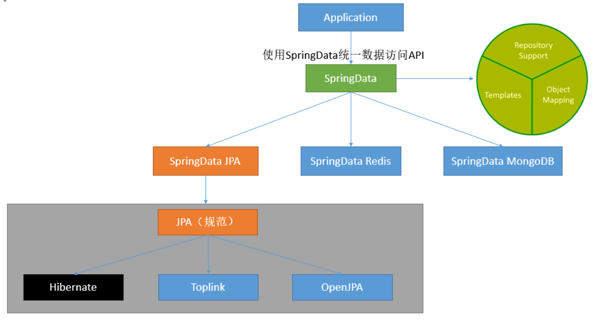

### 2）整合SpringData JPA

JPA:ORM（Object Relational Mapping）；

1）编写一个实体类（bean）和数据表进行映射，并且配置好映射关系；

```java
//使用JPA注解配置映射关系
@Entity //告诉JPA这是一个实体类（和数据表映射的类）
@Table(name = "tbl_user") //@Table来指定和哪个数据表对应;如果省略默认表名就是user；
public class User {

    @Id //这是一个主键
    @GeneratedValue(strategy = GenerationType.IDENTITY)//自增主键
    private Integer id;

    @Column(name = "last_name",length = 50) //这是和数据表对应的一个列
    private String lastName;
    @Column //省略默认列名就是属性名
    private String email;
    ...
}
```

2）编写一个Dao接口来操作实体类对应的数据表（Repository）

```java
//继承JpaRepository来完成对数据库的操作
public interface UserRepository extends JpaRepository<User,Integer> {
}
```

3）基本的配置JpaProperties

```yml
spring:  
  jpa:
    hibernate:
      # 更新或者创建数据表结构
      ddl-auto: update
	# 控制台显示SQL
    show-sql: true
```


# 七、启动配置原理

几个重要的事件回调机制

配置在META-INF/spring.factories

**ApplicationContextInitializer**

**SpringApplicationRunListener**


只需要放在ioc容器中

**ApplicationRunner**

**CommandLineRunner**


Spring Boot 启动流程：

## **1、创建SpringApplication对象**

```java
public SpringApplication(Class<?>... primarySources) {
    this(null, primarySources);
}
public SpringApplication(ResourceLoader resourceLoader, Class<?>... primarySources) {
    this.resourceLoader = resourceLoader;
    // 保存主配置类
    Assert.notNull(primarySources, "PrimarySources must not be null");
    this.primarySources = new LinkedHashSet<>(Arrays.asList(primarySources));
    // 判断当前是否一个web应用
    this.webApplicationType = WebApplicationType.deduceFromClasspath();
    
    // 从类路径下找到META-INF/spring.factories配置的所有ApplicationContextInitializer,然后保存起来。
    setInitializers((Collection) getSpringFactoriesInstances(
        ApplicationContextInitializer.class));
    
    // 从类路径下找到并加载META-INF/spring.factories配置的所有ApplicationListener,然后保存起来。
    setListeners((Collection) getSpringFactoriesInstances(
        ApplicationListener.class));
    
    // 从多个配置类中找到有main方法的主配置类
    this.mainApplicationClass = deduceMainApplicationClass();
}
```

## 2、运行 run 方法

```java
public ConfigurableApplicationContext run(String... args) {
    StopWatch stopWatch = new StopWatch();
    stopWatch.start();
    ConfigurableApplicationContext context = null;
    Collection<SpringBootExceptionReporter> exceptionReporters = new ArrayList<>();
    configureHeadlessProperty();
    
    // 获取SpringApplicationRunListeners,从类路径下META-INF/spring.factories获取。
    SpringApplicationRunListeners listeners = getRunListeners(args);
    // 监听一: 应用启动
    // 回调所有的获取SpringApplicationRunListener.starting()方法
    listeners.starting();
    try {
        // 封装命令行参数
        ApplicationArguments applicationArguments = new DefaultApplicationArguments(args);
        // 准备环境
        ConfigurableEnvironment environment = prepareEnvironment(listeners, applicationArguments);
        	- // 监听二: 环境刚准备好
        	- // 创建环境完成后回调SpringApplicationRunListener.environmentPrepared()；表示环境准备完成
        	- listeners.environmentPrepared(environment);
        configureIgnoreBeanInfo(environment);
        // 打印banner图标
        Banner printedBanner = printBanner(environment);
        
        // 创建ApplicationContext；决定创建Web的IOC容器还是普通的IOC容器
        context = createApplicationContext();
        
        // 用于出现异常的异常分析报告
        exceptionReporters = getSpringFactoriesInstances(
            SpringBootExceptionReporter.class,
            new Class[] { ConfigurableApplicationContext.class }, context);
        
        // 准备上下文环境
        prepareContext(context, environment, listeners, applicationArguments, printedBanner);
        	- // applyInitializers()：回调之前保存的所有的ApplicationContextInitializer的initialize方法
        	- applyInitializers(context);
        	- // 监听三: IOC容器准备好
        	- // 回调所有的SpringApplicationRunListener的contextPrepared()
        	- listeners.contextPrepared(context);
        	- // 监听四: 容器环境以及加载完成
         	- // prepareContext运行完成后回调所有的SpringApplicationRunListener的contextLoaded()
        	- listeners.contextLoaded(context);
        
        // 刷新容器: ioc容器初始化(如果是web应用还会创建嵌入式的Tomcat):加载IOC的所有组件。
        // 扫描,创建,加载所有组件的地方(配置类、组件、自动配置)
        refreshContext(context);
        afterRefresh(context, applicationArguments);
        stopWatch.stop();
        if (this.logStartupInfo) {
            new StartupInfoLogger(this.mainApplicationClass).logStarted(getApplicationLog(), stopWatch);
        }
        // 监听五: 容器启动
        listeners.started(context);
        // 从IOC容器中获取所有的ApplicationRunner和CommandLineRunner进行回调。
        // ApplicationRunner先回调,CommandLineRunner再回调。
        callRunners(context, applicationArguments);
    }
    catch (Throwable ex) {
        handleRunFailure(context, ex, exceptionReporters, listeners);
        throw new IllegalStateException(ex);
    }

    try {
        // 监听六: 容器运行
        listeners.running(context);
    }
    catch (Throwable ex) {
        // 处理运行错误
        handleRunFailure(context, ex, exceptionReporters, null);
        	- // 监听七: 容器出现异常
            - listeners.failed(context, exception);
        throw new IllegalStateException(ex);
    }
    // 整个SpringBoot应用启动完成以后返回启动的ioc容器
    return context;
}
```

## 3、事件监听机制

> SpringBoot配置的全局监听器，配置在META-INF/spring.factories

**ApplicationContextInitializer**

```java
public class HelloApplicationContextInitializer implements ApplicationContextInitializer<ConfigurableApplicationContext> {
    @Override
    public void initialize(ConfigurableApplicationContext applicationContext) {
        System.out.println("ApplicationContextInitializer...initialize..."+applicationContext);
    }
}
```

**SpringApplicationRunListener**

```java
public class HelloRunListener implements SpringApplicationRunListener {
    //必须有的构造器
    public HelloSpringApplicationRunListener(SpringApplication application, String[] args){}
    
    @Override
    public void starting() {}

    @Override
    public void environmentPrepared(ConfigurableEnvironment environment) {}

    @Override
    public void contextPrepared(ConfigurableApplicationContext context) {}

    @Override
    public void contextLoaded(ConfigurableApplicationContext context) {}

    @Override
    public void started(ConfigurableApplicationContext context) {}

    @Override
    public void running(ConfigurableApplicationContext context) {}

    @Override
    public void failed(ConfigurableApplicationContext context, Throwable exception) {}
}

```

配置（META-INF/spring.factories）

```properties
org.springframework.context.ApplicationContextInitializer=\
com.study.spring.boot.listener.HelloApplicationContextInitializer

org.springframework.boot.SpringApplicationRunListener=\
com.study.spring.boot.listener.HelloSpringApplicationRunListener
```

> IOC容器中的监听器，只需要放在ioc容器中

**ApplicationRunner**

```java
@Component
public class HelloApplicationRunner implements ApplicationRunner {
    @Override
    public void run(ApplicationArguments args) throws Exception {
        System.out.println("ApplicationRunner...run....");
    }
}
```

**CommandLineRunner**

```java
@Component
public class HelloCommandLineRunner implements CommandLineRunner {
    @Override
    public void run(String... args) throws Exception {
        System.out.println("CommandLineRunner...run..."+ Arrays.asList(args));
    }
}
```


# 八、自定义starter

starter：

1、这个场景需要使用到的依赖是什么？

2、如何编写自动配置

```java
@Configuration  //指定这个类是一个配置类
@ConditionalOnXXX  //在指定条件成立的情况下自动配置类生效
@AutoConfigureAfter  //指定自动配置类的顺序
@Bean  //给容器中添加组件

@ConfigurationPropertie结合相关xxxProperties类来绑定相关的配置
@EnableConfigurationProperties //让xxxProperties生效加入到容器中

自动配置类要能加载
将需要启动就加载的自动配置类，配置在META-INF/spring.factories
org.springframework.boot.autoconfigure.EnableAutoConfiguration=\
org.springframework.boot.autoconfigure.admin.SpringApplicationAdminJmxAutoConfiguration,\
org.springframework.boot.autoconfigure.aop.AopAutoConfiguration,\
```

3、设计的模式：

启动器（xxx-starter）只用来做依赖导入，引入自动配置模块；然后实际使用自动配置模块（xxx-autoconfigure）实现自动配置。

而其他人使用只需要引入启动器（xxx-starter）即可。

注：自定义starter名：自定义启动器名-spring-boot-starter


步骤：

1）启动器模块

```xml
<?xml version="1.0" encoding="UTF-8"?>
<project xmlns="http://maven.apache.org/POM/4.0.0"
         xmlns:xsi="http://www.w3.org/2001/XMLSchema-instance"
         xsi:schemaLocation="http://maven.apache.org/POM/4.0.0 http://maven.apache.org/xsd/maven-4.0.0.xsd">
    <modelVersion>4.0.0</modelVersion>

    <groupId>com.study.starter</groupId>
    <artifactId>study-spring-boot-starter</artifactId>
    <version>1.0</version>

    <!--启动器-->
    <dependencies>

        <!--引入自动配置模块-->
        <dependency>
            <groupId>com.study.starter</groupId>
            <artifactId>study-spring-boot-starter-autoconfigurer</artifactId>
            <version>1.0</version>
        </dependency>
    </dependencies>

</project>
```

2）自动配置模块

```xml
<?xml version="1.0" encoding="UTF-8"?>
<project xmlns="http://maven.apache.org/POM/4.0.0" xmlns:xsi="http://www.w3.org/2001/XMLSchema-instance"
   xsi:schemaLocation="http://maven.apache.org/POM/4.0.0 http://maven.apache.org/xsd/maven-4.0.0.xsd">
   <modelVersion>4.0.0</modelVersion>

   <groupId>com.study.starter</groupId>
   <artifactId>study-spring-boot-starter-autoconfigure</artifactId>
   <version>1.0</version>
   <packaging>jar</packaging>
   <name>study-spring-boot-starter-autoconfigure</name>

   <parent>
      <groupId>org.springframework.boot</groupId>
      <artifactId>spring-boot-starter-parent</artifactId>
      <version>2.3.1.RELEASE</version>
      <relativePath/> <!-- lookup parent from repository -->
   </parent>

   <properties>
      <project.build.sourceEncoding>UTF-8</project.build.sourceEncoding>
      <project.reporting.outputEncoding>UTF-8</project.reporting.outputEncoding>
      <java.version>1.8</java.version>
   </properties>

   <dependencies>
      <!--引入spring-boot-starter；所有starter的基本配置-->
      <dependency>
         <groupId>org.springframework.boot</groupId>
         <artifactId>spring-boot-starter</artifactId>
      </dependency>
   </dependencies>

</project>
```

autoconfigure中的自动配置类信息

```java
@ConfigurationProperties(prefix = "stuyd.hello")
public class HelloProperties {

    private String prefix;
    private String suffix;

    public String getPrefix() {
        return prefix;
    }

    public void setPrefix(String prefix) {
        this.prefix = prefix;
    }

    public String getSuffix() {
        return suffix;
    }

    public void setSuffix(String suffix) {
        this.suffix = suffix;
    }
}
```

```java
public class HelloService {

    HelloProperties helloProperties;

    public HelloProperties getHelloProperties() {
        return helloProperties;
    }

    public void setHelloProperties(HelloProperties helloProperties) {
        this.helloProperties = helloProperties;
    }

    public String sayHellStudy(String name){
        return helloProperties.getPrefix()+"-" +name + helloProperties.getSuffix();
    }
}
```

```java
@Configuration
@ConditionalOnWebApplication //web应用才生效
@EnableConfigurationProperties(HelloProperties.class)
public class HelloServiceAutoConfiguration {

    @Autowired
    HelloProperties helloProperties;
    @Bean
    public HelloService helloService(){
        HelloService service = new HelloService();
        service.setHelloProperties(helloProperties);
        return service;
    }
}
```


# 九、Spring Boot 与 缓存

**JSR-107、Spring缓存抽象、整合Redis**

## 1、JSR107

Java Caching定义了5个核心接口，分别是CachingProvider，CacheManager，Cache，Entry 和 Expiry。

- CachingProvider定义了创建、配置、获取、管理和控制多个CacheManager。一个应用可以在运行期访问多个CachingProvider。

- CacheManager定义了创建、配置、获取、管理和控制多个唯一命名的Cache，这些Cache存在于CacheManager的上下文中。

	一个CacheManager仅被一个CachingProvider所拥有。

- Cache是一个类似Map的数据结构并临时存储以Key为索引的值。一个Cache仅被一个CacheManager所拥有。

- Entry是一个存储在Cache中的key-value对。

- Expiry 每一个存储在Cache中的条目有一个定义的有效期。一旦超过这个时间，条目为过期 的状态。一旦过期，条目将不可访问、更新和

	删除。缓存有效期可以通过ExpiryPolicy设置。

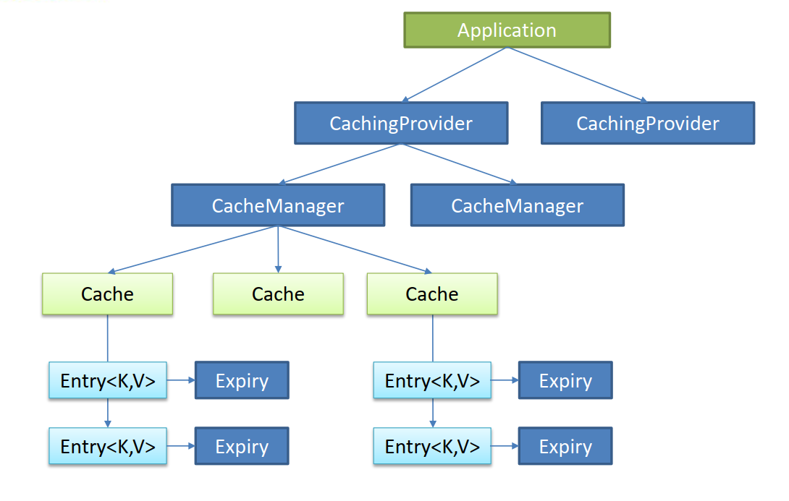

## 2、Spring 内存缓存

Spring从3.1开始定义了 org.springframework.cache.`Cache`  和 org.springframework.cache.`CacheManager` 接口来统一不同的缓存技术。

并支持使用JCache（JSR-107）注解简化我们开发。

> 相关缓存概念和注解

|      名称      | 作用                                                         |
| :------------: | ------------------------------------------------------------ |
|     Cache      | 缓存接口，定义缓存操作。实现有：RedisCache、EhCacheCache、ConcurrentMapCache等。 |
|  CacheManager  | 缓存管理器，管理各种缓存（Cache）组件                        |
| @EnableCaching | 开启基于注解的缓存                                           |
|  `@Cacheable`  | 主要针对方法配置，能够根据方法的请求参数对其结果进行缓存。   |
|  `@CachePut`   | 既调用方法，又更新缓存（同步同步缓存，前提是取和放的key是同一个key） |
| `@CacheEvict`  | 当删除数据的时候，清除其对应的缓存。                         |
|  keyGenerator  | 缓存数据时key生成策略                                        |
|   serialize    | 缓存数据时value序列化策略                                    |


> 缓存注解的属性

|      属性名      | 介绍和作用                                                   |
| :--------------: | ------------------------------------------------------------ |
| cacheNames/value | 指定缓存组件的名字;将方法的返回结果放在哪个缓存中，是数组的方式，可以指定多个缓存 |
|       key        | 缓存数据使用的key，可以用它来指定。默认是使用方法参数的值。可以使用SpEL表达式编写 |
|   keyGenerator   | key的生成器，可以自己指定key的生成器的组件id。key/keyGenerator：二选一使用; |
|    condition     | 指定符合条件的情况下才缓存。                                 |
|   cacheManager   | 指定缓存管理器；或者cacheResolver指定获取解析器 。           |
|      unless      | 用于否定缓存的，该表达式只在方法执行之后判断，可以拿到返回值进行判断。条件为true不会缓存，fasle才缓存。 |
|       sync       | 是否使用异步模式                                             |


## 3、缓存的运行原理和流程

> 缓存的运行原理：

1、通过自动配置类：CacheAutoConfiguration，注册配置bean的信息。

2、缓存的配置类

```java
org.springframework.boot.autoconfigure.cache.GenericCacheConfiguration
org.springframework.boot.autoconfigure.cache.JCacheCacheConfiguration
org.springframework.boot.autoconfigure.cache.EhCacheCacheConfiguration
org.springframework.boot.autoconfigure.cache.HazelcastCacheConfiguration
org.springframework.boot.autoconfigure.cache.InfinispanCacheConfiguration
org.springframework.boot.autoconfigure.cache.CouchbaseCacheConfiguration
org.springframework.boot.autoconfigure.cache.RedisCacheConfiguration【默认】
org.springframework.boot.autoconfigure.cache.CaffeineCacheConfiguration
org.springframework.boot.autoconfigure.cache.SimpleCacheConfiguration
org.springframework.boot.autoconfigure.cache.NoOpCacheConfiguration
```

3、哪个配置类默认生效：RedisCacheConfiguration；

4、给容器中注册了一个CacheManager： RedisCacheManager，用于管理多个Cache组件的。

5、可以获取和创建ConcurrentMapCache类型的缓存组件，将数据保存在ConcurrentMap中。


> 缓存的运行流程(以`@Cacheable`为例)：

1、方法运行之前，先去查询Cache（缓存组件），按照cacheNames指定的名字获取；（CacheManager先获取相应的缓存），

第一次获取缓存如果没有Cache组件会自动创建。

2、去Cache中查找缓存的内容，使用一个key，默认就是方法的参数；

key是按照某种策略生成的；默认是使用keyGenerator生成的，默认使用SimpleKeyGenerator生成key；

- SimpleKeyGenerator生成key的默认策略：
	- 如果没有参数；key=new SimpleKey()；
	- 如果有一个参数：key=参数的值
	- 如果有多个参数：key=new SimpleKey(params)；

3、没有查到缓存就继续执行调用目标方法；

4、将目标方法返回的结果，放进缓存中。

 @Cacheable 标注的方法执行之前先来检查缓存中有没有这个数据，默认按照参数的值作为key去查询缓存，如果没有就运行方法

并将结果放入缓存；以后再来调用就可以直接使用缓存中的数据。


## 4、缓存使用

1）引入spring-boot-starter-cache模块

2）@EnableCaching开启缓存

3）使用缓存注解

4）切换为其他缓存


## 5、整合redis实现缓存

**步骤一**：引入spring-boot-starter-data-redis

```xml
<dependency>
    <groupId>org.springframework.boot</groupId>
    <artifactId>spring-boot-starter-data-redis</artifactId>
</dependency>
```

**步骤二**：使用yml配置redis连接地址

```yml
spring:
  redis:
    host: 120.79.210.68
```

**步骤三**：使用ReditTemplate操作redis

- redisTemplate.opsForValue()：操作字符串

- redisTemplate.opsForHash()：操作hash

- redisTemplate.opsForList()：操作list

- redisTemplate.opsForSet()：操作set

- redisTemplate.opsForZSet()：操作有序set


缓存其他操作

自定义CacheManager配置缓存：CacheManagerCustomizers

测试使用缓存、切换缓存：CompositeCacheManager


# 十、Spring Boot 与 消息

## 1、消息队列的概述

1、大多应用中，可通过消息服务中间件来提升系统异步通信、扩展解耦能力。

2、消息服务中两个重要概念：

   ==消息代理（message broker）==和==目的地（destination）==

当消息发送者发送消息以后，将由消息代理接管，消息代理保证消息传递到指定目的地。

3、消息队列主要有两种形式的目的地
1. ==队列（queue）==：点对点消息通信（point-to-point）
2. ==主题（topic）==：发布（publish）/订阅（subscribe）消息通信。

## 2、消息队列的作用

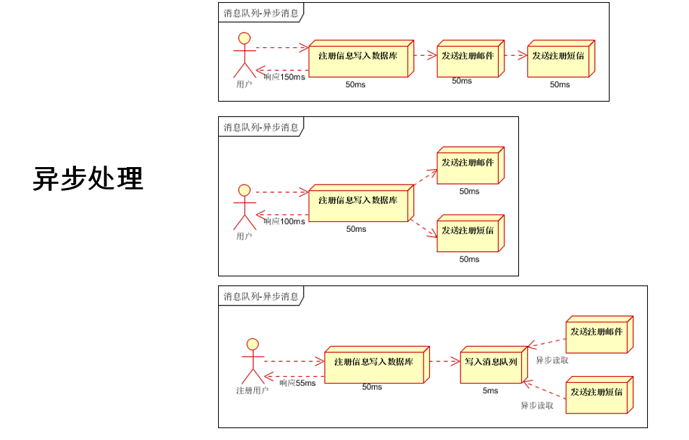

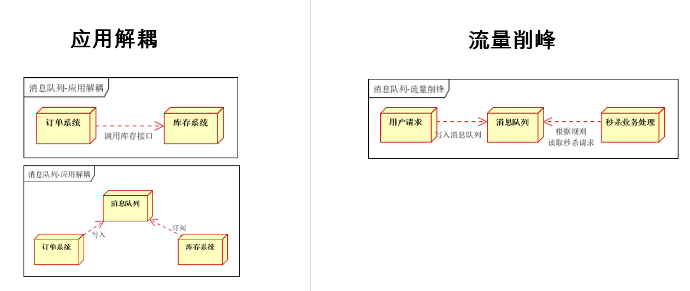

## 3、RabbitMQ简介

`RabbitMQ`简介：RabbitMQ是一个由erlang开发的AMQP(Advanved Message Queue Protocol)的开源实现。

### 核心概念

**`Publisher`**

消息的生产者，也是一个向交换器发布消息的客户端应用程序。

**`Message`**

消息，由消息头和消息体组成。

**`Broker`**

表示消息队列服务器

- **Virtual Host**

- 虚拟主机，表示一批交换器、消息队列和相关对象。

- 每个vhost本质上就是一个mini版的 RabbitMQ 服务器，拥有自己的队列、交换器、绑定和权限机制。

	- **Exchange**

	- 交换器，用来接收生产者发送的消息并将这些消息路由给服务器中的队列。

	- Exchange有4种类型：direct(默认)，fanout, topic, 和headers，不同类型的Exchange转发消息的策略有所区别。

	- **Queue**

	- 消息队列，用来保存消息直到发送给消费者。它是消息的容器，也是消息的终点。

	- **Binding**

	- 绑定，用于消息队列和交换器之间的关联。Exchange 和Queue的绑定可以是多对多的关系。

**`Connection`**

网络连接，比如一个TCP连接。

- **Channel**
- 信道，多路复用连接中的一条独立的双向数据流通道。

**`Consumer`**

消息的消费者，表示一个从消息队列中取得消息的客户端应用程序。

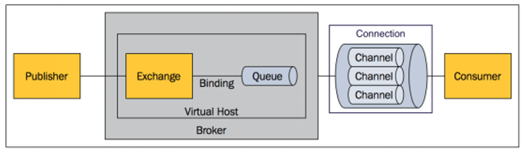


## 4、RabbitMQ的运行机制

AMQP中的消息路由

- AMQP中消息的路由过程和 Java 开发者熟悉的 JMS 存在一些差别，AMQP 中增加了 **Exchange** 和 **Binding** 的角色。

	==生产者把消息发布到 Exchange 上，消息最终到达队列并被消费者接收，而 Binding 决定交换器的消息应该发送到那个队列。==

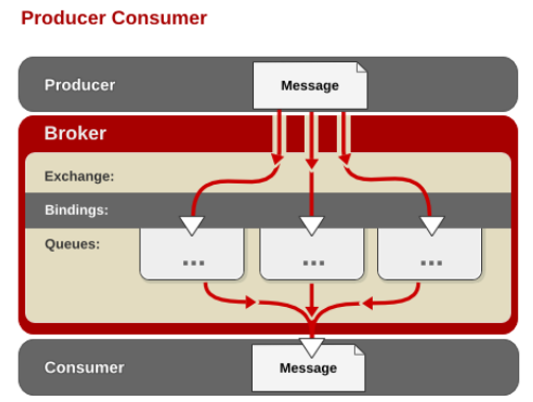


## 5、RabbitMQ整合

**步骤一**：启动RabbitMQ

```shell
docker run -d -p 5672:5672 -p 15672:15672 --name myrabbitmq 容器id
```

**步骤二**：引入依赖或使用 SpringBoot 创建向导添加 NOSQL/RabbitMQ

```xml
<dependency>
    <groupId>org.springframework.boot</groupId>
    <artifactId>spring-boot-starter-amqp</artifactId>
</dependency>
```

**步骤三**：编写yml配置RabbitMQ

```yml
spring:
  rabbitmq:
    host: 120.79.210.68
    username: guest
    password: guest
    port: 5672
```

**步骤四**：测试RabbitMQ

1. `RabbitTemplate`：消息发送处理组件，给RabbitMQ发送和接受消息。

2. `AmqpAdmin`： RabbitMQ系统管理功能组件，创建和删除 Queue，Exchange，Binding。

3. `@EnableRabbit` +  `@RabbitListener` 监听消息队列的内容。


# 十一、Spring Boot 与 检索

## 1、检索

我们的应用经常需要添加检索功能，开源的 [ElasticSearch](https://www.elastic.co/) 是目前全文搜索引擎的首选。它可以快速的存储、搜索和分析海量数据。

Spring Boot通过整合Spring Data ElasticSearch为我们提供了非常便捷的检索功能支持。

Elasticsearch是一个分布式搜索服务，提供Restful API，底层基于Lucene，采用多shard（分片）的方式保证数据安全，并且提供

自动resharding的功能，github等大型的站点也是采用了ElasticSearch作为其搜索服务。


## 2、概念 

以 员工文档 的形式存储为例：一个文档代表一个员工数据。存储数据到 ElasticSearch 的行为叫做 ==索引(.v)== ，但在索引一个文档之前，

需要确定将文档存储在哪里。

一个 ElasticSearch 集群可以 包含多个==索引(.n)== ，相应的每个索引可以包含多个==类型== 。 

这些不同的类型存储着多个==文档== ，每个文档又有 多个==属性==。

类比MySQL：

:ballot_box_with_check: 索引---数据库				:ballot_box_with_check: 类型---表					:ballot_box_with_check: 文档---表中的记录				:ballot_box_with_check: 属性---列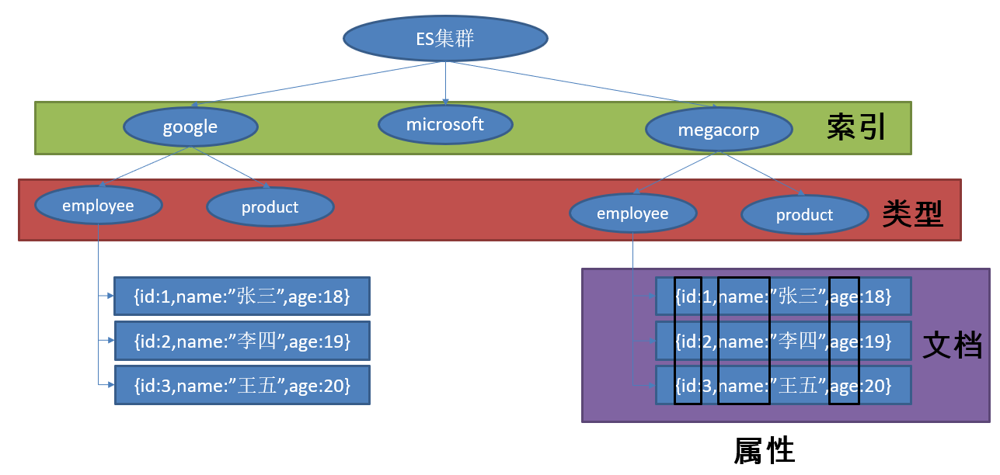


## 3、ES整合

**步骤一**：启动ElasticSearch

```shell
docker run -e ES_JAVA_OPTS="-Xms256m -Xmx256m" -d -p 9200:9200 -p 9300:9300 --name ES01 容器id
```

踩坑日记：

```shell
ERROR: [1] bootstrap checks failed
[1]: max virtual memory areas vm.max_map_count [65530] is too low, increase to at least [262144]
[2]: the default discovery settings are unsuitable for production use; at least one of [discovery.seed_hosts, discovery.seed_providers, cluster.initial_master_nodes] must be configured
```

1）内存不够启动不成功

```shell
# 持久化配置到本地
echo "vm.max_map_count=262144" > /etc/sysctl.conf
sysctl -p
# 查看修改的结果
sysctl -a|grep vm.max_map_count
```

2）需要配置以下三者最少其一【discovery.seed_hosts，discovery.seed_providers，cluster.initial_master_nodes】

```shell
# 找到elasticsearch.yml文件
find / -name elasticsearch.yml
# 修改elasticsearch.yml配置文件，将下面的配置加入到该配置文件中: 
cluster.initial_master_nodes: ["node-1"] #这里的node-1为node-name配置的值
```

**步骤二**：引入依赖或使用 SpringBoot 创建向导添加 NOSQL/ElasticSearch

```xml
<!--使用Springdata-elasticsearch-->
<dependency>
    <groupId>org.springframework.boot</groupId>
    <artifactId>spring-boot-starter-data-elasticsearch</artifactId>
</dependency>
<!--使用RestClient客户端-->
<dependency>
    <groupId>org.elasticsearch.client</groupId>
    <artifactId>elasticsearch-rest-client</artifactId>
    <version>7.8.1</version>
</dependency>
```


```java
* SpringBoot默认支持两种技术来和ES交互；
* 1、RestClient（默认不生效）
*  需要导入jest的工具包（io.searchbox.client.JestClient）
* 2、SpringData ElasticSearch【ES版本有可能不合适】
*     版本适配说明：https://github.com/spring-projects/spring-data-elasticsearch
*     如果版本不适配：2.4.6
*        1）、升级SpringBoot版本
*        2）、安装对应版本的ES
*
*     1）、Client 节点信息clusterNodes；clusterName
*     2）、ElasticsearchTemplate 操作es
*     3）、编写一个 ElasticsearchRepository 的子接口来操作ES；
*  两种用法：https://github.com/spring-projects/spring-data-elasticsearch
*  1）、编写一个 ElasticsearchRepository
```


# 十二、Spring Boot 与 任务

## 1、异步任务

在Java应用中，绝大多数情况下都是通过同步的方式来实现交互处理的；但是在处理与第三方系统交互的时候，容易造成响应迟缓的情况，

之前大部分都是使用多线程来完成此类任务，其实，在Spring 3.x之后，就已经内置了@Async来完美解决这个问题。

**两个注解：主启动类：`@EnableAysnc`、异步执行的目标方法：`@Aysnc`**

## 2、定时任务 

项目开发中经常需要执行一些定时任务，比如需要在每天凌晨时候，分析一次前一天的日志信息。Spring为我们提供了异步执行任务调度的

方式，提供TaskExecutor 、TaskScheduler 接口。

**两个注解：主启动类：`@EnableScheduling`、定时执行的目标方法：`@Scheduled`**

**cron表达式：**

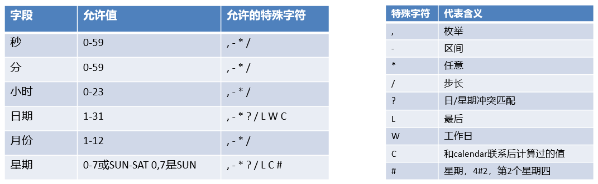

示例代码：

```java
@Service
public class ScheduledService {
    // 秒 分 时 日 月   周几
    // 0  *  * *  *  MON-FRI
    @Scheduled(cron = "0/4 * * * * MON-SAT")  //每4秒执行一次
    public void hello(){
        System.out.println("hello ... ");
    }
}
```


## 3、邮件任务 

**步骤一**：引入邮件发送需要的依赖

```xml
<dependency>
    <groupId>org.springframework.boot</groupId>
    <artifactId>spring-boot-starter-mail</artifactId>
</dependency>
```

**步骤二**：使用yml配置相关属性

```yml
spring:
  mail:
    username: 1905470291@qq.com	
    password: hwxpzeypdspddghb  # 授权码
    host: smtp.qq.com	
    properties:	
      smtp:
        ssl:
          enable: true
```

**步骤三**：测试邮件发送：

```java
// 自动装配JavaMailSender
@Autowired
JavaMailSenderImpl mailSender;
```

**测试一**：发送简单消息邮件

```java
@Test
public void contextLoads() {
    SimpleMailMessage message = new SimpleMailMessage();
    //邮件设置
    message.setSubject("通知-今晚开会");
    message.setText("今晚7:30开会");

    message.setFrom("534096094@qq.com");
    message.setTo("17512080612@163.com");

    mailSender.send(message);
}
```

**测试二**：发送复杂消息邮件

```java
@Test
public void test() throws  Exception{
    // 创建一个复杂消息邮件
    MimeMessage mimeMessage = mailSender.createMimeMessage();
    MimeMessageHelper helper = new MimeMessageHelper(mimeMessage, true);

    // 邮件设置
    helper.setSubject("通知-今晚开会");
    helper.setText("<b style='color:red'>今天 7:30 开会</b>",true);

    helper.setFrom("534096094@qq.com");
    helper.setTo("17512080612@163.com");
    
    // 上传文件(附件)
    helper.addAttachment("1.jpg",new File("C:\\Users\\lfy\\Pictures\\Saved Pictures\\1.jpg"));
    helper.addAttachment("2.jpg",new File("C:\\Users\\lfy\\Pictures\\Saved Pictures\\2.jpg"));

    mailSender.send(mimeMessage);
}
```


# 十三、Spring Boot 与 安全

## 1、安全

Spring Security是针对Spring项目的安全框架，也是Spring Boot底层安全模块默认的技术选型。他可以实现强大的web安全控制。

对于安全控制，我们仅需引入对应的 security 模块，进行少量的配置，即可实现强大的安全管理。

 几个类：

`@EnableWebSecurity`：开启WebSecurity模式

`WebSecurityConfigurerAdapter`：自定义Security策略

`AuthenticationManagerBuilder`：自定义认证策略


## 2、权限管理中的相关概念

**主体（principal）**：使用系统的用户或设备或从其他系统远程登录的用户等等。 简单说就是谁使用系统谁就是主体。

**认证（authentication）**：权限管理系统确认一个主体的身份，允许主体进入系统。 简单说就是"主体"证明自己是谁。

**授权（authorization）**：将操作系统的权限授予主体， 这样主体就具备了操作系统中特定功能的能力。

所以简单来说， 授权就是给用户分配权限。

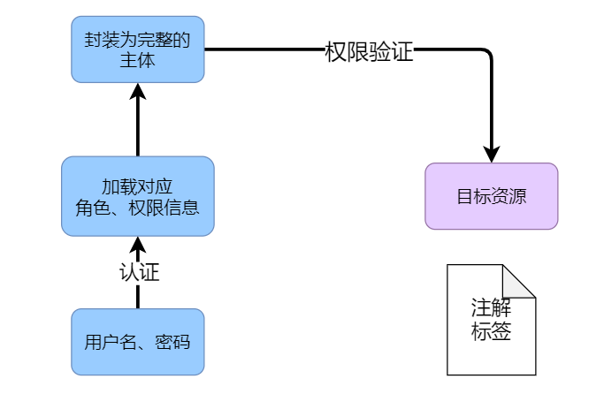


## 3、SpringSecurity用法

- 放行首页和静态资源

- 提交登录表单：

	- 内存认证
	- 数据库认证

- 注销

- 密码加密

- 在页面显示用户昵称等信息：使用security标签中的principal。

- 密码的擦除（提高安全性）

- 记住我

	- 表单添加remember-me的checkbox
	- 配置启用remember-me功能

- ==基于角色或权限实现访问控制==

- 页面元素的权限控制

- 防跨站请求伪造：HttpSecurity启用csrf功能，会为表单添加_csrf的值，提交携带来预防CSRF。

- ...

	

## 4、整合SpringSecurity

**步骤一**：引入security的依赖

```xml
<dependency>
    <groupId>org.springframework.boot</groupId>
    <artifactId>spring-boot-starter-security</artifactId>
</dependency>
```

**步骤二**：实现测试类

```java
@EnableWebSecurity
public class MySecurityConfig extends WebSecurityConfigurerAdapter {
    @Override
    protected void configure(HttpSecurity security) throws Exception {
        // 定制请求授权规则
        security.authorizeRequests()
                .antMatchers("/").permitAll()
                .antMatchers("/level1/**").hasRole("vip1")
                .antMatchers("/level2/**").hasRole("vip2")
                .antMatchers("/level3/**").hasRole("vip3")
        ;
    }

    @Override
    protected void configure(AuthenticationManagerBuilder auth) throws Exception {
        // 定义认证规则
        auth.inMemoryAuthentication()
                .withUser("").password("").roles("");
    }
}
```


# 十四、Spring Boot 与 分布式

## 1、分布式应用

在分布式系统中，国内常用zookeeper+dubbo组合，而Spring Boot推荐使用全栈的Spring，Spring Boot+Spring Cloud。

分布式系统：

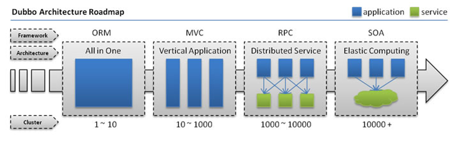


## 2、Zookeeper和Dubbo

**ZooKeeper**

ZooKeeper 是一个分布式的，开放源码的分布式应用程序协调服务。它是一个为分布式应用提供一致性服务的软件，提供的功能包括：

配置维护、域名服务、分布式同步、组服务等。

**Dubbo**

Dubbo是Alibaba开源的分布式服务框架，它最大的特点是按照分层的方式来架构，使用这种方式可以使各个层之间解耦合（或者最大限度地

松耦合）。从服务模型的角度来看，Dubbo采用的是一种非常简单的模型，要么是提供方提供服务，要么是消费方消费服务，所以基于这

一点可以抽象出服务提供方（Provider）和服务消费方（Consumer）两个角色。

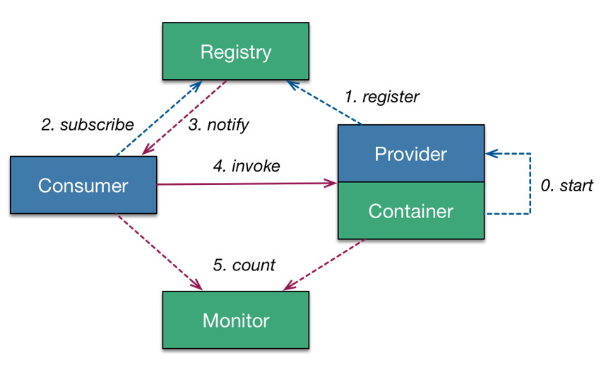


## 3、Spring Cloud

**Spring Cloud**

Spring Cloud是一个分布式的整体解决方案。Spring Cloud 为开发者提供了在分布式系统（配置管理，服务发现，熔断，路由，微代理，控制

总线，一次性token，全局锁，leader选举，分布式session，集群状态）中快速构建的工具，使用Spring Cloud的开发者可以快速的启动服务

或构建应用、同时能够快速和云平台资源进行对接。

SpringCloud 分布式开发五大常用组件

- 服务发现——Netflix Eureka
- 客户端负载均衡——Netflix Ribbon
- 断路器——Netflix Hystrix
- 服务网关——Netflix Zuul
- 分布式配置——Spring Cloud Config


# 十五、Spring Boot 与 开发热部署

## 热部署

在开发中我们修改一个Java文件后想看到效果不得不重启应用，这导致大量时间花费，

我们希望不重启应用的情况下，程序可以自动部署（热部署）。

**模板引擎配置热部署**

- 在Spring Boot中开发情况下禁用模板引擎的cache。

- 页面模板改变ctrl+F9可以重新编译当前页面并生效。

**Java程序配置热部署**：Spring Boot Devtools（推荐）

引入依赖

```xml
<dependency>  
    <groupId>org.springframework.boot</groupId>  
    <artifactId>spring-boot-devtools</artifactId>   
</dependency> 
```

程序改变时，按ctrl+F9可以重新编译当前页面并生效。


# 十六、Spring Boot 与 监控管理

## 1、监控管理

通过引入spring-boot-starter-actuator，可以使用Spring Boot为我们提供的准生产环境下的应用监控和管理功能。

我们可以通过HTTP，JMX，SSH协议来进行操作，自动得到审计、健康及指标信息等。

使用步骤：

**步骤一**：引入spring-boot-starter-actuator

```xml
<dependency>
    <groupId>org.springframework.boot</groupId>
    <artifactId>spring-boot-starter-actuator</artifactId>
</dependency>
```

**步骤二**：通过http方式访问监控端点

**步骤三**：可进行shutdown（POST 提交，此端点默认关闭）


监控和管理端点：

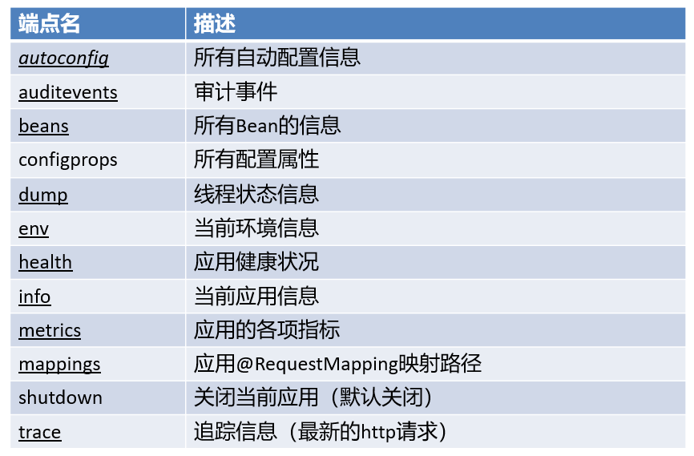


## 2、定制端点信息

定制端点一般通过endpoints+端点名+属性名来设置。

修改端点id（endpoints.beans.id=mybeans）

开启远程应用关闭功能（endpoints.shutdown.enabled=true）

关闭端点（endpoints.beans.enabled=false）

开启所需端点

- endpoints.enabled=false
- endpoints.beans.enabled=true

定制端点访问根路径

- management.context-path=/manage

关闭http端点

- management.port=-1