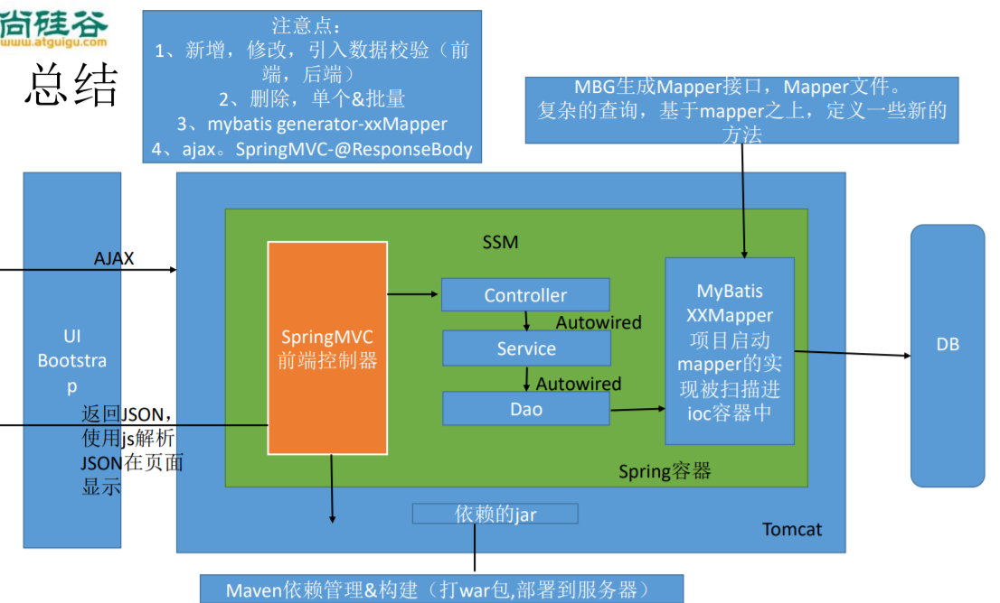

# SSM整合

## 功能点 

 1、分页

2、数据校验： jquery前端校验+JSR303后端校验+数据库约束！

3、ajax

4、Rest风格的URI：使用HTTP协议请求方式的动词，来表示对资源的操作。

​	  GET（查询），POST（新增），PUT（修改），DELETE （删除）

## 技术点 

- 基础框架-SSM（SpringMVC+Spring+MyBatis） 

- 数据库-MySQL 

- 前端框架-bootstrap快速搭建简洁美观的界面 

- 项目的依赖管理-Maven 

- 分页-pagehelper 

- 逆向工程-MyBatis Generator


## 基础环境搭建

 1、创建一个maven工程 

 2、引入项目依赖的jar包

- spring
- springmvc
- mybatis
- 数据库连接池，驱动包
- 其他（jstl，servlet-api，junit） 

 3、引入bootstrap前端框架 

 4、编写ssm整合的关键配置文件 

- web.xml，spring,springmvc,mybatis，使用mybatis的逆向工程生成对应的bean以 及mapper


### 注意：Maven每次重新导入依赖都要手动的引入lib到项目中。


### 引入所有Maven依赖

```xml
<dependencies>
    <!--Junit-->
    <dependency>
        <groupId>junit</groupId>
        <artifactId>junit</artifactId>
        <version>4.12</version>
    </dependency>
    <!--数据库驱动-->
    <dependency>
        <groupId>mysql</groupId>
        <artifactId>mysql-connector-java</artifactId>
        <version>8.0.19</version>
    </dependency>
    <!-- 数据库连接池 -->


    <!--Servlet - JSP -->
    <dependency>
        <groupId>javax.servlet</groupId>
        <artifactId>javax.servlet-api</artifactId>
        <version>4.0.1</version>
        <scope>provided</scope>
    </dependency>
    <dependency>
        <groupId>javax.servlet.jsp</groupId>
        <artifactId>javax.servlet.jsp-api</artifactId>
        <version>2.3.3</version>
        <scope>provided</scope>
    </dependency>
    <dependency>
        <groupId>javax.servlet</groupId>
        <artifactId>jstl</artifactId>
        <version>1.2</version>
    </dependency>

    <!--Mybatis-->
    <dependency>
        <groupId>org.mybatis</groupId>
        <artifactId>mybatis</artifactId>
        <version>3.5.4</version>
    </dependency>
    <!--Mybatis-Spring-->
    <dependency>
        <groupId>org.mybatis</groupId>
        <artifactId>mybatis-spring</artifactId>
        <version>2.0.4</version>
    </dependency>

    <!--aspectJ AOP 织入器-->
    <dependency>
        <groupId>org.aspectj</groupId>
        <artifactId>aspectjweaver</artifactId>
        <version>1.9.5</version>
    </dependency>

    <!--Spring-->
    <dependency>
        <groupId>org.springframework</groupId>
        <artifactId>spring-webmvc</artifactId>
        <version>5.2.6.RELEASE</version>
    </dependency>
    <dependency>
        <groupId>org.springframework</groupId>
        <artifactId>spring-jdbc</artifactId>
        <version>5.2.6.RELEASE</version>
    </dependency>
    <!--Spring-test-->
    <dependency>
        <groupId>org.springframework</groupId>
        <artifactId>spring-test</artifactId>
        <version>5.2.6.RELEASE</version>
    </dependency>

    <!--PageHelper分页插件-->
    <dependency>
        <groupId>com.github.pagehelper</groupId>
        <artifactId>pagehelper</artifactId>
        <version>5.1.11</version>
    </dependency>

    <!--提供返回Json字符串的支持-->
    <dependency>
        <groupId>com.fasterxml.jackson.core</groupId>
        <artifactId>jackson-databind</artifactId>
        <version>2.11.0</version>
    </dependency>
    <dependency>
        <groupId>com.fasterxml.jackson.core</groupId>
        <artifactId>jackson-core</artifactId>
        <version>2.11.0</version>
    </dependency>

    <!--JSR303数据校验支持-->
    <dependency>
        <groupId>org.hibernate.validator</groupId>
        <artifactId>hibernate-validator</artifactId>
        <version>6.1.5.Final</version>
    </dependency>
</dependencies>

<build>
    <!--配置资源过滤-->
    <resources>
        <resource>
            <directory>src/main/java</directory>
            <includes>
                <include>**/*.properties</include>
                <include>**/*.xml</include>
            </includes>
            <filtering>false</filtering>
        </resource>
        <resource>
            <directory>src/main/resources</directory>
            <includes>
                <include>**/*.properties</include>
                <include>**/*.xml</include>
            </includes>
            <filtering>false</filtering>
        </resource>
    </resources>


    <plugins>
        <!--配置MBG自动生成dao层代码-->
        <plugin>
            <groupId>org.mybatis.generator</groupId>
            <artifactId>mybatis-generator-maven-plugin</artifactId>
            <version>1.4.0</version>
            <configuration>
                <!--配置文件的位置-->
                <configurationFile>
                    src/main/resources/generatorConfig.xml
                </configurationFile>
                <verbose>true</verbose>
                <overwrite>true</overwrite>
            </configuration>
            <executions>
                <execution>
                    <id>Generate MyBatis Artifacts</id>
                    <goals>
                        <goal>generate</goal>
                    </goals>
                </execution>
            </executions>
        </plugin>
    </plugins>
</build>
```


### 引入bootstrap前端框架

```html
<link rel="stylesheet" href="static/css/bootstrap.min.css"/>
<script src="static/js/jquery.min.js"></script>
<script src="static/js/bootstrap.min.js"></script>
```


### 编写web.xml配置文件

```xml
<!--1、配置前端处理器-->
<servlet>
    <servlet-name>dispatcherServlet</servlet-name>
    <servlet-class>org.springframework.web.servlet.DispatcherServlet</servlet-class>
    <init-param>
        <param-name>contextConfigLocation</param-name>
        <param-value>classpath:applicationContext.xml</param-value>
    </init-param>
    <load-on-startup>1</load-on-startup>
</servlet>
<servlet-mapping>
    <servlet-name>dispatcherServlet</servlet-name>
    <url-pattern>/</url-pattern>
</servlet-mapping>

<!--2、配置字符编码-->
<filter>
    <filter-name>characterEncodingFilter</filter-name>
    <filter-class>org.springframework.web.filter.CharacterEncodingFilter</filter-class>
    <init-param>
        <param-name>encoding</param-name>
        <param-value>UTF-8</param-value>
    </init-param>
    <init-param>
        <param-name>forceEncoding</param-name>
        <param-value>true</param-value>
    </init-param>
</filter>
<filter-mapping>
    <filter-name>characterEncodingFilter</filter-name>
    <url-pattern>/*</url-pattern>
</filter-mapping>

<!--3、将指定post请求转为Rest风格的请求-->
<filter>
    <filter-name>hiddenHttpMethodFilter</filter-name>
    <filter-class>org.springframework.web.filter.HiddenHttpMethodFilter</filter-class>
</filter>
<filter-mapping>
    <filter-name>hiddenHttpMethodFilter</filter-name>
    <url-pattern>/*</url-pattern>
</filter-mapping>
<!--解决SpringMVC关于使用put、delete方式不会自动封装数据的问题-->
<filter>
    <filter-name>formContentFilter</filter-name>
    <filter-class>org.springframework.web.filter.FormContentFilter</filter-class>
</filter>
<filter-mapping>
	<filter-name>formContentFilter</filter-name>
    <url-pattern>/*</url-pattern>
</filter-mapping>
```


### 配置spring-mvc.xml

```xml
<?xml version="1.0" encoding="UTF-8"?>
<beans xmlns="http://www.springframework.org/schema/beans"
       xmlns:xsi="http://www.w3.org/2001/XMLSchema-instance"
       xmlns:context="http://www.springframework.org/schema/context"
       xmlns:mvc="http://www.springframework.org/schema/mvc"
       xsi:schemaLocation="http://www.springframework.org/schema/beans http://www.springframework.org/schema/beans/spring-beans.xsd http://www.springframework.org/schema/context https://www.springframework.org/schema/context/spring-context.xsd http://www.springframework.org/schema/mvc https://www.springframework.org/schema/mvc/spring-mvc.xsd">

    <!-- 扫描 controller 相关的bean 注册bean-->
    <context:component-scan base-package="com.study.controller"/>
    <!--静态资源处理: 将不能处理的映射请求交给tomcat的默认静态资源处理器-->
    <mvc:default-servlet-handler/>
    <!--开启注解驱动-->
    <mvc:annotation-driven/>

    <!--视图解析器-->
    <bean id="viewResolver" class="org.springframework.web.servlet.view.InternalResourceViewResolver">
        <property name="prefix" value="/WEB-INF/pages/"/>
        <property name="suffix" value=".jsp"/>
    </bean>

</beans>
```


### 配置spring-service.xml

```xml
<?xml version="1.0" encoding="UTF-8"?>
<beans xmlns="http://www.springframework.org/schema/beans"
       xmlns:xsi="http://www.w3.org/2001/XMLSchema-instance"
       xmlns:context="http://www.springframework.org/schema/context"
       xmlns:tx="http://www.springframework.org/schema/tx"
       xmlns:aop="http://www.springframework.org/schema/aop"
       xsi:schemaLocation="http://www.springframework.org/schema/beans
       http://www.springframework.org/schema/beans/spring-beans.xsd
       http://www.springframework.org/schema/context
       https://www.springframework.org/schema/context/spring-context.xsd
       http://www.springframework.org/schema/tx
       https://www.springframework.org/schema/tx/spring-tx.xsd
       http://www.springframework.org/schema/aop
       https://www.springframework.org/schema/aop/spring-aop.xsd">

    <!-- 扫描 service 相关的bean 注册bean-->
    <context:component-scan base-package="com.study.service"/>

    <!--1、创建事务管理器-->
    <bean id="transactionManager"
          class="org.springframework.jdbc.datasource.DataSourceTransactionManager">
        <property name="dataSource" ref="dataSource"/>
    </bean>

    <!--2、配置切入点和切面-->
    <aop:config>
        <!--配置切入点-->
        <aop:pointcut id="pointCut" expression=
                "execution(* com.study.service..*(..))"/>
        <!--配置切面-->
        <aop:advisor advice-ref="txAdvice" pointcut-ref="pointCut"/>
    </aop:config>

    <!--3、配置事务增强，事务如何切入-->
    <tx:advice id="txAdvice">
        <tx:attributes>
            <!--首先配置所有方法都是事务方法-->
            <tx:method name="*"/>
            <!--配置其他: 配置以get开头的所有方法-->
            <tx:method name="get*" read-only="true"/>
        </tx:attributes>
    </tx:advice>
</beans>
```


### 配置spring-dao.xml（spring整合mybatis的配置）

```xml
<?xml version="1.0" encoding="UTF-8"?>
<beans xmlns="http://www.springframework.org/schema/beans"
       xmlns:xsi="http://www.w3.org/2001/XMLSchema-instance"
       xmlns:context="http://www.springframework.org/schema/context"
       xsi:schemaLocation="http://www.springframework.org/schema/beans
                           http://www.springframework.org/schema/beans/spring-beans.xsd
                           http://www.springframework.org/schema/context
                           https://www.springframework.org/schema/context/spring-context.xsd">
    <!--配置spring整合mybatis-->
    <!--1、引入数据源-->
    <context:property-placeholder location="classpath:db.properties"/>

    <!--2、配置数据源-->
    <bean id="dataSource" class="org.springframework.jdbc.datasource.DriverManagerDataSource">
        <property name="driverClassName" value="${spring.driverClassName}"/>
        <property name="url" value="${spring.url}"/>
        <property name="username" value="${spring.username}"/>
        <property name="password" value="${spring.password}"/>
    </bean>


    <!--3、配置sqlSessionFactory-->
    <bean id="sqlSessionFactory" class="org.mybatis.spring.SqlSessionFactoryBean">
        <!-- 注入数据库连接池 -->
        <property name="dataSource" ref="dataSource"/>
        <!-- 配置MyBatis全局配置文件:mybatis-config.xml -->
        <property name="configLocation" value="classpath:mybatis-config.xml"/>
        <!-- 配置映射所有mapper-->
        <property name="mapperLocations" value="classpath:com/study/mapper/*.xml"/>
    </bean>


    <!--4.MapperScannerConfigurer 自动扫描 将Mapper接口生成代理注入到Spring。
        原理：MapperScannerConfigurer 将会查找类路径下的映射器并自动将它们创建成MapperFactoryBean,
        使用配置的MapperFactoryBean来生成Mapper接口的代理-->
    <bean class="org.mybatis.spring.mapper.MapperScannerConfigurer">
        <!-- 注入sqlSessionFactory -->
        <property name="sqlSessionFactoryBeanName" value="sqlSessionFactory"/>
        <!-- 给出需要扫描Dao接口包 -->
        <property name="basePackage" value="com.study.mapper"/>
    </bean>

    <!--配置一个可以执行批量操作的sqlSession-->
    <bean id="sqlSession" class="org.mybatis.spring.SqlSessionTemplate">
        <constructor-arg name="sqlSessionFactory" ref="sqlSessionFactory"/>
        <constructor-arg name="executorType" value="BATCH"/>
    </bean>
</beans>
```


#### 配置数据源db.properties

```properties
spring.driverClassName=com.mysql.cj.jdbc.Driver
spring.url=jdbc:mysql://localhost:3306/ssm-crud?useSSL=true&useUnicode=true&characterEncoding=UTF-8&serverTimezone=UTC
spring.username=root
spring.password=sfz200108
```


### 配置mybatis-config.xml

```xml
<?xml version="1.0" encoding="UTF-8" ?>
<!DOCTYPE configuration
        PUBLIC "-//mybatis.org//DTD Config 3.0//EN"
        "http://mybatis.org/dtd/mybatis-3-config.dtd">
<configuration>

    <settings>
        <!--驼峰命名转换-->
        <setting name="mapUnderscoreToCamelCase" value="true"/>
    </settings>

    <typeAliases>
        <package name="com.study.pojo"/>
    </typeAliases>

    <!--配置分页插件使用所需的拦截器-->
    <plugins>
        <plugin interceptor="com.github.pagehelper.PageInterceptor">
            <!--配置分页参数合理化-->
            <property name="reasonable" value="true"/>
        </plugin>
    </plugins>

</configuration>
```


### 配置generatorConfig.xml

```xml
<?xml version="1.0" encoding="UTF-8"?>
<!DOCTYPE generatorConfiguration
        PUBLIC "-//mybatis.org//DTD MyBatis Generator Configuration 1.0//EN"
        "http://mybatis.org/dtd/mybatis-generator-config_1_0.dtd">
<generatorConfiguration>
    <!-- 数据库驱动:选择你的本地硬盘上面的数据库驱动包-->
    <classPathEntry
            location="D:\develop\apache-maven-3.6.3\maven-repo\mysql\mysql-connector-java\8.0.19\mysql-connector-java-8.0.19.jar"/>

    <context id="mysqlTables" targetRuntime="MyBatis3">

        <!--覆盖生成XML文件,解决生成的xml文件代码重复问题!!!-->
        <plugin type="org.mybatis.generator.plugins.UnmergeableXmlMappersPlugin"/>

        <commentGenerator>
            <!--是否生成注释代替时间戳-->
            <property name="suppressDate" value="true"/>
            <!-- 是否去除自动生成的注释 true：是 ： false:否 -->
            <property name="suppressAllComments" value="true"/>
        </commentGenerator>

        <!--配置数据库连接 -->
        <jdbcConnection driverClass="com.mysql.cj.jdbc.Driver"
                        connectionURL="jdbc:mysql://localhost:3306/ssm-crud?useSSL=true&amp;
                        useUnicode=true&amp;characterEncoding=UTF8 &amp;serverTimezone=UTC"
                        userId="root" password="sfz200108">
        </jdbcConnection>
        <javaTypeResolver>
            <property name="forceBigDecimals" value="false"/>
        </javaTypeResolver>


        <!-- !!!    生成模型的包名和位置     !!!-->
        <javaModelGenerator targetPackage="com.study.pojo"
                            targetProject="src/main/java">
            <property name="enableSubPackages" value="true"/>
            <property name="trimStrings" value="true"/>
        </javaModelGenerator>


        <!-- !!!    生成映射文件的包名和位置     !!!-->
        <sqlMapGenerator targetPackage="com.study.mapper"
                         targetProject="src/main/resources">
            <property name="enableSubPackages" value="true"/>
        </sqlMapGenerator>

        <!-- !!!    生成DAO的包名和位置     !!!-->
        <!-- type：选择怎么生成mapper接
            XMLMAPPER：会生成Mapper接口,接口完全依赖XML,完全以mapper.xml的方式生成-->
        <javaClientGenerator type="XMLMAPPER"
                             targetPackage="com.study.mapper"
                             targetProject="src/main/java">
            <property name="enableSubPackages" value="true"/>
        </javaClientGenerator>


        <!-- 要生成的表 tableName 是数据库中的表名或视图名 domainObjectName是实体类名-->
        <table tableName="tbl_emp" domainObjectName="Employee"/>
        <table tableName="tbl_dept" domainObjectName="Department"/>

    </context>
</generatorConfiguration>
```


#### 配置使用maven生成mybatis逆向 

配置mybatis-generator:generate 命令


### 最终引入所有Spring配置

```xml
<?xml version="1.0" encoding="UTF-8"?>
<beans xmlns="http://www.springframework.org/schema/beans"
       xmlns:xsi="http://www.w3.org/2001/XMLSchema-instance"
       xsi:schemaLocation="http://www.springframework.org/schema/beans http://www.springframework.org/schema/beans/spring-beans.xsd">

    <import resource="spring-mvc.xml"/>
    <import resource="spring-service.xml"/>
    <import resource="spring-dao.xml"/>

</beans>
```


### 编写代码

创建三层架构所需环境，编写代码

com.study.controller

com.study.service

com.study.mapper

com.study.pojo


## 总结

