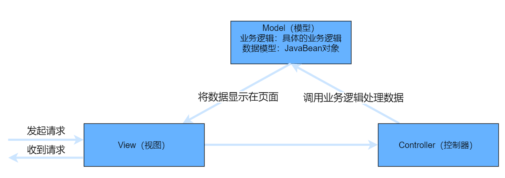
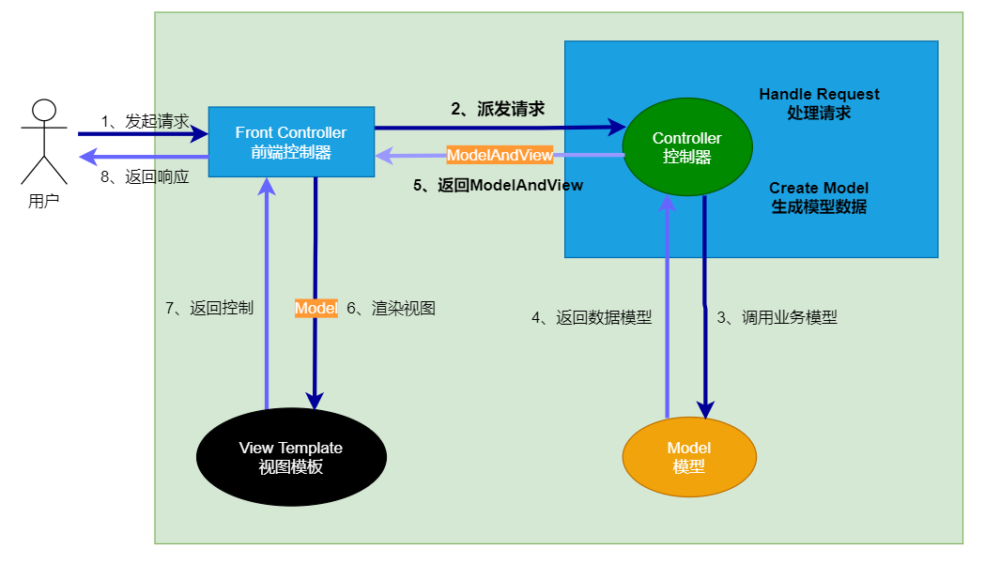
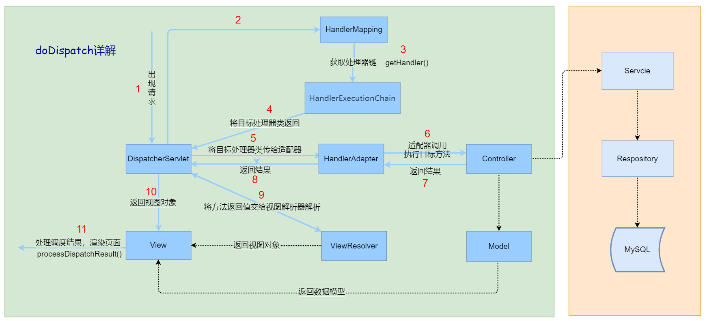
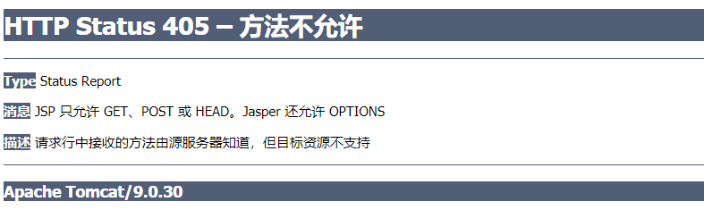
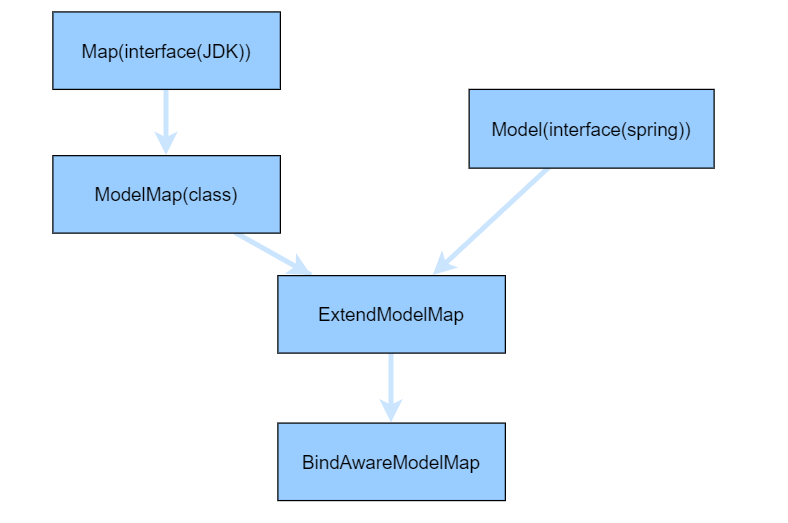
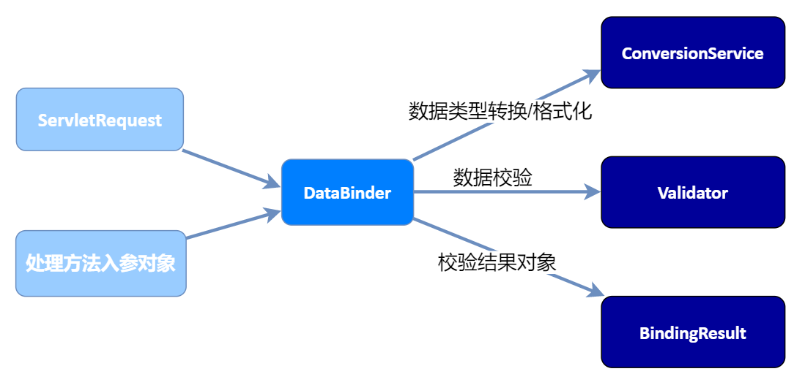
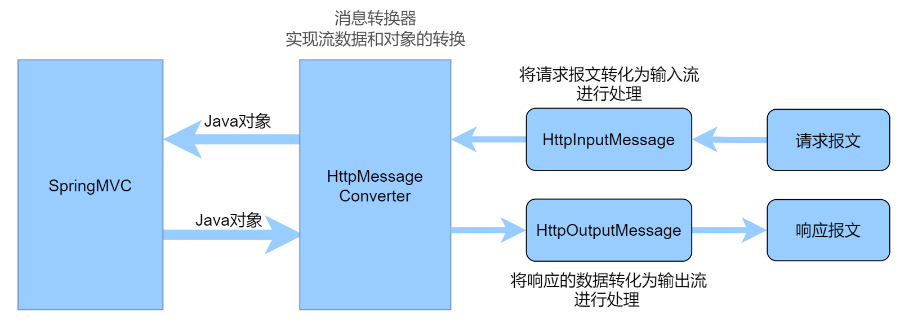
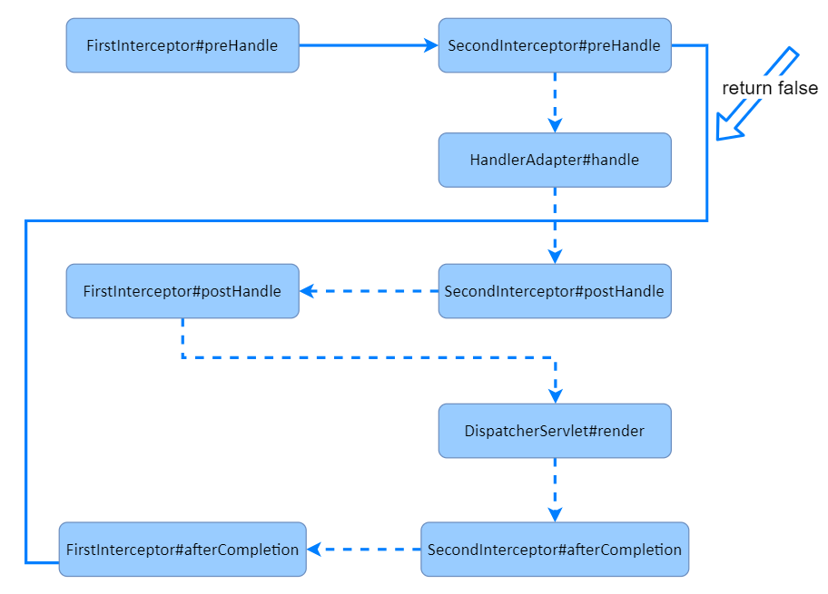
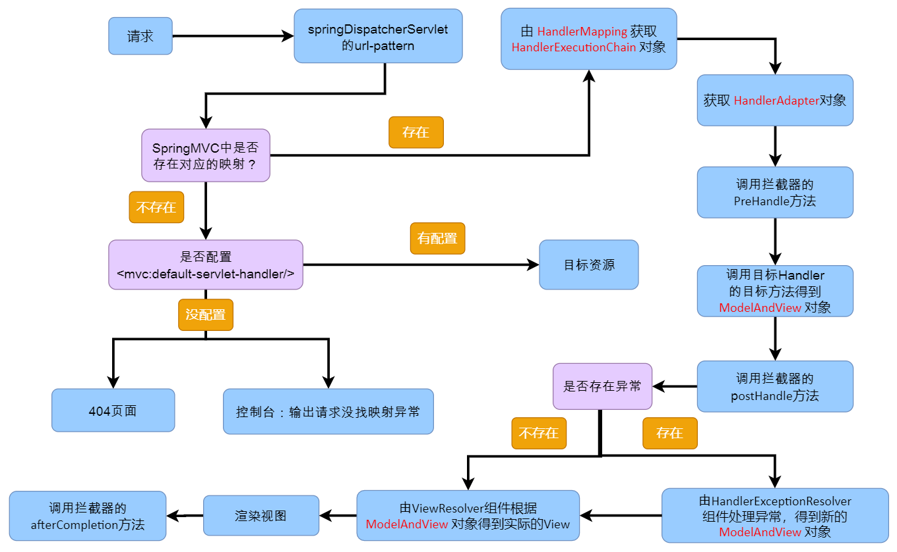

# SpringMVC笔记

## 1、SpringMVC简介

### 1.1、回顾MVC

> 什么是MVC

- MVC是模型(Model)、视图(View)、控制器(Controller)的简写，是一种软件设计规范。
- 是将业务逻辑、数据、显示分离的方法来组织代码。
- MVC主要作用是**降低了视图与业务逻辑间的双向耦合**。
- MVC不是一种设计模式，MVC**是一种架构模式**。当然不同的MVC存在差异。


> MVC组件的职责分析：

M：Model模型，封装和映射数据（JavaBean）

V：View视图，页面显示工作（JSP）

C：Controller控制器，控制整个网页的跳转逻辑（Servlet）



> 说明：

常见的服务器端MVC框架有：Struts、Spring MVC、ASP.NET MVC、Zend Framework、JSF；

常见前端MVC框架：vue、angularjs、react、backbone；由MVC演化出了另外一些模式如：MVP、MVVM 等等....


### 1.2、什么是SpringMVC

#### 1.2.1、概述

> SpringMVC的概述：

①  Spring 为展现层提供的基于 MVC 设计理念的优秀的 Web 框架，是目前最主流的 MVC 框架之一。

②  Spring MVC 通过一套 MVC 注解，让 POJO 成为处理请求的控制器，而无须实现任何接口。

③  支持 REST 风格的 URL 请求。

④  采用了松散耦合可插拔组件结构，比其他 MVC 框架更具扩展性和灵活性。

官方文档：https://docs.spring.io/spring/docs/5.2.6.RELEASE/spring-framework-reference/web.html#spring-web

> SpringMVC的特点：

1. 轻量级，简单易学
2. 高效 , 基于请求响应的MVC框架
3. 与Spring兼容性好，无缝结合
4. 约定优于配置
5. 功能强大：RESTful、数据校验、格式化、本地化、主题等
6. 简洁灵活

> SpringMVC的使用

- <font color=red>天生与Spring框架集成，如：(IOC，AOP)</font>
-  <font color=red>支持Restful风格</font>

-  进行更简洁的Web层开发

-  <font color=red>支持灵活的URL到页面控制器的映射</font>

-  非常容易与其他视图技术集成，如:thymeleafTemplate、FreeMarker等等

-  因为模型数据不存放在特定的API里，而是放在一个Model里（Map数据结构实现，因此很容易被其他框架使用）

- 非常灵活的数据验证、格式化和数据绑定机制、能使用任何对象进行数据绑定，不必实现特定框架的API

-  更加简单、强大的异常处理

-  对静态资源的支持

-  支持灵活的本地化、主题等解析


#### 1.2.2、SpringMVC核心DispatcherServlet

> DispatcherServlet的认识

Spring的web框架围绕 `DispatcherServlet` [ 调度Servlet ] 设计。

==DispatcherServlet的作用是将请求分发到不同的处理器。==

从Spring 2.5开始，使用Java 5或者以上版本的用户可以采用==基于注解形式进行开发==，十分简洁；

Spring MVC框架像许多其他MVC框架一样，以请求为驱动，围绕一个中心Servlet分派请求及提供其他功能，

DispatcherServlet是一个实际的Servlet （它继承自HttpServlet 基类）。


> SpringMVC的执行过程如下图所示：

​		当发起请求时被前置的控制器拦截到请求，根据请求参数生成代理请求，找到请求对应的实际控制器，控制器处

理请求，创建数据模型，访问数据库，将模型响应给中心控制器，控制器使用模型与视图渲染视图结果，将结果返

回给中心控制器，再将结果返回给请求者。


> SpringMVC执行原理

SpringMVC前端控制器的架构：DispatcherServlet；核心方法`doDispatch()`详细细节：



**简要分析执行流程**

1. 所有请求过来DispatcherServlet收到请求；

2. 调用doDispatch()方法进行处理：

	1）`getHandler()`：根据当前请求地址找到能处理这个请求的目标处理器类（处理器），

	​				根据当前请求在HandlerMapping中找到这个请求的映射信息，获取到目标处理器类；

	2）`getHandlerAdapter()`：根据当前处理器类获取到能执行这个处理器方法的适配器，

	​				根据当前处理器类，找到当前类的HandlerAdapter（适配器）；

	3）使用刚才获取到的适配器（`AnnotationMethodHandlerAdapter`）执行目标方法；

	4）目标方法执行后会返回一个`ModelAndView对象`；

	5）根据ModelAndView的信息`转发到具体的页面`，并可以在请求域中取出ModelAndView中的模型数据。


## 2、SpringMVC-HelloWorld

### 2.1、编写流程

- 第一步：环境搭建

	- 导入Maven依赖

	```xml
	<dependency>
	    <groupId>org.springframework</groupId>
	    <artifactId>spring-webmvc</artifactId>
	    <version>5.2.6.RELEASE</version>
	</dependency>
	```

	- 考虑Maven资源过滤问题

	```xml
	<build>
	    <resources>
	        <resource>
	            <directory>src/main/java</directory>
	            <includes>
	                <include>**/*.properties</include>
	                <include>**/*.xml</include>
	            </includes>
	            <filtering>false</filtering>
	        </resource>
	        <resource>
	            <directory>src/main/resources</directory>
	            <includes>
	                <include>**/*.properties</include>
	                <include>**/*.xml</include>
	            </includes>
	            <filtering>false</filtering>
	        </resource>
	    </resources>
	</build>
	```

	

- 第二步：写配置

  - 配置**`web.xml`**

    配置SpringMVC的前端控制器，指定SpringMVC配置位置

    ```xml
    <!--注册DispatcherServlet-->
    <servlet>
        <servlet-name>springmvc</servlet-name>
        <servlet-class>org.springframework.web.servlet.DispatcherServlet</servlet-class>
        <!--绑定spring【mvc】的配置的文件-->
        <init-param>
            <param-name>contextConfigLocation</param-name>
            <param-value>classpath:springmvc-servlet.xml</param-value>
        </init-param>
        <!--启动级别 1-->
        <load-on-startup>1</load-on-startup>
    </servlet>
    <servlet-mapping>
        <servlet-name>springmvc</servlet-name>
        <!--让所有请求都经过调度器的处理！-->
        <url-pattern>/</url-pattern>
    </servlet-mapping>
    <!--处理字符编码的过滤器-->
    <!--支持Rest风格的过滤器-->
    ```
    
  - `SpringMVC`的配置文件
  

	```xml
  	<!-- 自动扫描包，让指定包下的注解生效,由IOC容器统一管理 -->
	<context:component-scan base-package="com.study"/>
  	
  	<!--SpringMVC默认的前端控制器是拦截所有资源(除过jsp),
  	    如果请求js文件就会出现404,所以要请求js文件就需要交给tomcat-->
  	<!--告诉SpringMVC,自己映射的请求就自己处理,不能处理的请求直接交给tomcat-->
  	<!--静态资源能访问,动态映射的就不行了-->
  	<mvc:default-servlet-handler/>
  	
  	<!--注解驱动: SpringMVC可以保证静态资源和动态资源都可以访问-->
  	<mvc:annotation-driven/>
  	
  	<!-- 视图解析器 可以简化方法的返回值 -->
  	<bean class="org.springframework.web.servlet.view.InternalResourceViewResolver"
  	      id="internalResourceViewResolver">
  	    <property name="prefix" value="/WEB-INF/jsp/"/>
  	    <property name="suffix" value=".jsp"/>
  	</bean>
  ```
  
- 第三步：测试

	```java
	@Controller
	public class HelloController {
	    /**
	     * 配置路径: /代表从当前项目下开始，处理当前项目下的hello请求
	     */
	    @RequestMapping ("/hello")
	    public String hello(Model model) {
	        //传输数据
	        model.addAttribute("msg", "Hello,SpringMVC!");
	
	       	//返回数据给视图解析器进行拼串，用于找到指定的视图
	        return "hello";
	    }
	}
  ```

> 可能遇到的问题：访问出现404，排查步骤：

1. 查看控制台输出，看一下是不是缺少了什么jar包。
2. 如果jar包存在，显示无法输出，就在IDEA的项目发布中，`添加lib依赖`！
3. 重启Tomcat 即可解决！


### 2.2、HelloWorlde细节

#### 2.2.1、运行流程

1)  客户端点击链接`发起请求`，来到tomcat服务器；

2）SpringMVC的`前端控制器`接收到所有请求；

3）根据请求地址通过`@RequestMapping`的配置进行`查找目标方法`；

4）当前端控制器找到了目标处理器类和目标方法后，会直接`执行目标方法并返回`；

5）方法执行的返回值，SpringMVC会默认认为这个`返回值就是要访问的页面`；

6）获取返回值后，会通过视图解析器进行拼串，`得到完整的页面地址`；

7）拿到页面地址后，前端控制器帮我们`转发到页面`。


#### 2.2.2、@RequestMapping映射

> @RequestMapping的使用

`value`【重点】：请求URL映射

`method`【重点】：规定请求的方式

params【了解】：规定请求参数

headers【了解】：规定请求头

consumes【了解】处理请求的提交内容类型 （Content-Type）

produces【了解】：指定返回的内容类型

RequestMapping 支持 Ant路径风格【了解】

RequestMapping 请求占位符`@PathVariable`【重点】

RequestMapping 支持 `Rest风格`【重点】

> @RequestMapping-value

`value`参数可以配置URL映射路径

SpringMVC使用@RequestMapping注解为控制器指定可以处理哪些 URL 请求？

- 在控制器的<font color=red>类定义及方法定义处</font>都可标注 `@RequestMapping`
	- <font color=red>标记在类上</font>：提供初步的请求映射信息。相对于 WEB 应用的根目录。
	- <font color=red>标记在方法上</font>：提供进一步的细分映射信息。相对于标记在类上的 URL。

作用：DispatcherServlet 截获请求后，就通过控制器上 @RequestMapping 提供的映射信息确定

请求所对应的处理方法。 

> @RequestMapping-method

`method`参数可以规定请求的方式

HTTP协议中所有请求的方式：

【GET】、HEAD、【POST】、PUT、PATCH、DELETE、OPTIONS、TRACE

常用请求方式：【GET】、【POST】

也可以使用：`@GetMapping`、`@PostMapping` 等价替换。

> @RequestMapping-parms/headers

`parms`参数可以规定请求参数

`headers`参数可以规定请求头

parms参数和headers参数使用方式一样，都支持简单的表达式：

- param：表示请求必须包含名为 param 的请求参数

- !param：表示请求不能包含名为 param 的请求参数

- param != value：表示请求包含名为 param 的请求参数，但其值不能为 value

- {"param1=value1", "param2"}：请求必须包含名为 param1 和param2 的两个请求参数，

	且 param1 参数的值必须为 value1。


> RequestMapping支持Ant路径风格

`Ant`风格资源地址支持 **3** 种匹配符：【了解】

?：匹配文件名中的一个字符

*：匹配文件名中的任意字符

**：匹配多层路径

```java
@RequestMapping ("/hello?/*/**")
//?：匹配文件名中的一个字符。 可以匹配hello1、hello2、hello3...
//*：匹配文件名中的任意字符。 可以匹配hello1/aaa、hello1/bbb...
//**：匹配多层路径。	可以匹配hello1/aaa/bbb、hello1/aaa/bbb/ccc...
```

Ant 风格可以实现对 URL路径进行模糊匹配，匹配的原则是精确优先。


> RequestMapping映射请求占位符@PathVariable

`@PathVariable` 映射 URL中绑定的占位符

带占位符的 URL 是 Spring3.0 新增的功能，该功能在 SpringMVC 向 `REST` 风格挺进发展过程中具有里程碑的意义。

通过 @PathVariable 可以将 URL中的占位符参数绑定到控制器处理方法的入参中：

```java
@RequestMapping ("/hello/{id}")
public String hello(@PathVariable ("id") String id){}
```


#### 2.2.3、<mvc:annotation-driven/>注解驱动

> mvc注解驱动配置的作用

- <mvc:annotation-driven /> 配置后运行时会自动注册：

```java
`RequestMappingHandlerMapping (处理器)`、
`RequestMappingHandlerAdapter(适配器)`、
`ExceptionHandlerExceptionResolver(异常解析器)` 三个bean
```

- 还将提供以下支持：

 - 支持使用 `ConversionService` 实例对表单参数进行类型转换。
	- 支持使用 `@NumberFormat`、`@DateTimeFormat`注解完成数据类型的格式化。
	- 支持使用 `@Valid` 注解对 JavaBean 实例进行 JSR 303 验证。
	- 支持使用 `@RequestBody` 和 `@ResponseBody` 注解。


>mvc注解驱动配置的使用场景

①  直接配置响应的页面：无需经过控制器来执行结果 ；但可能会导致其他请求路径失效。

```xml
<mvc:annotation-driven/>
<mvc:view-controller  path="/success"  view-name="success"/>
```


② 找不到静态资源时（html，js...）。

```xml
<mvc:default-servlet-handler/>
<mvc:annotation-driven/>
```

<mvc:default-servlet-handler/> 将在 SpringMVC 上下文中定义一个  DefaultServletHttpRequestHandler，它会对进入 

DispatcherServlet 的请求进行筛查，如果发现是`没有经过映射`的请求，就将该请求交由 WEB 应用服务器

默认的 Servlet 处理，如果不是静态资源的请求，才由 DispatcherServlet 继续处理。


③  配置类型转换器服务时，需要指定转换器注册生效。

```xml
<mvc:annotation-driven conversion-service="conversionService"/> 
```

该语句会将自定义的ConversionService 成功注册到 Spring MVC 的上下文中。


④  后面完成JSR 303数据验证，也需要配置。


## 3、Rest风格

> Rest风格是什么?

REST：即 Representational State Transfer（【资源】表现层状态转化）。是目前最流行的一种互联网软件架构。

它结构清晰、符合标准、易于理解、扩展方便，所以正得到越来越多网站的采用。


> Rest作用

简洁的提交URL请求，以不同的==请求方式==来区分对不同资源的操作。

/ book / 1 ：	`GET`   		查询1号图书

/ book / 1 ：	`PUT`   		更新1号图书

/ book / 1 ：	`DELETE`	 删除1号图书

/ book ：			`POST`	   	添加图书


> Rest使用

`HiddenHttpMethodFilter`的介绍：浏览器的form表单只支持GET与POST请求，而DELETE、PUT等方式并不支持。

spring3.0 添加了这个过滤器，可以将这些请求方式转换为标准的http方式，使得支持GET、POSTPUT与DELETE请求。

第一步：配置`HiddenHttpMethodFilter`过滤器，支持Rest风格。

```xml
<filter>
    <filter-name>hiddenHttpMethodFilter</filter-name>
    <filter-class>org.springframework.web.filter.HiddenHttpMethodFilter</filter-class>
</filter>
<filter-mapping>
    <filter-name>hiddenHttpMethodFilter</filter-name>
    <url-pattern>/*</url-pattern>
</filter-mapping>
```

第二步：创建Controller类，通过`@RequestMapping`以不同的请求方式来区分对不同资源的操作

```java
@Controller
public class BookController {
	@GetMapping("/book/{bid}")
    public String getBook(@PathVariable Integer bid) {
        System.out.println("bid = " + bid);
        System.out.println("查询图书");
        return "success";
    }

    @PostMapping ("/book")
    public String addBook() {
        System.out.println("添加图书");
        return "success";
    }

    @PutMapping ("/book/{bid}")
    public String updateBook(@PathVariable Integer bid) {
        System.out.println("bid = " + bid);
        System.out.println("更新图书的信息");
        return "success";
    }

    @DeleteMapping("/book/{bid}")
    public String deleteBook(@PathVariable Integer bid) {
        System.out.println("bid = " + bid);
        System.out.println("删除图书");
        return "success";
    }
}
```

第三步：在页面中配置 `_method`，使过滤器生效。

```jsp
 <input type="hidden" name="_method" value="put/delete">
```

```jsp
<a href="${pageContext.request.contextPath}/book/1">查询图书</a>
<form action="${pageContext.request.contextPath}/book" method="post">
    <input type="submit" value="添加图书">
</form>
<%--删除图书: delete--%>
<form action="${pageContext.request.contextPath}/book/1" method="post">
    <input type="hidden" name="_method" value="delete">
    <input type="submit" value="删除图书">
</form>
<%--修改图书: put--%>
<form action="${pageContext.request.contextPath}/book/1" method="post">
    <input type="hidden" name="_method" value="put">
    <input type="submit" value="修改图书">
</form>
```


注意：在高版本的tomcat中Rest-JSP不接受`DELETE、PUT`形式的请求。

解决：所以需要在出错页面的page指令中加上`isErrorPage=true `


## 4、数据处理和乱码解决

### 4.1、请求数据传入

#### 4.1.1、普通请求参数传入

> @RequestParam 注解

在处理方法入参处使用 `@RequestParam` 可以把`请求参数`传递给请求方法。

- value：用于映射请求参数名称。

- required：用于设置请求参数是否必须的，默认为true。

- defaultValue: 设置默认值，当没有传递参数时使用该值。

> @RequestHeader 注解

使用 `@RequestHeader` 获取`请求头`中的属性值。

请求头包含了若干个属性，服务器可据此获知客户端的信息，通过 @RequestHeader 即可将请求头中的属性值

绑定到处理方法的入参中。

参数与@RequestParam中的一致。

> @CookieValue 注解

使用 `@CookieValue` 获取请求头中的 `Cookie值`。

@CookieValue 可让处理方法入参获取某个 Cookie值。

参数与@RequestParam中的一致。

> 示例代码

```java
@RequestMapping ("handle")
public String handle(
    	@RequestParam(value = "user",required = false,defaultValue = "") String username,
        @RequestHeader(value = "User-Agent") String userAgent,
    	@CookieValue(value = "JSESSIONID") String sessionId) {
    System.out.println("username = " + username);
    System.out.println("userAgent = " + userAgent);
    System.out.println("sessionId = " + sessionId);
    return "success";
}
```


#### 4.1.2、POJO类型的请求参数传入

如果传入的是个POJO，SpringMVC会自动的为这个POJO进行赋值。

SpringMVC <font color=red>会按请求参数名和 POJO 属性名进行自动匹配，并自动为该对象填充属性值，也支持级联属性。</font>

封装要求：做到请求参数的参数名和对象名的属性名一 一对应即可。

> 示例代码

```java
@RequestMapping("/handle")
public String handle(User user){
   System.out.println(user);
   return "success";
}
```


#### 4.1.3、使用Servlet原生API作为请求参数

1)    `HttpServletRequest`

2)    `HttpServletResponse`

3)    `HttpSession`

4)    java.security.Principal：HTTPS相关

5)    Locale：国际化有关的区域信息对象	

6)    InputStream   OutputStream：文件上传和下载相关字符流

  	  Reader	 Writer：文件上传和下载相关字节流

> 示例代码

```java
@RequestMapping ("handle")
public String handle(HttpServletRequest request, 
                     HttpServletResponse response, 
                     HttpSession session) {
    request.setAttribute("request", request);
    response.addCookie(new Cookie("response", response));
    session.setAttribute("session", 1);
    return "success";
}
```


### 4.2、响应数据传出

SpringMVC `输出模型数据`的方式：

SpringMVC 除过在方法上传入的原生request和session还能怎么将数据带给页面？

> 方式一：可以在方法中传入Map、Model或者ModelMap

```java
//示例代码：
map.put("msg","map");	
model.addAttribute("msg","model");
modelMap.addAttribute("msg","modelMap");
```

最终这些参数中保存的所有数据都会放在请求域中，可以在页面上获取到。

关系：`Map、Model、ModelMap`，最终都是以`BindingAwareModelMap`在工作。

相当于`BindingAwareModelMap`中保存的所有数据都会被放在请求域中。



> 方式二：方法的返回值可以变为ModelAndView类型

`ModelAndView`对象既包含视图信息（页面地址），也包含模型数据（给页面带的数据）；

而且数据是放在请求域中的；示例代码：

```java
    @RequetsMapping("/handle")
    public ModelAndView handle() {
        //返回一个模型视图对象
        ModelAndView mv = new ModelAndView();
        mv.setViewName("success");
        mv.addObject("msg","大聪明");
        return mv;
    }
```


### 4.3、解决数据传入与传出的乱码问题

提交数据和回显数据都可能出现乱码问题：

> JavaWeb解决乱码的方式

- 请求乱码：

  - GET请求：修改tomcat的server.xml配置文件，添加`URIEncoding="utf-8"`的配置。

  	```xml
  	<Connector port="8080" protocol="HTTP/1.1" URIEncoding="utf-8"
  	          connectionTimeout="20000"
  	          redirectPort="8443" />
  	```
  ```
  
  - POST请求：在第一次获取请求参数之前
  
  	```java
  	request.setCharacterEncoding("UTF-8");
  ```

- 响应乱码：

	```java
	response.setContentType("text/html;charset=utf-8");
	```


> SpringMVC提供的乱码解决方式

SpringMVC给我们提供了一个过滤器`CharacterEncodingFilter`，用于解决==请求和响应乱码==！

```xml
	<!--配置一个控制字符编码的Filter-->
    <filter>
        <filter-name>encoding</filter-name>
        <filter-class>org.springframework.web.filter.CharacterEncodingFilter</filter-class>
        <!--encoding: 指定解决POST请求乱码(GET乱码由Tomcat进行配置)-->
        <init-param>
            <param-name>encoding</param-name>
            <param-value>utf-8</param-value>
        </init-param>
        <!--forceEncoding: 顺手解决响应乱码-->
        <init-param>
            <param-name>forceEncoding</param-name>
            <param-value>true</param-value>
        </init-param>
    </filter>
    <filter-mapping>
        <filter-name>encoding</filter-name>
        <url-pattern>/*</url-pattern>
    </filter-mapping>
```

注意：如果中文有乱码，需要配置`字符编码过滤器`，且==应该配置其他过滤器之前。==

如：使用控制Rest风格的过滤器 `HiddenHttpMethodFilter` 时，需将字符编码过滤器配置在其之前。


## 5、视图解析

> 视图解析的应用：转发和重定向

`forward`：转发到一个页面。				用法：`forwad：/index.jsp`

`redirect`：重定向到一个页面。		用法：`redirect：/index.jsp`

注：带有前缀的请求与重定向，是不会经过视图解析器进行拼串的！

/hello.jsp：代表请求或重定向到当前项目下的 hello.jsp

一定要加上/，如果不加/就是相对路径。容易出问题。

`/`：代表在当前`web项目`下的资源，SpringMVC会为路径自动拼接上项目名。

> 示例代码

```java
@RequestMapping
public String forward(){
    //请求转发到web目录下的index.jsp
    return  "forward:/index.jsp";
}
@RequestMapping
public String redirect(){
    //重定向到web目录下的index.jsp
    return  "redirect:/index.jsp";
}
```


## 6、数据绑定

### 6.1、数据绑定流程原理

①  Spring MVC 主框架将 ServletRequest 对象及目标方法的入参实例传递给 WebDataBinderFactory 实例，

以创建 `DataBinder` 实例对象。

②  DataBinder 调用装配在 SpringMVC上下文中的 `ConversionService`组件进行数据类型转换、数据格式化工作。

将 Servlet 中的请求信息填充到入参对象中。

③  调用 `Validator` 组件对已经绑定了请求消息的入参对象进行数据合法性校验，

并最终生成数据绑定结果 `BindingData` 对象。

④  Spring MVC 抽取 `BindingResult` 中的入参对象和校验错误对象，将它们赋给处理方法的响应入参。


Spring MVC 通过反射机制对目标处理方法进行解析，将请求消息绑定到处理方法的入参中。

数据绑定的核心部件是 `DataBinder`，运行机制如下：


### 6.2、数据类型转换

Spring MVC 上下文中内建了很多转换器，可完成大多数 Java 类型的转换工作

```java
ConversionService converters =  
	java.lang.Boolean -> java.lang.String : ObjectToStringConverter@f874ca
	java.lang.Character -> java.lang.Number : CharacterToNumberFactory@f004c9
	java.lang.Character -> java.lang.String : ObjectToStringConverter@68a961
	java.lang.Enum -> java.lang.String : EnumToStringConverter@12f060a
    	...
```

> 自定义类型转换器

`ConversionService` 是 Spring类型转换体系的核心接口。

- 可以利用 ConversionServiceFactoryBean 在 Spring 的 IOC 容器中定义一个 ConversionService。

	Spring 将自动识别出 IOC 容器中的 ConversionService，并在 Bean属性配置及 
	
	SpringMVC 处理方法入参绑定等场合使用它进行数据的转换

- 可通过 ConversionServiceFactoryBean 的 `converters属性`==注册自定义的类型转换器==

> Spring转化器的使用

Spring 定义了一个转换器接口：`Converter<S,T>`：将 S 类型对象转为 T 类型对象

实现了转换器接口的类都可以作为自定义转换器，注册到 ConversionServiceFactroyBean 中。


> 示例代码

- 第一步：配置类，实现转换器接口`Converter<S,T>`

```java
class MyConversion implements Converter<String,Employee>{
	@Override
    public Employee convert(String source) {
        return null;
    }
}
```

- 第二步：在springmvc.xml中注册我们自定义的类型转换器组件。

```xml
<!--配置SpringMVC中使用我们自己配置的类型转换组件-->
<mvc:annotation-driven conversion-service="conversionService"/>

<bean id="conversionService" class="org.springframework.format.support.
                                    FormattingConversionServiceFactoryBean">
    <!--converters转换器中添加我们自定义的类型转换器  -->
    <property name="converters">
        <set>
            <bean id="myConversion" class="com.study.controller.MyConversion"/>
        </set>
    </property>
</bean>
```


### 6.3、数据格式化

> 数据格式化的认识

某些数据在传输时需要按照一定的规范，此时就需要使用数据格式化来实现。

Spring 在`格式化模块`中定义了 `FormattingConversionService` 实现类，

该实现类实现了 ConversionService接口，又继承于 GenericConversionService类；

因此它既具有类型转换的功能，又具有格式化的功能。

> 数据格式化的使用：

要使用数据格式化，需要在Spring中装配了 `FormattingConversionServiceFactroyBean` ，

就可以实现在 SpringMVC的入参绑定及模型数据输出时使用注解驱动进行数据格式化了。

```xml
<bean class="org.springframework.format.support.FormattingConversionServiceFactoryBean"/>
```


> FormattingConversionService注解的使用：

FormattingConversionService为==数据格式化==提供了两个注解：

- @DateTimeFormat 注解：支持对日期类型的属性使用。

- @NumberFormat 注解：   支持对数字类型的属性使用。

> @DateTimeFormat 

`@DateTimeFormat` 注解可对 java.util.Date、java.util.Calendar、java.long.Long `时间类型`进行标注：

- `pattern` 属性：类型为字符串。指定解析/格式化字段数据的模式，如："yyyy-MM-dd hh:mm:ss"

- iso 属性：类型为 DateTimeFormat.ISO。指定解析/格式化字段数据的ISO模式，包括四种：

	- ISO.NONE（不使用）默认

	- ISO.DATE（yyyy-MM-dd）

	- ISO.TIME（hh:mm:ss.SSSZ）

	- ISO.DATE_TIME（yyyy-MM-dd hh:mm:ss.SSSZ）

- style 属性：字符串类型。通过样式指定日期时间的格式，

	由两位字符组成，第一位表示日期的格式，第二位表示时间的格式。

>@NumberFormat

`@NumberFormat` 可对类似`数字类型`的属性进行标注，它拥有两个互斥的属性：

- pattern：类型为 String，自定义样式，如 patter="#，###"；

- style：类型为 NumberFormat.Style。用于指定样式类型，包括三种：
	- Style.NUMBER	（正常数字类型）
	- Style.CURRENCY（货币类型）
	- Style.PERCENT  （百分数类型）


### 6.4、数据校验

#### 6.4.1、JSR 303 

是 Java 为 Bean 数据合法性校验提供的标准框架，它已经包含在 JavaEE 6.0 中 .

JSR 303 （Java Specification Requests意思是Java 规范提案）通过在 Bean 属性上标注类似于 @NotNull、@Max 等

标准的注解指定校验规则，并通过标准的验证接口对 Bean 进行验证。

| **Constraint**                | **详细信息**                                             |
| :---------------------------- | :------------------------------------------------------- |
| `@Null`                       | 被注释的元素必须为 `null`                                |
| `@NotNull`                    | 被注释的元素必须不为 `null`                              |
| `@AssertTrue`                 | 被注释的元素必须为 `true`                                |
| `@AssertFalse`                | 被注释的元素必须为 `false`                               |
| `@Min(value)`                 | 被注释的元素必须是一个数字，其值必须大于等于指定的最小值 |
| `@Max(value)`                 | 被注释的元素必须是一个数字，其值必须小于等于指定的最大值 |
| `@DecimalMin(value)`          | 被注释的元素必须是一个数字，其值必须大于等于指定的最小值 |
| `@DecimalMax(value)`          | 被注释的元素必须是一个数字，其值必须小于等于指定的最大值 |
| `@Size(max, min)`             | 被注释的元素的大小必须在指定的范围内                     |
| `@Digits (integer, fraction)` | 被注释的元素必须是一个数字，其值必须在可接受的范围内     |
| `@Past`                       | 被注释的元素必须是一个过去的日期                         |
| `@Future`                     | 被注释的元素必须是一个将来的日期                         |
| `@Pattern(value)`             | 被注释的元素必须符合指定的正则表达式                     |


#### 6.4.2、Hibernate Validator 扩展注解

**Hibernate Validator** 是 JSR 303 的一个参考实现，除支持所有标准的校验注解外，它还支持以下的扩展注解

| **Constraint** | **详细信息**                           |
| :------------- | :------------------------------------- |
| `@Email`       | 被注释的元素必须是电子邮箱地址         |
| `@Length`      | 被注释的字符串的大小必须在指定的范围内 |
| `@NotEmpty`    | 被注释的字符串的必须非空               |
| `@Range`       | 被注释的元素必须在合适的范围内         |


#### 6.4.3、Spring MVC 数据校验

> 数据校验原理认识

- Spring 4.0 拥有自己独立的数据校验框架，同时支持 JSR 303 标准的校验框架。

- Spring 在进行数据绑定时，可同时调用校验框架完成数据校验工作。

	在 SpringMVC 中，可直接通过注解驱动的方式进行数据校验。

- Spring 的 `LocalValidatorFactroyBean` 既实现了Spring的 Validator接口，也实现了JSR303 的 Validator 接口。

	只要在 Spring 容器中定义了一个 LocalValidatorFactoryBean，即可将其注入到需要数据校验的 Bean 中。

- <mvc:annotation-driven/> 会默认装配好一个 `LocalValidatorFactoryBean`，通过在处理方法的入参上标注 

	`@Valid`注解即可让 Spring MVC 在完成数据绑定后执行数据校验的工作。


> 校验结果`BindingResult` 

- Spring MVC 是通过对处理方法签名的规约来保存校验结果的：前一个表单/命令对象的校验结果保存到。

	随后的入参中，这个保存校验结果的入参必须是 `BindingResult` 或 `Errors` 类型。

- 需校验的 Bean 对象和其绑定结果对象或错误对象是成对出现的，它们之间不允许声明其他的入参。


> 在目标方法中获取校验结果

在表单/命令对象类的属性中标注校验注解，在处理方法对应的入参前添加 @Valid，SpringMVC就会实施校验并

将校验结果保存在被校验入参对象之后的 BindingResult 或 Errors 入参中。

常用方法：

- FieldError  getFieldError（String field）

- List <FieldError**>**  getFieldErrors（）

- Object  getFieldValue（String field）

- Int  getErrorCount（）


>在页面上显示错误

- SpringMVC 除了会将表单/命令对象的校验结果保存到对应的 BindingResult 或 Errors 对象中外，

	还会将所有校验结果保存到 "隐含模型"。

- 即使处理方法的签名中没有对应于表单/命令对象的结果入参，校验结果也会保存在 "隐含对象" 中。

- 隐含模型中的所有数据最终将通过 `HttpServletRequest`的属性列表暴露给 JSP 视图对象，

	因此在 JSP 中可以获取错误信息。

- 在 JSP 页面上可通过 `<form:errors path="userName">` 显示错误消息。

- 在所有的数据校验注解中都有一个`message`属性，可以修改原本的提示消息。


> 后端校验实操演示：

第一步：`添加校验框架的maven依赖`；

   ```xml
<dependency>
    <groupId>org.hibernate.validator</groupId>
    <artifactId>hibernate-validator</artifactId>
    <version>6.1.5.Final</version>
</dependency>
   ```

第二步：给需要进行校验的JavaBean的属性添加上`校验注解`；

```java
public class Employee {
   @NotEmpty
   @Length(min = 6,max = 18)
   private String lastName;

   @Email
   private String email;

   //可以规定页面提交的日期格式
   @DateTimeFormat(pattern = "yyyy-MM-dd")
   private Date birthday;
}
```

第三步：在SpringMVC封装对象的时候，添加`@Valid`表示告诉SpringMVC这个JavaBean需要校验。

```java
public String addEmp(@Valid Employee employee, BindingResult result) {}
```

第四步：验证出错后如何处理。

```java
public String addEmp(@Valid Employee employee, BindingResult result) {
    //获取校验是否错误
    boolean hasErrors = result.hasErrors();
    if (hasErrors) {
        System.out.println("出现错误");
        return "add";
    } else {
        employeeDao.save(employee);
        return "redirect:/index.jsp";
    }
}
```

第五步：错误消息，如何显示。


## 7、JSON数据交互

### 7.1、JSON 的回顾

> 什么是JSON？

- JSON(JavaScript Object Notation, JS 对象标记) 是一种轻量级的数据交换格式。
- 采用完全独立于编程语言的**文本格式**来存储和表示数据。
- 易于人阅读和编写，同时也易于机器解析和生成，并有效地提升网络传输效率。


> JSON的要求和语法格式

在 JavaScript 语言中，一切都是对象。因此，任何JavaScript 支持的类型都可以通过 `JSON` 来表示。

`JSON` 是 JavaScript 对象的`字符串表示法`，它使用文本表示一个 JS 对象的信息，本质是一个字符串。

```js
var obj = {a: 'Hello', b: 'World'}; 	   //这是一个对象，注意键名也是可以使用引号包裹的
var json = '{"a": "Hello", "b": "World"}'; //这是一个 JSON 字符串，本质是一个字符串
```


### 7.2、SpringMVC 中 JSON 数据交互注解

> @RequestBody注解

@RequestBody注解用于读取http请求的内容（字符串），通过SpringMVC提供的HttpMessageConverter接口

<font color=red>将读到的内容转换为json、xml等格式的数据</font>并绑定到Controller类方法的参数上。

本例子应用：@RequestBody注解实现接收http请求的json数据，将json数据转换为java对象。

> @ResponseBody注解

@ResponseBody注解用于将Controller类的方法返回的对象，通过HttpMessageConverter接口

<font color=red>将java对象转换为指定格式的数据如：json、xml等</font>，通过Response响应给客户端。

本例子应用：@ResponseBody注解实现将Controller类方法返回对象转换为json响应给客户端。

> SpringMVC的消息转换机制

SpringMVC就是通过这个消息转换机制实现`java对象`和`json数据`的转换和交互。




> 在Controller层返回JSON数据

### 7.3、Jackson（json解析工具）

Jackson应该是目前比较好的json解析工具了，当然工具不止这一个，比如还有阿里巴巴的 fastjson等等。

我们这里使用jackson进行测试！

> Jackson的使用步骤

第一步：添加jackson的依赖

```xml
<!-- https://mvnrepository.com/artifact/com.fasterxml.jackson.core/jackson-databind -->
<dependency>
    <groupId>com.fasterxml.jackson.core</groupId>
    <artifactId>jackson-databind</artifactId>
    <version>2.11.0</version>
</dependency>
```

第二步：配置SpringMVC需要的配置

- web.xml

- springmvc-servlet.xml

第三步：测试

```java
@Controller
public class JsonController {
    @ResponseBody
    @RequestMapping("/json")
    public String json() throws JsonProcessingException {
        //创建一个对象
        User user = new User("秦疆1号", 3, "男");
        
        //创建一个jackson的对象映射器，用来解析数据
        ObjectMapper mapper = new ObjectMapper();
        //将我们的对象解析成为json格式
        String str = mapper.writeValueAsString(user);
        
        //由于@ResponseBody注解，这里会将str转成json格式返回；十分方便
        return str;
    }
}
```


> Json乱码解决

在springmvc的配置文件上添加一段消息StringHttpMessageConverter转换配置！

```xml
    <!--json乱码问题的配置-->
    <mvc:annotation-driven>
        <mvc:message-converters register-defaults="true">
            <bean class="org.springframework.http.converter.StringHttpMessageConverter">
                <constructor-arg value="UTF-8"/>
            </bean>
            <bean class="org.springframework.http.converter.json.
                         MappingJackson2HttpMessageConverter">
                <property name="objectMapper">
                    <bean class="org.springframework.http.converter.json.
                                 Jackson2ObjectMapperFactoryBean">
                        <property name="failOnEmptyBeans" value="false"/>
                    </bean>
                </property>
            </bean>
        </mvc:message-converters>
    </mvc:annotation-driven>
```


## 8、拦截器

SpringMVC提供了拦截器机制，允许==运行目标方法之前进行一些拦截工作==，或者==目标方法运行之后进行一些其他==

==处理==；程序员也可以自定义拦截器来实现特定的功能，自定义的拦截器必须实现`HandlerInterceptor`接口。

> HandlerInterceptor接口中的方法

`preHandle`：在目标方法运行（处理请求）之前调用，返回boolean。

- return true：表示(chain.doFilter( ) )放行， 请求会去到业务处理器去进行处理。
- return false：表示不放行，程序员决定不需要再调用其他的组件去处理请求。

`postHandle`：在目标方法运行（处理完请求）之后调用：目标方法调用之后。

该方法可以对用户请求`request`进行处理。

`afterCompletion`：在请求整个完成之后，来到目标页面之后，或是在资源响应之后；

该方法可以进行一些资源清理的操作。


> 拦截器的使用

1）实现HandlerInterceptor接口，重写相关的处理方法；

2）配置自己注册的拦截器；

```xml
<mvc:interceptors >
    <!--声明自定义的拦截器-->
    <bean id="firstHandleInterceptor" class="com.study.interceptor.FirstHandleInterceptor"
    <mvc:interceptor>
        <!--mvc:mapping配置拦截的路径-->
        <mvc:mapping path="/"/>
        <bean id="secondHandleInterceptor" 	
              class="com.study.interceptor.SecondHandleInterceptor"/>
    </mvc:interceptor>
</mvc:interceptors>
```

3）测试发送请求，进行拦截。


> 拦截器的运行流程

正常执行流程：

拦截器的preHandle----->目标方法----->拦截器postHandle----->页面----->拦截器的afterCompletion;

其他流程：

- 只要preHandle不放行就没有以后的流程；

- 只要放行了，afterCompletion都会执行。


> 多个拦截器的执行顺序图解

当有多个拦截器时，正常流程与异常流程执行图解！




> Filter与拦截器的使用场景

`Filter`为javaweb三大组件之一，由tomcat进行管理并创建对象；当实现功能简单时，可以使用Filter。

`拦截器`是SpringMVC特有的，可以支持很多复杂的拦截请求，并且可以装配到Spring的IOC容器中，也可以直接

使用 IOC容器的某些组件；所以当我们的某些功能复杂并可能需要与其他组件配合完成，我们就使用拦截器。


## 9、异常处理

SpringMVC 底层通过`HandlerExceptionResolver`处理程序的异常，

包括 Handler 映射、数据绑定以及目标方法执行时发生的异常。

> SpringMVC 提供的 HandlerExceptionResolver 的实现类，以处理异常！

使用了<mvc:annotation-driven/>配置以后，提供的HandlerExceptionResolver异常处理器的实现类为：

- `ExceptionHandlerExceptionResolver`：处理普通异常。

- ResponseStatusExceptionResolver：处理自定义类的异常，以及自定义的页面展示。

- DefaultHandlerExceptionResolver：处理SpringMVC自带的异常。


### ExceptionHandlerExceptionResolver

>`@ExceptionHandler`的认识

主要处理 Handler 中用 `@ExceptionHandler` 注解定义的方法。

@ExceptionHandler 注解定义的`方法优先级`问题：

- 如果有多个@ExceptionHandler都能处理这个异常，考虑精确优先。

- 当全局异常与本类异常同时存在时，考虑本类优先。

>`@ExceptionHandler`的使用

@ExceptionHandler 告诉SpringMVC这个方法专门处理这个类发生的异常。

1、添加了注解的方法只能指定一个参数Exception，用来接受发生的异常对象。

2、要想获取返回数据，可以将方法的返回值改为ModelAndView，通过ModelAndView对象设置回显的数据。

```java
// 标记类为自定义异常处理类
@ControllerAdvice
public class MyExceptionHandler {
    // 标记处理异常的方法，指定处理的异常。
    @ExceptionHandler(RuntimeException.class)
    public String handlerException(){
        return "...";
    }
}
```

注：@ExceptionHandler 在普通类只能作用于本类的异常，不方便对页面所有异常进行操作，

​			所以处理全局异常时可以使用 `@ControllerAdvice` 对所以异常进行集中处理异常。


> ResponseStatusExceptionResolver：`@ResponseStatus`

- 在异常及异常父类中找到`@ResponseStatus`注解，然后使用这个注解的属性进行处理。

- 定义一个 @ResponseStatus 注解修饰的自定义异常类。

- 若在处理器方法中抛出了上述异常：若ExceptionHandlerExceptionResolver 不会解析此异常。由于触发的异常 

	UnauthorizedException 带有 @ResponseStatus 注解。因此会被`ResponseStatusExceptionResolver`解析到。
	
	最后响应 HttpStatus.UNAUTHORIZED 代码给客户端。

- HttpStatus.UNAUTHORIZED 代表响应码401，无权限。 关于其他的响应码请参考 HttpStatus 枚举类型源码。

> DefaultHandlerExceptionResolver

处理一些SpringMVC中自带自定义异常，比如：

```java
NoSuchRequestHandlingMethodException、
HttpRequestMethodNotSupportedException、
HttpMediaTypeNotSupportedException、
HttpMediaTypeNotAcceptableException等
```

> SimpleMappingExceptionResolver

如果希望对所有异常进行统一处理，可以使用 SimpleMappingExceptionResolver，它==将异常类名映射为视图名==，

即发生异常时使用对应的视图报告异常。（但优先级较低）

```xml
<bean id="simpleMappingExceptionResolver"
      class="org.springframework.web.servlet.handler.SimpleMappingExceptionResolver">
    <!--配置异常的映射,异常类映射视图名-->
    <property name="exceptionMappings">
        <props>
             <!--配置映射-->
            <prop key="ArithmeticException">error</prop>
        </props>
    </property>
</bean>
```


## 10、SpringMVC运行流程

1、所有请求，前端控制器（DispatcherServlet）收到请求，调用`doDispatch`进行处理

2、根据 HandlerMapping 中保存的请求映射信息找到，处理当前请求的，`处理器执行链（包含拦截器）`

3、根据当前处理器`找到对应的HandlerAdapter(适配器)`

4、拦截器的`preHandle`先执行

5、适配器`执行目标方法`，并返回`ModelAndView`

6、拦截器的`postHandle`执行

7、处理结果（页面渲染流程）

​            1）如果有异常使用`异常解析器处理异常`；`处理完后将会返回ModelAndView`。

​            2）调用`render`进行页面渲染

​            3）执行拦截器的完成后`afterCompletion`

> SpringMVC运行流程图（重要）




