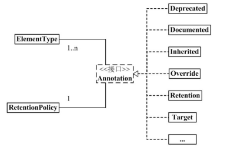

## 一、泛型（Genericity）

泛型提供了编译时类型安全检测机制，该机制允许程序员在编译时检测到非法的类型。泛型的本质是参数化类型，也就是说所操作的数据类型被指定为一个参数。相当于一个“标签”。

### 1.1 泛型类、泛型接口

在类名后面添加了类型参数声明部分，泛型类的类型参数声明部分也包含一个或多个类型参数，参数间用逗号隔开。一个泛型参数，也被称为一个类型变量，是用于指定一个泛型类型名称的标识符。因为他们接受一个或多个参数，这些类被称为参数化的类或参数化的类型。

1. 语法形式

```
[修饰符]  class/interface  类名/接口名<类型参数列表> {
	// 代码块
}
```

2. 注意点

（1）常见命名习惯：原则上，见名知意，尽量是1个大写字母，或大写字母加数字。
E：Element；K：Key；V：Value；T：Type；R：ReturnType

（2）多个参数用“，”分隔。如，Map<k, V>。

（3）泛型参数由泛型实参决定，可在创建对象时申明参数类型（new ClassA<Integer, String>），或在继承类或实现类时申明（定义接口interface Comparable\<T>，class Student implements Comparable\<Student>）。

（4）泛型形参在声明它的类或接口中，当做某种已知的类型来使用的，可以用它声明属性、方法的形参类型，方法的返回值类型，方法的局部变量类型等

（5）泛型形参不能作为异常的类型（IOException、RunTimeException等），不能用于<font color='red'>静态成员</font>上。

（6）泛型不能用于创建数组对象。创建数组对象必须申明数组类型。


3. 举例说明

```java
public class GenercClass<K, V> {
	
	// 定义一个集合HashMap实例
	private Map<K, V> map = new HashMap<K, V>();

	// 设置put()方法，将具体值与对应具体值的键名放入集合中
	public void put(K k, V v) {
		map.put(k, v);
	}

	// 根据键值获取键名
	public V get(K k) {
		return map.get(k); 
	}

	// 主方法
	public static void main(String[] args) {
		// 实例化泛型类对象
		GenercClass<Integer, String> gc = new GenercClass<Integer, String>();
		
		// 向成员变量添加键和值
		for (int i = 0; i < 5; i++) {
			// 根据集合的长度循环将键名与具体值放入集合中
			gc.put(i, "我是集合成员" + i);
		}

		for (int i = 0; i < gc.map.size(); i++) {
			// 调用get()方法获取集合中的值
			System.out.println(gc.get(i));
		}
	}
}
```


### 1.2 泛型方法

泛型方法在调用时可以接收不同类型的参数。根据传递给泛型方法的参数类型，编译器适当地处理每一个方法调用。

1. 语法形式

```
[修饰符]  <类型参数列表>  返回值类型   方法名(形参列表)
```

2. 注意点

（1）泛型方法可以为静态方法、也可以是非静态方法，静态方法如果要用泛型，必须使用泛型方法的语法形式。

（2）泛型方法的泛型形参由调用该方法时实参的类型决定，此时实参，即决定了泛型方法形参的值，又决定了泛型方法形参的类型。

（3）泛型方法的泛型形参也不能是指定为基本数据类型，可以用它的包装类，也不能用于异常类型

3. 举例说明

```java
// 解释1：如果static后不加<K, V>，则会提示报错
public static<K, V> void put(K k, V v) { 
	map.put(k, v);
}
// 解释2、3
public static void main(String[] args) {
    // 实例化泛型类对象时，实参是基本类型的包装类
    GenercClass<Integer, String> gc = new GenercClass<Integer, String>();
    // 实参的类型决定了形参方法的类型
    for (int i = 0; i < 5; i++) {
    	// 根据集合的长度循环将键名与具体值放入集合中
    	gc.put(i, "我是集合成员" + i);
    }
    for (int i = 0; i < gc.map.size(); i++) {
    	// 调用get()方法获取集合中的值
    	System.out.println(gc.get(i));
    }
}
```


### 1.3 通配符

1. ?

   代表任意类型
   如果是集合，例如ArrayList<?>，这样的集合不能添加元素

2. ?  extends 父类（上限）
   ? 代表父类本身或父类的子类类型可以
   如果是集合，例如ArrayList<?  extends 父类>，这样的集合不可以添加

3. ?  super 子类（下限）
   ? 代表子类本身或子类的父类类型可以
   如果是集合，例如ArrayList<?  super 子类>，这样的集合，可以添加，仅限于添加子类或子类的子类对象

说明：<font color='red'>使用通配符声明的名称实例化的对象不能对其加入新的信息，只能获取或删除。</font>

### 1.4 类型擦除

Java 中的泛型基本上都是在编译器这个层次来实现的。在生成的 Java 字节代码中是不包含泛型中的类型信息的。使用泛型的时候加上的类型参数，会被编译器在编译的时候去掉。这个过程就称为类型擦除。如在代码中定义的 List<Object>和 List<String>等类型，在编译之后都会变成 List。JVM 看到的只是 List，而由泛型附加的类型信息对 JVM 来说是不可见的。类型擦除的基本过程也比较简单，首先是找到用来替换类型参数的具体类。这个具体类一般是 Object。如果指定了类型参数的上界的话，则使用这个上界。把代码中的类型参数都替换
成具体的类。

## 二、注解（Annotation）

### 2.1 定义

Annotation是从JDK5.0开始引入的新技术，Java 定义了一套注解，共有 7 个，**3 个在 java.lang 中，剩下 4 个在 java.lang.annotation 中**。



作用：

- 不是程序本身，可以对程序作出解释（这一点和注释comment没什么区别）
- **可以被其他程序（如编译器）读取**

Annotation格式：

- 注解是以“@注释名”在代码重尊在的，还可以添加一些参数值，例如：@SuppressWarnings（value="unchecked"）

Annotation在哪里使用？

- 可以附加在package，class，method，filed等上面，相当给他们添加了额外的辅助信息，我们可以通过反射机制编程实现对这些元数据的访问

### 2.2 标准注解（格式检查）

- @Override：定义在java.lang.Override中， 此注解只适用于修辞方法，表示一个方法打算重写超类中的另一个方法声明
- @Deprecated：定义在java.lang.Deprecated中，此注解可以用于修辞方法、属性、类，表示不鼓励程序员使用这样的元素，通常是因为他很危险或者存在更好的选择。标记过时方法。
- @SuppressWarnings：定义在java.lang.SuppressWarnings中，用来抑制编译时的警告信息，指示编译器去忽略注解中声明的警告。与前两个不同，需要添加一个参数才能够正确使用，这些参数都是已经定义好了的，我们选择性的使用就好了。
```java
    @SuppressWarnings("unchecked") //执行了未检查的转换时的警告，例如当使用集合时没有用泛型 (Generics) 来指定集合保存的类型。
    @SuppressWarnings("unused")  //未使用的变量
    @SuppressWarnings("resource")  //有泛型未指定类型
    @SuppressWarnings("path")  //在类路径、源文件路径等中有不存在的路径时的警告
    @SuppressWarnings("deprecation")  //使用了不赞成使用的类或方法时的警告
    @SuppressWarnings("fallthrough") //当 Switch 程序块直接通往下一种情况而没有 break; 时的警告
    @SuppressWarnings("serial")//某类实现Serializable(序列化)， 但没有定义 serialVersionUID 时的警告
    @SuppressWarnings("rawtypes") //没有传递带有泛型的参数
    @SuppressWarnings("finally") //任何 finally 子句不能正常完成时的警告。
    @SuppressWarnings("try") // 没有catch时的警告
    @SuppressWarnings("all") //所有类型的警告
    // 以下是源码引用中见到的，但实际很少用到的
    @SuppressWarnings("FragmentNotInstantiable")
    @SuppressWarnings("ReferenceEquality")
    @SuppressWarnings("WeakerAccess")
    @SuppressWarnings("UnusedParameters")
    @SuppressWarnings("NullableProblems")
    @SuppressWarnings("SameParameterValue")
    @SuppressWarnings("PointlessBitwiseExpression")
```


### 2.3 元注解

1. 元注解的作用是负责注解其他注解，Java定义了4个标准的meta-annotation类型，它们被用来提供对其他annotation类型作说明

2. 这些类型和他们所支持的类在java.lang.annotation包中可以找到。（**@Target**， **@Retention**， **@Documented**， **@Inherited**）

   （1）**@Target**：用于描述注解的使用范围（即：被描述的注解可以用在什么地方）

   ```java
   // @Target 有下面的取值，可以有多个取值（例：@Target(value = {value1, value2, ...}) ）。
   @Target(ElementType.ANNOTATION_TYPE)      // 可以给一个注解进行注解
   @Target(ElementType.CONSTRUCTOR)      // 可以给构造方法进行注解
   @Target(ElementType.FIELD)      // 可以给属性进行注解
   @Target(ElementType.LOCAL_VARIABLE)      // 可以给局部变量进行注解
   @Target(ElementType.METHOD)      // 可以给方法进行注解
   @Target(ElementType.PACKAGE)      // 可以给一个包进行注解
   @Target(ElementType.PARAMETER)      // 可以给一个方法内的参数进行注解
   @Target(ElementType.TYPE)      // 可以给一个类型进行注解，比如类、接口、枚举
   ```

   （2）**@Retention**：表示需要在什么级别保存该注释信息，用于描述注解的生命周期，是只在代码中，还是编入class文件中，或者是在运行时可以通过反射访问。一般写runtime 。

   ```java
   // @Retention 只能有一个取值
   @Retention(RetentionPolicy.SOURCE)      // 注解只在源码阶段保留，在编译器进行编译时它将被丢弃忽视。
   @Retention(RetentionPolicy.CLASS)      // 注解只被保留到编译进行的时候，它并不会被加载到JVM中。
   @Retention(RetentionPolicy.RUNTIME)      // 注解可以保留到程序运行的时候，它会被加载进入到JVM中，所以在程序运行时可以获取到它们。
   //生命周期：（SOURCE < CLASS < RUNTIME）
   ```

   （3）@Documented：说明该注解将被包含在javadoc中

   （4）@Inherited：说明子类可以继承父类中的注解

3. 从 Java 7 开始，额外添加了 3 个注解：
   @SafeVarargs - Java 7 开始支持，忽略任何使用参数为泛型变量的方法或构造函数调用产生的警告。@FunctionalInterface - Java 8 开始支持，标识一个匿名函数或函数式接口。
   @Repeatable - Java 8 开始支持，标识某注解可以在同一个声明上使用多次。

### 2.4 自定义注解

1. 使用@interface自定义注解时，自动继承了java.lang.annotation.Annotation接口

2. 语法格式

   ```Java
   @元注解
   [修饰符]  @interface  注解名{
   	配置参数 // 相当于：数据类型 参数名() default 0/"";
   }
   ```

3. 说明

   - @interface用来声明一个注解，格式： public @interface 注解名 {定义内容}

   - 其中的每一个方法实际上是声明了一个配置参数

   - 方法的名称就是参数的名称

   - 数据类型只能是八种基本数据类型、String类型、Class类型、enum类型、Annotation类型或以上所有类型的数组。

   - 注解元素必须要有值，我们定义注解元素时，经常使用空字符串、0作为默认值。可以通过default来声明参数的默认值

   - 如果只有一个参数成员，一般参数名为value，如果名称是value，那么可以在赋值时省略value=

4. 举例

```java
import java.lang.annotation.*;

@MyAnnotation
public class Test01 {

    /*
    * 如果只有一个参数的话，我们如果将参数名设置为value，那么我们在复制的时候
    * 可以省略key，直接写value。否则不可以省略key。
    * */
    @MyAnnotation3("wo")
    public void test3(){}

    /*
    * 注解如果有默认值的话， 那我们可以不进行赋值，也可以进行显式赋值
    * 如果没有默认值的话，我们就必须要进行赋值
    * */
    @MyAnnotation2(woc = 231.2f)//多参数注解
    public void test2(){}

    @MyAnnotation
    public void test(){}
}


@Target(value =  {ElementType.METHOD, ElementType.TYPE})
@Retention(RetentionPolicy.RUNTIME)
@interface MyAnnotation3{
     /*
    * 如果只有一个参数的话，我们如果将参数名设置为value，那么我们在复制的时候
    * 可以省略key，直接写value。否则不可以省略key。
    * */
    String value();
}


@Target(value =  {ElementType.METHOD, ElementType.TYPE})
@Retention(RetentionPolicy.RUNTIME)
@interface MyAnnotation2{
    // 注释的参数 ： 参数类型 + 参数名 ();
    String name() default "";//默认值为空，有默认值就可以不写该参数
    int age() default 0;
    int id() default -1;  //如果默认值为 -1， 代表不存在
    String[] schools() default {"清华大学"}; 
   //数组，可以多个参数，参数类型为string ，如果数组名为value在注解写参数时可以不用    	   写“value= ” 
    float woc();
}


@Target(value = {ElementType.METHOD, ElementType.TYPE})
@Retention(value = RetentionPolicy.RUNTIME)
@Documented
@Inherited
@interface MyAnnotation{

}
```

### 2.5 提取注解

通过反射实现对注解的获取，接口类：java.lang.reflect.AnnotatedElement

1. 实现类：Class、Constructor、Field、Method、Package

2. 实现方法：

（1）getAnnotation：返回该元素上在的指定类型的注解，如果该类型的注解不存在，则返回null

（2）getAnnotations：返回该元素上存在的所有注解。

（3）isAnnotationPresent：判新该元素上是否包含指定类型的注解，存在返回true，否则返回false

（4）getDeclaredAnnotations：返回直接存在于此元素上的所有注解。该方法将忽略所有继承的注释。

getAnnotation返回的是"直接修饰"注解和继承的注解的合集，不包括容器注解里包含的注解；而getDeclaredAnnotation仅仅返回"直接修饰"注解。

| 方法                         | directly present | indirectly present | present | associated |
| :--------------------------- | :--------------: | :----------------: | :-----: | :--------: |
| getAnnotation                |                  |                    |    *    |            |
| getAnnotations               |                  |                    |    *    |            |
| getAnnotationsByType         |                  |                    |         |     *      |
| getDeclaredAnnotation        |        *         |                    |         |            |
| getDeclaredAnnotations       |        *         |                    |         |            |
| getDeclaredAnnotationsByType |        *         |         *          |         |            |

- directly present："直接修饰"注解是指直接修饰在某个元素上的注解；(同一个classfile)
- indirectly present："间接修饰"注解是指容器注解的数组中指定的注解；
- present：是"直接修饰"注解和父类继承下来的"直接注解"的合集；
- associated："关联"是"直接修饰"注解、"间接修饰"注解以及父类继承下来的注解的合集；
